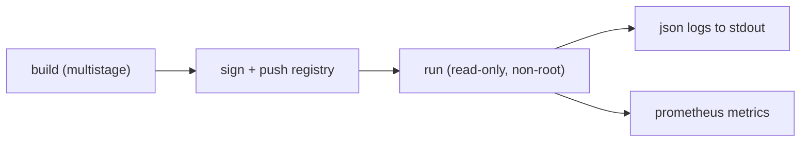

# Production-Ready Docker

> Docker 101 series (10/10)

<!-- a-grade-intro:begin -->

**Core question**: To take everything you have learned *into production*, *what else* do you need?

> *Production containers require *image, security, logging, registry, and tagging* to align *all at once*.*

<!-- a-grade-intro:end -->

## What You Will Learn

- An *image tag policy* (semver + sha)
- *Registries* and *signed images*
- *Runtime security* (read-only, capabilities)
- Standard *logging / metrics*
- Five common pitfalls

## Why It Matters

Every prior decision is *validated together in production*. One weak link makes the *whole chain weak*.

> *Production is a *system, not a checklist*. Everything must work *at the same time*.*

## Concept at a Glance



## Key Terms

- **Tag policy**: `semver` + `git sha` dual tagging.
- **Cosign**: a tool to *sign* images.
- **Read-only rootfs**: *lock down* the container FS.
- **Capabilities**: granular Linux *privileges*.
- **Logging driver**: how *stdout* is collected/forwarded.

## Before/After

**Before**: deploy `latest`, run as root, write logs *inside the container*.

**After**: dual-tag `1.4.2` + `sha-abc1234`, *non-root + read-only*, *JSON logs -> collector*.

## Hands-on: Production in 5 Steps

### Step 1 — Tag and push

```bash
TAG=1.4.2
SHA=$(git rev-parse --short HEAD)
docker build -t ghcr.io/me/myapp:${TAG} -t ghcr.io/me/myapp:sha-${SHA} .
docker push ghcr.io/me/myapp:${TAG}
docker push ghcr.io/me/myapp:sha-${SHA}
```

### Step 2 — Sign the image (Cosign)

```bash
cosign sign --yes ghcr.io/me/myapp:${TAG}
cosign verify --certificate-identity-regexp '.*' \
              --certificate-oidc-issuer-regexp '.*' \
              ghcr.io/me/myapp:${TAG}
```

### Step 3 — Runtime security flags

```bash
docker run -d --name api \
  --read-only \
  --tmpfs /tmp \
  --cap-drop=ALL \
  --security-opt=no-new-privileges \
  --user 1000:1000 \
  -p 8000:8000 \
  ghcr.io/me/myapp:${TAG}
```

### Step 4 — Compose (production-style)

```yaml
services:
  web:
    image: ghcr.io/me/myapp:1.4.2
    read_only: true
    tmpfs: ["/tmp"]
    cap_drop: ["ALL"]
    user: "1000:1000"
    deploy:
      restart_policy: { condition: on-failure }
    logging:
      driver: json-file
      options: { max-size: "10m", max-file: "5" }
```

### Step 5 — Metrics (Prometheus)

```python
from prometheus_fastapi_instrumentator import Instrumentator
Instrumentator().instrument(app).expose(app, endpoint="/metrics")
```

## What to Notice in This Code

- *Signing* gives you *supply-chain trust*.
- *Read-only + cap-drop* lock down *runtime*.
- *Logs* and *metrics* via *stdout / endpoints* is enough.

## Five Common Mistakes

1. **Deploying `latest`.** You cannot tell *which version* is live.
2. **Using *unsigned* images.** Defenseless against supply-chain attacks.
3. **Writing logs to *files inside* the container.** Rotation and collection break.
4. **Using `--privileged`.** Security *gone*.
5. **No healthcheck and no restart policy.** Quietly stays *dead*.

## How This Shows Up in Production

Most production runs on *Kubernetes*, and the five practices above translate *directly* into K8s manifest options. *Docker 101* skills become *K8s assets* immediately.

## How a Senior Engineer Thinks

- *Production *flips defaults* to deny-by-default*.
- *Image tags are *immutable*; deploys pin by *digest*.
- *Logs to stdout, metrics to endpoint, traces via OTel*.
- *An unsigned image is *someone else's code*.
- *MTTR drives every decision*.

## Checklist

- [ ] *semver + sha* dual tag.
- [ ] Image *signed* and *verified*.
- [ ] *read-only / cap-drop / non-root*.
- [ ] Standard channels for *logs* and *metrics*.
- [ ] healthcheck + restart policy.

## Practice Problems

1. Push your image with both *semver* and *sha* tags.
2. Sign and verify with *Cosign*.
3. Run a container with *read-only + cap-drop* and verify it still works.

## Wrap-up and Next Steps

If you followed along, you can handle *95% of Docker* in the wild. From here, learn *Kubernetes 101* for *container orchestration* and *SRE 101* for *operational reliability*.

<!-- toc:begin -->
- [What Is Docker?](./01-what-is-docker.md)
- [Images and Containers](./02-image-and-container.md)
- [Writing a Dockerfile](./03-dockerfile.md)
- [Volumes and Networks](./04-volume-and-network.md)
- [Docker Compose](./05-docker-compose.md)
- [Environment Variables and Configuration](./06-env-and-config.md)
- [Containerizing a Python App](./07-python-app-containerize.md)
- [Running with a Database](./08-database-with-app.md)
- [Image Optimization](./09-image-optimization.md)
- **Production-Ready Docker (current)**
<!-- toc:end -->

## References

- [Docker security](https://docs.docker.com/engine/security/)
- [Sigstore Cosign](https://docs.sigstore.dev/cosign/overview/)
- [Read-only filesystem](https://docs.docker.com/engine/reference/run/#read-only)
- [12-factor - logs](https://12factor.net/logs)
