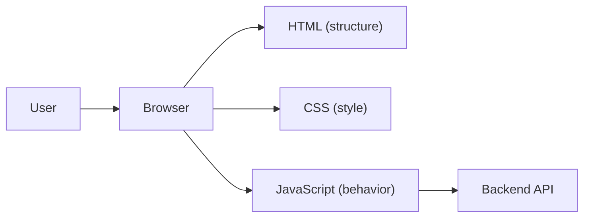

# What Is Frontend Development?

> Frontend Development 101 series (1/10)

<!-- a-grade-intro:begin -->

**Core question**: Where is *everything the user can see* actually built?

> The frontend is *a tiny operating system that runs inside the browser*. HTML, CSS, and JavaScript are the *languages* of that OS.

<!-- a-grade-intro:end -->

## What You Will Learn

- The *clear boundary* between frontend and backend
- *How a browser draws* a page
- The *distinct roles* of HTML, CSS, and JavaScript
- A bird's-eye view of *modern frontend tooling*
- A learning roadmap

## Why It Matters

*Everything users feel* passes through the frontend. A perfect backend with a slow frontend is *judged as a slow product*. The frontend is the *first and last impression* of your product.

> A great frontend is *invisible*: users just *use it* without thinking.

## Concept at a Glance



The browser *combines* the three languages to draw the screen.

## Key Terms

- **DOM**: the *tree structure* the browser builds from HTML.
- **Rendering**: the process of *turning HTML+CSS into pixels*.
- **Bundle**: the *single file* produced from many JS files.
- **SPA (Single Page Application)**: an app whose screen changes *via JS*, with no page reload.
- **Hydration**: the process of *attaching JS behavior* to server-rendered HTML.

## Before/After

**Before (static website, 1995)**

```html
<!-- Each page is its own .html file -->
<a href="/about.html">About</a>
```

**After (modern SPA, 2025)**

```javascript
// A router swaps the screen inside one page
<Link to="/about">About</Link>
```

## Hands-on: Your First Page in Five Steps

### Step 1 — index.html

```html
<!DOCTYPE html>
<html lang="en">
<head><meta charset="utf-8"><title>Hi</title></head>
<body>
  <h1 id="t">Hello</h1>
  <button id="b">Click me</button>
  <script src="app.js"></script>
</body>
</html>
```

### Step 2 — style.css

```css
body { font-family: system-ui; padding: 2rem; }
button { padding: .5rem 1rem; cursor: pointer; }
```

### Step 3 — app.js

```javascript
document.getElementById("b").addEventListener("click", () => {
  document.getElementById("t").textContent = "Hello, frontend!";
});
```

### Step 4 — Local server

```bash
python3 -m http.server 8000
# Visit http://localhost:8000 in the browser
```

### Step 5 — Open DevTools

Press `F12` and inspect the Elements, Console, and Network tabs to see *what the browser actually received*.

## What to Notice in This Code

- HTML is *structure*, CSS is *appearance*, JS is *behavior*.
- The three are *separated*, so each can evolve independently.
- DevTools is the *single most powerful tool* in frontend work.

## Five Common Mistakes

1. **Inlining styles in HTML.** Maintenance becomes *exponentially harder*.
2. **Mixing business logic and DOM manipulation in JS.** Tests become impossible.
3. **Ignoring DevTools.** You debug *with your eyes half-closed*.
4. **Reaching for a framework everywhere.** *React for a simple page* is overkill.
5. **Treating mobile as an afterthought.** Mobile users are *more than half* of traffic.

## How This Shows Up in Production

Most teams use *React/Vue/Svelte* with *TypeScript* and *Vite/Next.js*. Don't try to learn every tool at once: build one page in *plain HTML/CSS/JS*, then move to a framework. That path is *much faster* in practice.

## How a Senior Engineer Thinks

- *Fundamentals* outlive frameworks by years.
- User experience is measured in *milliseconds*.
- If HTML/CSS alone solve it, *don't reach for JS*.
- Accessibility is *cheaper when designed in from day one*.
- *Most answers are inside DevTools*.

## Checklist

- [ ] You can distinguish the roles of HTML, CSS, and JS.
- [ ] You can serve a static page locally.
- [ ] You can open DevTools and use Elements/Console/Network.
- [ ] You can describe what the DOM is.
- [ ] You can explain an SPA in one sentence.

## Practice Problems

1. Build a self-introduction page using only HTML and CSS — no JavaScript.
2. Add a button that updates the text on click.
3. In the DevTools Network tab, count *how many files* are downloaded for one page load.

## Wrap-up and Next Steps

The frontend is *the layer where the product meets the user inside the browser*. Next, we dig into the *foundation* of that layer: HTML and CSS.

<!-- toc:begin -->
- **What Is Frontend Development? (current)**
- HTML and CSS Basics (upcoming)
- JavaScript Basics (upcoming)
- Components and State (upcoming)
- Routing and Pages (upcoming)
- API Calls and Async (upcoming)
- Forms and Validation (upcoming)
- Styling and Design Systems (upcoming)
- Build Tools and Bundling (upcoming)
- Building a Small Frontend App (upcoming)
<!-- toc:end -->

## References

- [MDN Web Docs](https://developer.mozilla.org/)
- [web.dev](https://web.dev/)
- [Frontend Roadmap](https://roadmap.sh/frontend)
- [HTML Living Standard](https://html.spec.whatwg.org/)
