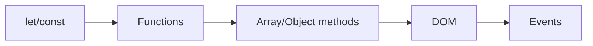

# JavaScript Basics

> Frontend Development 101 series (3/10)

<!-- a-grade-intro:begin -->

**Core question**: *Where* should you start with JavaScript to learn it efficiently?

> Don't memorize every feature. *Variables, functions, arrays/objects, DOM, events* — those five cover *80%* of JavaScript.

<!-- a-grade-intro:end -->

## What You Will Learn

- `let`/`const` and *immutable thinking*
- Functions, arrow functions, and a *minimal grasp* of closures
- Array/object methods (`map`, `filter`, `reduce`)
- Reading and updating the DOM
- *The standard pattern* for event listeners

## Why It Matters

JavaScript stays the same *across frameworks*. Inside React components, inside Vue, inside Node.js — the *syntax is identical*. Time invested here makes *every framework faster to learn*.

> Good JavaScript is a sum of *small, separated functions*.

## Concept at a Glance



## Key Terms

- **`const`**: cannot be reassigned. Use it *by default*.
- **Arrow function**: `() => {}`, the short form.
- **Closure**: a function remembers *the environment in which it was created*.
- **`map/filter/reduce`**: standard tools to transform collections *without for-loops*.
- **Event delegation**: attach the listener *to the parent* and handle child events from there.

## Before/After

**Before (var and for)**

```javascript
var arr = [1,2,3];
var doubled = [];
for (var i = 0; i < arr.length; i++) doubled.push(arr[i] * 2);
```

**After (modern JS)**

```javascript
const arr = [1, 2, 3];
const doubled = arr.map(n => n * 2);
```

## Hands-on: A Todo List in Five Steps

### Step 1 — HTML skeleton

```html
<input id="todo">
<button id="add">Add</button>
<ul id="list"></ul>
```

### Step 2 — State variable

```javascript
const todos = [];
```

### Step 3 — A render function

```javascript
function render() {
  const list = document.getElementById("list");
  list.innerHTML = todos.map(t => `<li>${t}</li>`).join("");
}
```

### Step 4 — Events

```javascript
document.getElementById("add").addEventListener("click", () => {
  const input = document.getElementById("todo");
  if (!input.value) return;
  todos.push(input.value);
  input.value = "";
  render();
});
```

### Step 5 — Delete via event delegation

```javascript
document.getElementById("list").addEventListener("click", (e) => {
  if (e.target.tagName === "LI") {
    const idx = [...e.target.parentNode.children].indexOf(e.target);
    todos.splice(idx, 1);
    render();
  }
});
```

## What to Notice in This Code

- State (`todos`) and rendering (`render`) are *separated*.
- Every change flows *state → render*. (A *taste* of the React paradigm.)
- A single listener on the parent is more efficient than one per child.

## Five Common Mistakes

1. **Using `var`.** Function-scoped behavior creates bugs. Use `const`/`let`.
2. **Using `==`.** Type coercion makes results *unpredictable*. Use `===`.
3. **Updating state and DOM in parallel.** You lose track of *the source of truth*.
4. **Attaching a listener to every element.** Wastes memory and CPU.
5. **Not handling errors inside `async`.** Bugs that *fail silently* appear.

## How This Shows Up in Production

Most teams standardize on *TypeScript*, *ESLint*, and *Prettier*. JavaScript's freedom becomes a *risk* at team scale, so types and lint rules draw the *boundaries*. Yet all of those tools *run on top of* plain JS.

## How a Senior Engineer Thinks

- A function does *one thing*.
- Separate state from rendering.
- `const` by default; `let` by exception; `var` never.
- Flatten callback hell with `async/await`.
- *Reading* JavaScript takes longer than writing it.

## Checklist

- [ ] You know the difference between `let` and `const`.
- [ ] You can write arrow functions.
- [ ] You replace for-loops with `map/filter/reduce`.
- [ ] You can read and modify the DOM.
- [ ] You have used event delegation at least once.

## Practice Problems

1. Add a *complete (check)* feature to the todo code above.
2. Persist todos across reloads using `localStorage`.
3. Compute an average grade using only `map/filter/reduce`.

## Wrap-up and Next Steps

Plain JavaScript can build small apps on its own. As the screen grows, you need a tool that *binds state to rendering* automatically. Next up: components and state.

<!-- toc:begin -->
- [What Is Frontend Development?](./01-what-is-frontend-development.md)
- [HTML and CSS Basics](./02-html-and-css-basics.md)
- **JavaScript Basics (current)**
- Components and State (upcoming)
- Routing and Pages (upcoming)
- API Calls and Async (upcoming)
- Forms and Validation (upcoming)
- Styling and Design Systems (upcoming)
- Build Tools and Bundling (upcoming)
- Building a Small Frontend App (upcoming)
<!-- toc:end -->

## References

- [MDN JavaScript Guide](https://developer.mozilla.org/en-US/docs/Web/JavaScript/Guide)
- [JavaScript.info](https://javascript.info/)
- [Eloquent JavaScript](https://eloquentjavascript.net/)
- [TC39 Proposals](https://github.com/tc39/proposals)
