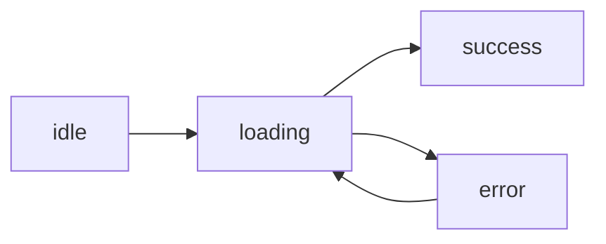

# API Calls and Async

> Frontend Development 101 series (6/10)

<!-- a-grade-intro:begin -->

**Core question**: What do you show the user *during the brief moment* a server fetch is in flight?

> Async code requires you to keep three states in mind at all times: *loading, success, failure*.

<!-- a-grade-intro:end -->

## What You Will Learn

- The *minimum usage* of `fetch` and `async/await`
- Handling loading/error states *explicitly*
- Cancellation and race conditions
- Caching and stale-while-revalidate
- *Why React Query / SWR* became standard

## Why It Matters

Async bugs make up *half of frontend defects*. They hide on a fast network and explode on a user's *slow 3G*. Explicit state management is *the only cure*.

> Good async code *assumes the worst network*.

## Concept at a Glance



## Key Terms

- **`fetch`**: the browser-built-in HTTP client.
- **Promise**: an object representing *a value to arrive in the future*.
- **`async/await`**: syntax to use Promises *as if they were synchronous*.
- **AbortController**: tool to *cancel a request mid-flight*.
- **Stale-while-revalidate**: *show cached data first*, refresh in the background.

## Before/After

**Before (callback hell)**

```javascript
fetch(url, (res) => {
  parse(res, (data) => {
    render(data, (e) => { ... });
  });
});
```

**After (async/await)**

```javascript
const res = await fetch(url);
const data = await res.json();
render(data);
```

## Hands-on: A User List in Five Steps

### Step 1 — Plain fetch

```javascript
async function loadUsers() {
  const res = await fetch("/api/users");
  return res.json();
}
```

### Step 2 — Use it from React

```jsx
function Users() {
  const [users, setUsers] = useState([]);
  useEffect(() => { loadUsers().then(setUsers); }, []);
  return <ul>{users.map(u => <li key={u.id}>{u.name}</li>)}</ul>;
}
```

### Step 3 — Loading and error states

```jsx
function Users() {
  const [state, setState] = useState({ status: "idle" });
  useEffect(() => {
    setState({ status: "loading" });
    loadUsers()
      .then(data => setState({ status: "success", data }))
      .catch(err => setState({ status: "error", err }));
  }, []);

  if (state.status === "loading") return <p>Loading...</p>;
  if (state.status === "error")   return <p>Error: {state.err.message}</p>;
  return <ul>{state.data.map(u => <li key={u.id}>{u.name}</li>)}</ul>;
}
```

### Step 4 — Cancel on unmount

```jsx
useEffect(() => {
  const ctrl = new AbortController();
  fetch("/api/users", { signal: ctrl.signal })
    .then(r => r.json()).then(setUsers)
    .catch(e => e.name !== "AbortError" && console.error(e));
  return () => ctrl.abort();
}, []);
```

### Step 5 — Compress all of it with React Query

```jsx
import { useQuery } from "@tanstack/react-query";

function Users() {
  const { data, isLoading, error } = useQuery({
    queryKey: ["users"],
    queryFn: loadUsers,
  });
  if (isLoading) return <p>Loading...</p>;
  if (error)     return <p>Error</p>;
  return <ul>{data.map(u => <li key={u.id}>{u.name}</li>)}</ul>;
}
```

## What to Notice in This Code

- The state is *explicit*: `idle/loading/success/error`.
- The request is *canceled* on unmount.
- React Query handles caching, retry, and race conditions *for you*.

## Five Common Mistakes

1. **Skipping the loading state.** Users assume the *app is dead*.
2. **Logging errors only to the console.** Users see *a white screen*.
3. **Ignoring race conditions.** Fast typing in search shows *the wrong result*.
4. **Each component fetches the *same* data separately.** N copies of one resource.
5. **No cache invalidation strategy.** Stale screens stay even after fresh data exists.

## How This Shows Up in Production

Most React apps standardize on *React Query (TanStack Query)* or *SWR*. Vue uses *Pinia + composables*; Svelte ships with built-in *load functions*. Hand-rolled fetch state code is *fading out*.

## How a Senior Engineer Thinks

- Async is *a state machine* — draw all four states.
- Every fetch should be *cancellable*.
- Caching is *the default*; live refresh is the exception.
- User-facing errors must be *friendly and actionable*.
- Test on the DevTools *Slow 3G* throttle once in a while.

## Checklist

- [ ] You can write fetch with `async/await`.
- [ ] You render loading, error, and success states distinctly.
- [ ] You have used `AbortController` once.
- [ ] You have tried React Query or SWR.
- [ ] You have tested under Slow 3G.

## Practice Problems

1. Call `https://jsonplaceholder.typicode.com/users` and render the user list.
2. Add explicit loading and error states.
3. Add a search box; ensure that fast typing only renders *the latest input's result*.

## Wrap-up and Next Steps

Async is *state*. Next, we look at handling *user input* via forms and validation.

<!-- toc:begin -->
- [What Is Frontend Development?](./01-what-is-frontend-development.md)
- [HTML and CSS Basics](./02-html-and-css-basics.md)
- [JavaScript Basics](./03-javascript-basics.md)
- [Components and State](./04-components-and-state.md)
- [Routing and Pages](./05-routing-and-pages.md)
- **API Calls and Async (current)**
- Forms and Validation (upcoming)
- Styling and Design Systems (upcoming)
- Build Tools and Bundling (upcoming)
- Building a Small Frontend App (upcoming)
<!-- toc:end -->

## References

- [MDN Fetch API](https://developer.mozilla.org/en-US/docs/Web/API/Fetch_API)
- [TanStack Query](https://tanstack.com/query/latest)
- [SWR docs](https://swr.vercel.app/)
- [MDN AbortController](https://developer.mozilla.org/en-US/docs/Web/API/AbortController)
