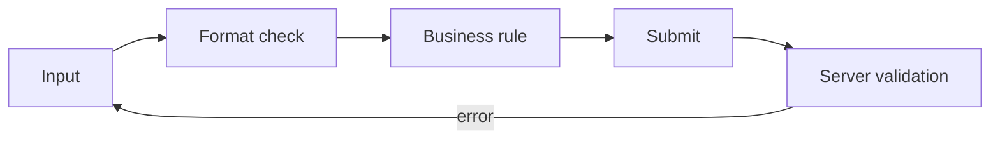

# Forms and Validation

> Frontend Development 101 series (7/10)

<!-- a-grade-intro:begin -->

**Core question**: How do you tell a user *kindly* that they made a mistake?

> A good form *helps while typing* and never *scolds only after submit*.

<!-- a-grade-intro:end -->

## What You Will Learn

- Controlled vs uncontrolled inputs
- Three layers of validation (format, business rule, server)
- *Where and when* to show error messages
- Accessibility and keyboard usability
- The role of form libraries (React Hook Form, Zod)

## Why It Matters

Forms drive *conversion*. Sign-up, payment, search — all forms. *Slightly awkward* forms cause users to leave. Forms are the *UX exam* of the frontend.

> Great forms *ask less*, *catch typos early*, and *submit fast*.

## Concept at a Glance



## Key Terms

- **Controlled input**: value lives in *React state*.
- **Uncontrolled input**: value lives in the *DOM*.
- **Schema validation**: declarative validation with libraries like Zod or Yup.
- **Inline error**: an error shown *next to the field*.
- **`aria-invalid`**: ARIA attribute telling screen readers *the field is invalid*.

## Before/After

**Before (validate only on submit)**

```javascript
form.onsubmit = () => {
  if (email.value === "") alert("Please enter an email");
};
```

**After (real-time inline check + friendly message)**

```jsx
{!isEmail(email) && <p className="error">That doesn't look like an email</p>}
```

## Hands-on: A Sign-up Form in Five Steps

### Step 1 — Controlled input

```jsx
function Signup() {
  const [email, setEmail] = useState("");
  return <input value={email} onChange={e => setEmail(e.target.value)} />;
}
```

### Step 2 — Format check

```jsx
const isValidEmail = /^[^@\s]+@[^@\s]+\.[^@\s]+$/.test(email);
```

### Step 3 — Inline error

```jsx
<input
  value={email}
  onChange={e => setEmail(e.target.value)}
  aria-invalid={!isValidEmail}
/>
{!isValidEmail && email && <p className="error">That doesn't look like an email</p>}
```

### Step 4 — Disable submit while invalid

```jsx
<button disabled={!isValidEmail || submitting}>
  {submitting ? "Submitting..." : "Sign up"}
</button>
```

### Step 5 — Schema with Zod

```jsx
import { z } from "zod";

const SignupSchema = z.object({
  email: z.string().email(),
  password: z.string().min(8),
});

const result = SignupSchema.safeParse({ email, password });
if (!result.success) showErrors(result.error.format());
```

## What to Notice in This Code

- Validation happens *while the user types*.
- `aria-invalid` carries *the same information* to screen reader users.
- One Zod schema unifies *frontend and backend* validation.

## Five Common Mistakes

1. **Asking for the password *only once*.** A typo causes the entire signup to fail.
2. **Showing errors *only after submit*.** Users must re-scan *every field*.
3. **Technical error text.** "Schema validation failed" means *nothing* to the user.
4. **Missing `<label>`.** Screen readers don't know *which input* this is.
5. **No mobile keyboard hint.** An email field opens the *letters keyboard*.

## How This Shows Up in Production

Most React apps use *React Hook Form + Zod*. State, validation, submission, and error display are bundled *declaratively*. Hand-rolled `useState` forms vanish *after the learning phase*.

## How a Senior Engineer Thinks

- A form is *a conversation* — give *feedback* at every step.
- Validate on *both* frontend (UX) and backend (security).
- Errors must be *friendly and actionable*.
- The *whole form* must be reachable by *keyboard alone*.
- Autocomplete and mobile keyboard `type` are *defaults*, not optional.

## Checklist

- [ ] You can use a controlled input.
- [ ] You display inline errors.
- [ ] You attach `<label>` and `for` to every input.
- [ ] You know `aria-invalid` and `aria-describedby`.
- [ ] You have used a schema validator like Zod or Yup.

## Practice Problems

1. Build a signup form with email, password, and password-confirm fields.
2. Add inline validation and friendly error messages to every field.
3. Verify the form can be filled and submitted using *only the keyboard*.

## Wrap-up and Next Steps

Forms are *the longest conversation with the user*. Next, we look at how the form — and the rest of the screen — gets *its appearance* via styling and design systems.

<!-- toc:begin -->
- [What Is Frontend Development?](./01-what-is-frontend-development.md)
- [HTML and CSS Basics](./02-html-and-css-basics.md)
- [JavaScript Basics](./03-javascript-basics.md)
- [Components and State](./04-components-and-state.md)
- [Routing and Pages](./05-routing-and-pages.md)
- [API Calls and Async](./06-api-calls-and-async.md)
- **Forms and Validation (current)**
- Styling and Design Systems (upcoming)
- Build Tools and Bundling (upcoming)
- Building a Small Frontend App (upcoming)
<!-- toc:end -->

## References

- [React Hook Form](https://react-hook-form.com/)
- [Zod docs](https://zod.dev/)
- [MDN Form validation](https://developer.mozilla.org/en-US/docs/Learn/Forms/Form_validation)
- [W3C Form best practices](https://www.w3.org/WAI/tutorials/forms/)
