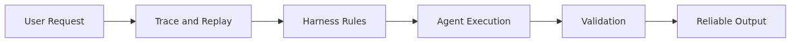

# Observability — Tracing and Replaying Agent Work

> Harness Engineering 101 Series (9/10)

If you cannot see what the agent did, you cannot debug it or improve it. Observability is the practice of making every step of the agent traceable, recordable, and replayable.

---



*Observability - tracing and replaying agent work*
## What Is Observability?

Observability is the ability to reconstruct, from the outside, what an agent did, why it did it, and how. It is not just "leave logs around" — when an incident happens, you must be able to trace and reproduce the decision made at that moment.

```python
from dataclasses import dataclass, field
from datetime import datetime, timezone
from typing import Any
import uuid

@dataclass
class Span:
    span_id: str
    trace_id: str
    parent_id: str | None
    name: str
    started_at: datetime
    ended_at: datetime | None = None
    attributes: dict[str, Any] = field(default_factory=dict)
    events: list[dict] = field(default_factory=list)
    status: str = "ok"
```

A `Span` is one unit of work in the agent. One tool call, one LLM call, one reflection step — each becomes its own span. Spans that share the same trace_id form one execution flow.

## What Should You Record?


*What should you Record*
You need three layers of information to make traces useful.

1. **What did the agent do?** tool name, input, output
2. **Why did it decide that?** prompt, model, temperature, retrieved context
3. **How long did it take and how much did it cost?** latency, token count, cost in dollars

```python
def record_llm_call(span: Span, prompt: str, model: str, response: str, usage: dict):
    span.attributes.update({
        "llm.model": model,
        "llm.prompt_tokens": usage["prompt_tokens"],
        "llm.completion_tokens": usage["completion_tokens"],
        "llm.cost_usd": _calculate_cost(model, usage),
    })
    span.events.append({
        "name": "llm.prompt",
        "timestamp": datetime.now(timezone.utc).isoformat(),
        "body": prompt,
    })
    span.events.append({
        "name": "llm.response",
        "timestamp": datetime.now(timezone.utc).isoformat(),
        "body": response,
    })
```

Note that prompt and response go into events, not attributes. Attributes are short metadata for search and filtering; events are payloads ordered by time.

## Trace Model — Following One Run End to End


*Trace model - following one run end to end*
A single agent run produces a trace shaped like this tree:

```python
class Tracer:
    def __init__(self, exporter):
        self.exporter = exporter
        self._stack: list[Span] = []

    def start(self, name: str, **attrs) -> Span:
        parent_id = self._stack[-1].span_id if self._stack else None
        trace_id = self._stack[0].trace_id if self._stack else str(uuid.uuid4())
        span = Span(
            span_id=str(uuid.uuid4()),
            trace_id=trace_id,
            parent_id=parent_id,
            name=name,
            started_at=datetime.now(timezone.utc),
            attributes=dict(attrs),
        )
        self._stack.append(span)
        return span

    def end(self, status: str = "ok"):
        span = self._stack.pop()
        span.ended_at = datetime.now(timezone.utc)
        span.status = status
        self.exporter.export(span)
```

```text
trace 7a3f...
├── span: agent.run           (12.3s, $0.04)
│   ├── span: llm.plan        (1.2s, $0.01)
│   ├── span: tool.search     (0.8s)
│   ├── span: llm.synthesize  (2.1s, $0.02)
│   └── span: tool.send_email (0.3s)
```

With this tree alone you can answer "where was it slow?", "where did the cost spike?", and "which tool failed?" instantly.

## Replay — Reproducing a Run from Logs


*Replay - reproducing a run from logs*
A good trace is reproducible. You should be able to run the same step with the same input again and verify the same output comes back.

```python
def replay_trace(trace_id: str, store) -> list[dict]:
    spans = store.load_spans(trace_id)
    results = []
    for span in spans:
        if span.name.startswith("tool."):
            tool_name = span.attributes["tool.name"]
            tool_input = span.attributes["tool.input"]
            actual = invoke_tool(tool_name, tool_input)
            expected = span.attributes["tool.output"]
            results.append({
                "span": span.name,
                "matches": actual == expected,
                "expected": expected,
                "actual": actual,
            })
    return results
```

For replay to work, every input — prompts, retrieved context, tool inputs — must be in the span. "Just record the result" makes replay impossible.

## Cost and Latency Dashboards

Production agents see sudden spikes in cost and response time. The dashboard should surface these four metrics in real time:

```python
@dataclass
class AgentMetrics:
    total_runs: int
    avg_latency_ms: float
    p95_latency_ms: float
    avg_cost_usd: float
    error_rate: float

def aggregate(spans: list[Span]) -> AgentMetrics:
    runs = [s for s in spans if s.name == "agent.run"]
    latencies = [(s.ended_at - s.started_at).total_seconds() * 1000 for s in runs]
    costs = [s.attributes.get("total.cost_usd", 0) for s in runs]
    errors = [s for s in runs if s.status != "ok"]
    latencies_sorted = sorted(latencies)
    p95_idx = int(len(latencies_sorted) * 0.95)
    return AgentMetrics(
        total_runs=len(runs),
        avg_latency_ms=sum(latencies) / len(latencies) if latencies else 0,
        p95_latency_ms=latencies_sorted[p95_idx] if latencies_sorted else 0,
        avg_cost_usd=sum(costs) / len(costs) if costs else 0,
        error_rate=len(errors) / len(runs) if runs else 0,
    )
```

P95 latency matters far more than the average. The average can look fine while five percent of users wait 30 seconds.

## Alerting — When to Wake Someone Up

Alert on every anomaly and you get alert fatigue. Wake people up only on these three conditions:

```python
def should_alert(metrics: AgentMetrics, baseline: AgentMetrics) -> str | None:
    if metrics.error_rate > baseline.error_rate * 2 and metrics.error_rate > 0.05:
        return f"Error rate spike: {metrics.error_rate:.1%}"
    if metrics.p95_latency_ms > baseline.p95_latency_ms * 3:
        return f"P95 latency spike: {metrics.p95_latency_ms:.0f}ms"
    if metrics.avg_cost_usd > baseline.avg_cost_usd * 5:
        return f"Cost spike: ${metrics.avg_cost_usd:.4f}/run"
    return None
```

1. **Error rate spike**: more than 2x baseline AND above 5% absolute
2. **P95 latency spike**: more than 3x baseline
3. **Per-run cost spike**: more than 5x baseline

## Five Common Mistakes

1. **Logging only outputs, not inputs.** Replay becomes impossible and you cannot trace incident causes. Always record prompts and retrieved context.
2. **Logging PII verbatim.** User emails, card numbers and similar end up raw in spans. Mask or hash before recording.
3. **Losing trace_id across boundaries.** Async calls drop the context and the trace breaks. Use an async-aware tracer or pass it explicitly.
4. **Watching averages and ignoring P95.** The mean looks fine while 5% wait 30s. Always look at percentiles.
5. **Alerting on every anomaly.** Alert fatigue makes you miss real alerts. Combine baseline-relative ratios with absolute thresholds.

## Key Takeaways

- Observability lets you trace and reproduce decisions after the fact.
- Spans are units of work; traces are the tree of one run.
- Record all three layers: What, Why, and Cost.
- Replay only works if prompts and retrieved context are stored.
- Watch p95 (not average) latency and alert on baseline-relative spikes.

The next post is Production Harness — combining the nine harnesses into a deployment pattern for real production environments.

<!-- toc:begin -->
## In this series

- [What Is Harness Engineering?](./01-what-is-harness-engineering.md)
- [Task Harness — Turning Vague Work into Executable Tasks](./02-task-harness.md)
- [Context Harness — Designing What the Agent Should Know and Not Know](./03-context-harness.md)
- [Constraint Harness — Defining Rules, Boundaries, and Forbidden Actions](./04-constraint-harness.md)
- [Tool Harness — Designing Safe Tools for Agents](./05-tool-harness.md)
- [Test Harness — Turning Completion Criteria into Tests](./06-test-harness.md)
- [Feedback Loops — Building Structures That Let Agents Recover from Failure](./07-feedback-loop.md)
- [Approval Gates — Designing Where Humans Must Approve](./08-approval-gate.md)
- **Observability — Tracing and Replaying Agent Work (current)**
- Production Harness — Building Operational Environments for Agents (upcoming)

<!-- toc:end -->

---

## References

- [OpenTelemetry — Tracing concepts](https://opentelemetry.io/docs/concepts/signals/traces/)
- [Google SRE — Monitoring distributed systems](https://sre.google/sre-book/monitoring-distributed-systems/)
- [LangSmith — Tracing for LLM applications](https://docs.smith.langchain.com/observability)
- [Honeycomb — Observability engineering](https://www.honeycomb.io/blog/what-is-observability)
