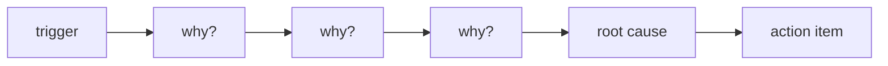

# Root Cause Analysis

> Incident Response 101 series (6/10)

<!-- a-grade-intro:begin -->

**Core question**: What is the *real cause* of an *incident*, and *how* do you find it?

> *RCA* uses *five whys* and *contributing factors* to find the *root cause*, not the *trigger*.

<!-- a-grade-intro:end -->

## What You Will Learn

- The *five whys* technique
- *Fishbone diagrams*
- *Contributing factors*
- *Trigger vs root cause*
- *Systems thinking*

## Why It Matters

If you only fix the *trigger*, the *same root cause* explodes *again* in the *next incident*.

## Concept at a Glance



## Key Terms

- **trigger**: the *event* that *fired* directly.
- **root cause**: the *condition* that made it possible.
- **contributing factor**: a *contributing element*.
- **5 whys**: ask *why* *five times*.
- **systems thinking**: thinking in *systems*.

## Before/After

**Before**: mistake the *trigger* for the *root cause*.

**After**: trace down to the *condition* with the *five whys*.

## Hands-on: A Mini RCA Workbook

### Step 1 — Five whys

```python
def five_whys(start):
    chain = [start]
    for _ in range(5):
        chain.append(input(f"why? {chain[-1]} -> "))
    return chain
```

### Step 2 — Collect contributing factors

```python
def factors():
    return {"people": [], "process": [], "tooling": [], "system": []}
```

### Step 3 — Trigger vs root cause

```python
def classify(item, evidence):
    return "root" if evidence >= 3 else "trigger"
```

### Step 4 — Map to actions

```python
def actions(root):
    return [{"root": root, "action": f"fix {root}"}]
```

### Step 5 — Verifiable?

```python
def is_actionable(action):
    return action["action"].startswith(("add ", "fix ", "remove ", "test "))
```

## What to Notice in This Code

- A *chain* preserves *depth*.
- *Contributing factors* sit on *four axes*.
- *Actions* start with a *verb*.

## Five Common Mistakes

1. **Stopping at the *first answer*.**
2. **Naming a *person* as the *root cause*.**
3. **Fixing only the *trigger* and closing.**
4. ***Vague*, abstract actions.**
5. **Actions that *cannot be verified*.**

## How This Shows Up in Production

The *postmortem doc* embeds a *Five Whys* section and a *Contributing Factors* table as part of the *template*.

## How a Senior Engineer Thinks

- Suspect the *system*.
- Do not blame *people*.
- The *root cause* is usually *process*.
- *Actions* are *measurable*.
- The *five whys* is a *starting point*, not the *end*.

## Checklist

- [ ] *Template section*.
- [ ] *Four-axis factor model*.
- [ ] *Verb-first action* rule.
- [ ] *Verification criteria*.

## Practice Problems

1. Distinguish *trigger* and *root cause* in one line.
2. Define the *five whys* in one line.
3. Define *contributing factor* in one line.

## Wrap-up and Next Steps

Next, we cover *mitigation and resolution*.

<!-- toc:begin -->
- [What is an Incident?](./01-what-is-incident.md)
- [Severity Classification](./02-severity.md)
- [Initial Response](./03-initial-response.md)
- [Communication](./04-communication.md)
- [Writing the Timeline](./05-timeline.md)
- **Root Cause Analysis (current)**
- Mitigation and Resolution (upcoming)
- Postmortem (upcoming)
- Prevention (upcoming)
- Building an Incident Runbook (upcoming)
<!-- toc:end -->

## References

- [Five Whys - Google SRE Workbook](https://sre.google/workbook/postmortem-culture/)
- [Root Cause Analysis - PagerDuty](https://response.pagerduty.com/after/root_cause_analysis/)
- [Incident RCA - Atlassian](https://www.atlassian.com/incident-management/postmortem/templates)
- [Beyond Root Cause - Increment](https://increment.com/postmortems/beyond-root-cause/)
