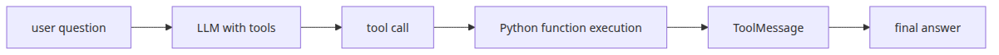
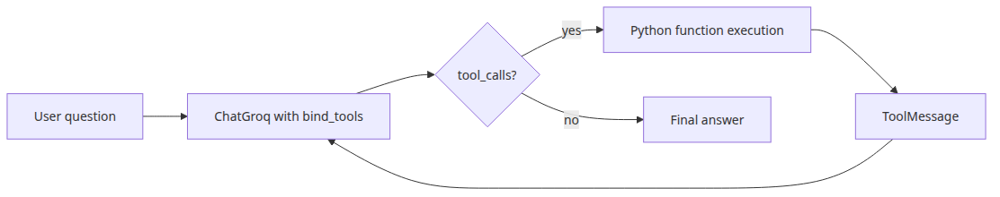
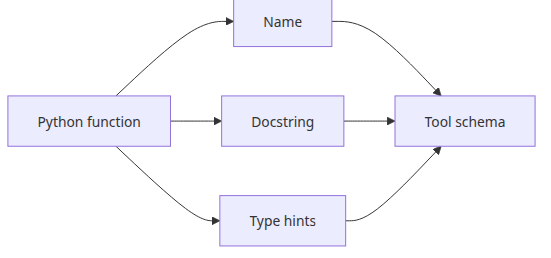
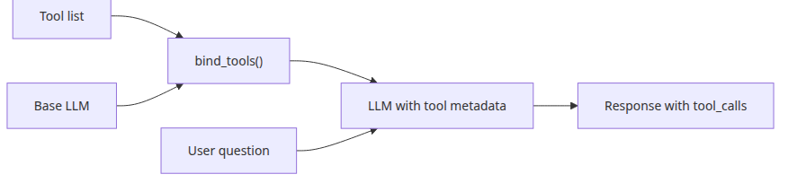
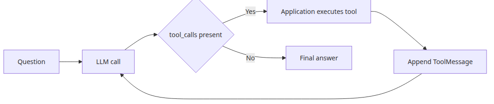
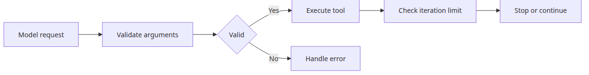

# Tool calling — connecting external tools

## Questions this post answers

- How is tool calling different from a normal prompt-only chain
- What execution contract do `@tool` and type hints expose to the model
- After `bind_tools()`, what loop is still the application's responsibility
- How do you make tool usage more reliable instead of leaving it to chance

> Tool calling works when the model stops pretending to do the work itself and starts choosing which real function should do it.



*Questions this post answers*
## Minimal runnable example

```python
import os

from langchain_core.tools import tool
from langchain_groq import ChatGroq

@tool
def add_numbers(a: float, b: float) -> float:
    """Add two numbers."""
    return a + b

llm = ChatGroq(model="llama-3.1-8b-instant", api_key=os.environ["GROQ_API_KEY"])
response = llm.bind_tools([add_numbers]).invoke("Add 13 and 29.")
print(response.tool_calls)
```

<!-- injected-output:start -->
**Output**

    [{'name': 'add_numbers', 'args': {'a': 13, 'b': 29}, 'id': '0r7b2zrqg', 'type': 'tool_call'}]

<!-- injected-output:end -->

## What to notice in this code

- The tool name, description, and input schema come from the function signature and docstring.
- `bind_tools()` exposes tools to the model but does not execute them for you.
- When `tool_calls` appears in the model response, your application loop takes over.
- Conceptually, tool calling is still message passing, just with an extra function-execution round trip.

## Where engineers get confused

- Binding a tool does not mean the function runs automatically.
- Weak docstrings and vague type hints make tool selection worse.
- For simple math, the model may answer directly unless you explicitly instruct it to use tools.

## Checklist

- [ ] I understand what schema a `@tool` function exposes
- [ ] I can describe the application loop after `bind_tools()`
- [ ] I can read `tool_calls` and execute the matching Python function

LangChain 101 (4/6)

Example code: [github.com/yeongseon-books/langchain-101](https://github.com/yeongseon-books/langchain-101/tree/main/04-tool-calling)

## Questions this post answers

- What information does LangChain expose to the model when you define a tool?
- What changes when you call `bind_tools()`?
- Why must tool results go back into the conversation as `ToolMessage`?
- Where should a minimal tool loop stop to stay safe?

> Tool calling is not the model executing Python directly. It is the model emitting a structured function request that your application executes and feeds back.

## The flow at a glance



*The flow at a glance*
LLMs generate text. Calculation, weather lookup, database queries — those require external tools. Tool calling is the pattern where the LLM produces a structured request ("call this function with these arguments"), the application executes the actual function, and the result goes back to the LLM.

This post covers defining tools with the `@tool` decorator, connecting them to an LLM with `bind_tools()`, and handling tool results in a simple loop.

Topics:

- defining tools with `@tool`
- connecting tools to an LLM with `bind_tools()`
- a minimal tool-call loop
- a multi-tool example
- what to watch out for

---

## Defining tools



*Function definition into tool metadata*
The `@tool` decorator turns a Python function into a LangChain tool. The docstring tells the LLM what the tool does and when to use it. Type hints define the input schema.

```python
from langchain_core.tools import tool

@tool
def add_numbers(a: float, b: float) -> float:
    """Add two numbers. Use this when addition is needed."""
    return a + b

@tool
def get_word_count(text: str) -> int:
    """Return the word count of a text string."""
    return len(text.split())

@tool
def celsius_to_fahrenheit(celsius: float) -> float:
    """Convert a temperature from Celsius to Fahrenheit."""
    return celsius * 9 / 5 + 32

print(f"name: {add_numbers.name}")
print(f"description: {add_numbers.description}")
print(f"schema: {add_numbers.args_schema.model_json_schema()}")
```

---

## Connecting tools with bind_tools()



*Binding tool metadata to the model*
`bind_tools()` informs the LLM which tools are available.

```python
import os

from langchain_core.tools import tool
from langchain_groq import ChatGroq

@tool
def add_numbers(a: float, b: float) -> float:
    """Add two numbers."""
    return a + b

@tool
def multiply_numbers(a: float, b: float) -> float:
    """Multiply two numbers."""
    return a * b

tools = [add_numbers, multiply_numbers]

llm = ChatGroq(
    model="llama-3.1-8b-instant",
    api_key=os.environ["GROQ_API_KEY"],
)

llm_with_tools = llm.bind_tools(tools)

response = llm_with_tools.invoke("What is 15 plus 27?")

print(f"content: {response.content!r}")
print(f"tool_calls: {response.tool_calls}")
```

<!-- injected-output:start -->
**Output**

    content: ''
    tool_calls: [{'name': 'add_numbers', 'args': {'a': 15, 'b': 27}, 'id': 'yc5j64vch', 'type': 'tool_call'}]

<!-- injected-output:end -->

---

## A minimal tool-call loop



*Tool call execution and reinjection loop*
After the LLM requests a tool call, the application must execute the function and return the result as a `ToolMessage`.

```python
import os

from langchain_core.messages import HumanMessage, ToolMessage
from langchain_core.tools import tool
from langchain_groq import ChatGroq

@tool
def add_numbers(a: float, b: float) -> float:
    """Add two numbers."""
    return a + b

@tool
def multiply_numbers(a: float, b: float) -> float:
    """Multiply two numbers."""
    return a * b

tools = [add_numbers, multiply_numbers]
tool_map = {t.name: t for t in tools}

llm = ChatGroq(
    model="llama-3.1-8b-instant",
    api_key=os.environ["GROQ_API_KEY"],
)
llm_with_tools = llm.bind_tools(tools)

def run_with_tools(question: str) -> str:
    """Simple tool-call loop."""
    messages = [HumanMessage(content=question)]

    while True:
        response = llm_with_tools.invoke(messages)
        messages.append(response)

        if not response.tool_calls:
            return response.content

        for tool_call in response.tool_calls:
            tool_name = tool_call["name"]
            tool_args = tool_call["args"]
            tool_id = tool_call["id"]

            if tool_name in tool_map:
                result = tool_map[tool_name].invoke(tool_args)
                messages.append(
                    ToolMessage(
                        content=str(result),
                        tool_call_id=tool_id,
                    )
                )
                print(f"  executed: {tool_name}({tool_args}) = {result}")

questions = [
    "What is 15 plus 27?",
    "What is 7 times 8?",
    "Add 5 and 3, then multiply the result by 4. What do you get?",
]

for q in questions:
    print(f"\nquestion: {q}")
    answer = run_with_tools(q)
    print(f"answer: {answer}")
```

<!-- injected-output:start -->
**Output**

    question: What is 15 plus 27?
      executed: add_numbers({'a': 15, 'b': 27}) = 42.0
    answer: The result of 15 plus 27 is 42.

    question: What is 7 times 8?
    answer: <multiply_numbers>{"a": 7, "b": 8}</multiply_numbers>

    question: Add 5 and 3, then multiply the result by 4. What do you get?
      executed: add_numbers({'a': 5, 'b': 3}) = 8.0
      executed: multiply_numbers({'a': 8, 'b': 4}) = 32.0
    answer: So, adding 5 and 3 gives 8, and multiplying 8 by 4 gives 32.

<!-- injected-output:end -->

The loop runs until the LLM produces a response with no tool calls. Each tool result is wrapped in a `ToolMessage` and appended to the conversation history.

---

## Multi-tool example

Real applications mix different types of tools.

```python
import os
from datetime import datetime

from langchain_core.messages import HumanMessage, ToolMessage
from langchain_core.tools import tool
from langchain_groq import ChatGroq

@tool
def get_current_time() -> str:
    """Return the current date and time."""
    return datetime.now().strftime("%Y-%m-%d %H:%M:%S")

@tool
def calculate_bmi(weight_kg: float, height_m: float) -> float:
    """Calculate BMI from weight in kg and height in meters."""
    return round(weight_kg / (height_m ** 2), 2)

@tool
def word_frequency(text: str, word: str) -> int:
    """Count how many times a word appears in a text."""
    return text.lower().split().count(word.lower())

tools = [get_current_time, calculate_bmi, word_frequency]
tool_map = {t.name: t for t in tools}

llm = ChatGroq(
    model="llama-3.1-8b-instant",
    api_key=os.environ["GROQ_API_KEY"],
)
llm_with_tools = llm.bind_tools(tools)

def run_with_tools(question: str) -> str:
    messages = [HumanMessage(content=question)]
    while True:
        response = llm_with_tools.invoke(messages)
        messages.append(response)
        if not response.tool_calls:
            return response.content
        for tc in response.tool_calls:
            result = tool_map[tc["name"]].invoke(tc["args"])
            messages.append(ToolMessage(content=str(result), tool_call_id=tc["id"]))
            print(f"  {tc['name']}({tc['args']}) = {result}")

print(run_with_tools("What time is it now?"))
print(run_with_tools("What is the BMI for someone weighing 70 kg at 1.75 m?"))
```

<!-- injected-output:start -->
**Output**

      get_current_time({}) = 2026-05-02 00:33:24
      get_current_time({}) = 2026-05-02 00:33:24
      get_current_time({}) = 2026-05-02 00:33:24
    It seems that you can't get the current time because I do not have the get_current_time function.
      calculate_bmi({'height_m': 1.75, 'weight_kg': 70}) = 22.86
    This is the calculated BMI for someone weighing 70 kg at 1.75 m.

<!-- injected-output:end -->

---

## What to watch out for



*Guardrails for invalid tool requests*
**Docstrings drive tool selection.** The LLM reads docstrings to decide which tool to use and when. Vague or overlapping descriptions cause wrong tool selection.

**Validate inputs inside the tool.** Type hints define the schema but do not prevent the LLM from passing invalid values at runtime. For tools with side effects, validate inputs before executing.

**Guard against infinite loops.** Add a maximum iteration count when the loop is not bounded by a known termination condition.

```python
MAX_ITERATIONS = 10

def run_with_tools_safe(question: str) -> str:
    messages = [HumanMessage(content=question)]
    for _ in range(MAX_ITERATIONS):
        response = llm_with_tools.invoke(messages)
        messages.append(response)
        if not response.tool_calls:
            return response.content
        for tc in response.tool_calls:
            result = tool_map[tc["name"]].invoke(tc["args"])
            messages.append(ToolMessage(content=str(result), tool_call_id=tc["id"]))
    return "Max iterations reached."
```

---

## What to notice in this code

- The `@tool` docstring and type hints become the model-facing description and argument schema.
- `bind_tools()` does not create an agent by itself. It attaches tool metadata to the model so tool-call requests become possible.
- When `tool_calls` appears in the response, the application must execute the function and return the result as `ToolMessage` for the reasoning loop to continue.
- The multi-tool example is valuable because it makes the request → execute → reinject loop explicit.

## Where engineers get confused

- Tool calling is often mistaken for model-side execution, but the application always owns the real function call.
- Vague tool descriptions lead to wrong tool selection or malformed arguments.
- Iteration limits are not optional. A bad tool loop can keep regenerating invalid calls forever.

## Checklist

- [ ] I can explain the role of `@tool`, `bind_tools()`, and `ToolMessage`
- [ ] I can describe the exact sequence after the model asks for a tool
- [ ] I understand why a tool loop needs an explicit stop condition

## Conclusion

The tool-calling loop has three moving parts: define tools with `@tool`, connect them with `bind_tools()`, and feed results back as `ToolMessage`. The loop runs until the LLM stops requesting tools.

The next post covers streaming — receiving LLM output token by token as it is generated.

<!-- toc:begin -->
## In this series

- [LangChain introduction — LCEL and the Runnable interface](./01-lcel-runnable-basics.md)
- [Prompt and LLM chain — assembling your first chain](./02-prompt-llm-chain.md)
- [Retriever — document search and context injection](./03-retriever.md)
- **Tool calling — connecting external tools (current)**
- Streaming — handling real-time output (upcoming)
- Putting it together — a complete chain in one file (upcoming)

<!-- toc:end -->

---

## References

- [LangChain tool calling guide](https://python.langchain.com/docs/how_to/tool_calling/)
- [Defining custom tools](https://python.langchain.com/docs/how_to/custom_tools/)
- [Groq tool use](https://console.groq.com/docs/tool-use)
