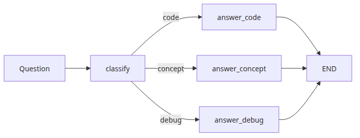
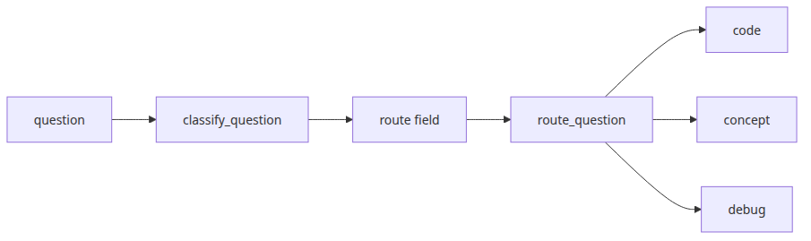
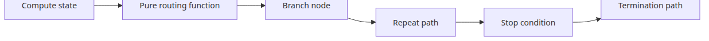
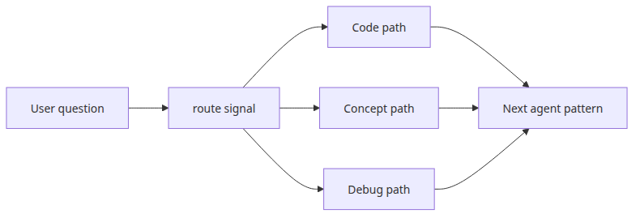

# Conditional edges and branching

## Questions this post answers

- When should you use `add_conditional_edges()`?
- What job should the routing function do, and what should it avoid?
- How do you keep branch-heavy graphs from turning into unbounded loops?

> A conditional edge inspects state and returns the name of the next node, so routing becomes an explicit runtime decision instead of hidden control flow.

Example code: [github.com/yeongseon-books/langgraph-101](https://github.com/yeongseon-books/langgraph-101/tree/main/en/03-conditional-edges)

Real agent workflows do not follow one path forever. Some requests should go to code generation, some to conceptual explanation, and others to debugging. LangGraph makes that branch visible with one routing node and one conditional edge definition.



*Questions this post answers*
## Minimal runnable example


*Three way branch from classify node*
```python
from typing import Literal, TypedDict

from langgraph.graph import END, START, StateGraph

class RouterState(TypedDict):
    question: str
    route: str
    answer: str

def classify_question(state: RouterState) -> RouterState:
    text = state["question"].lower()
    if any(word in text for word in ("bug", "error", "traceback")):
        route = "debug"
    elif any(word in text for word in ("code", "implement", "write")):
        route = "code"
    else:
        route = "concept"
    return {"route": route}

def route_question(state: RouterState) -> Literal["code", "concept", "debug"]:
    return state["route"]

def answer_code(_: RouterState) -> RouterState:
    return {"answer": "Route: code. Next node should generate or review code."}

def answer_concept(_: RouterState) -> RouterState:
    return {"answer": "Route: concept. Next node should explain the idea clearly."}

def answer_debug(_: RouterState) -> RouterState:
    return {"answer": "Route: debug. Next node should inspect failure details first."}

def build_graph():
    graph = StateGraph(RouterState)
    graph.add_node("classify", classify_question)
    graph.add_node("code", answer_code)
    graph.add_node("concept", answer_concept)
    graph.add_node("debug", answer_debug)

    graph.add_edge(START, "classify")
    graph.add_conditional_edges(
        "classify",
        route_question,
        {"code": "code", "concept": "concept", "debug": "debug"},
    )
    graph.add_edge("code", END)
    graph.add_edge("concept", END)
    graph.add_edge("debug", END)

    return graph.compile()

if __name__ == "__main__":
    app = build_graph()
    for question in [
        "Write Python code for quicksort.",
        "What is a checkpoint in LangGraph?",
        "I got a traceback while running my graph.",
    ]:
        result = app.invoke({"question": question, "route": "", "answer": ""})
        print(f"Question: {question}")
        print(f"Route: {result['route']}")
        print(f"Answer: {result['answer']}\n")
```

Runnable file: `/root/Github/langgraph-101/en/03-conditional-edges/main.py`

## What to notice in this code



*Question to route field flow*
- `classify_question()` writes the routing signal into state.
- `route_question()` has one job: return the next node name with no side effects.
- The path map keeps the branch labels and target nodes explicit and easy to audit.

## Where engineers get confused



*Termination design for branches and loops*
- Mixing classification logic and side-effectful work in one routing function makes debugging painful.
- Conditional edges are not only for one-time if/else branches. They also control loops, which means termination must be designed explicitly.
- Route strings are runtime contracts. Typos become graph failures, which is why `Literal[...]` helps.

## Checklist

- [ ] Is the branch decision written into a dedicated state field
- [ ] Is the routing function pure and side-effect free
- [ ] Does every branch terminate cleanly or move into a stable next step

## Summary



*Routing flow by question type*
Conditional edges are where LangGraph starts to feel meaningfully graph-shaped. In the next post, we put that branching machinery under a real tool-calling loop and move from workflow to agent behavior.

<!-- toc:begin -->
## In this series

- [LangGraph introduction and graph basics](./01-graph-basics.md)
- [State management and checkpoints](./02-state-and-checkpoints.md)
- **Conditional edges and branching (current)**
- Tool-calling agents (upcoming)
- Multi-agent systems (upcoming)
- Completing LangGraph (upcoming)

<!-- toc:end -->

---

## References

- [LangGraph branching guide](https://langchain-ai.github.io/langgraph/how-tos/branching/)
- [LangGraph low-level concepts: edges](https://langchain-ai.github.io/langgraph/concepts/low_level/)
- [LangGraph recursion limit guide](https://langchain-ai.github.io/langgraph/how-tos/recursion-limit/)
