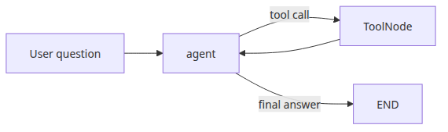
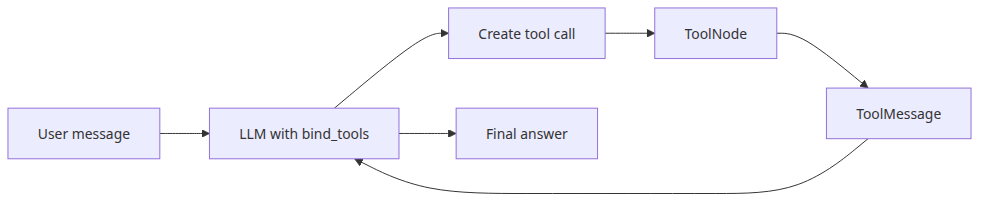
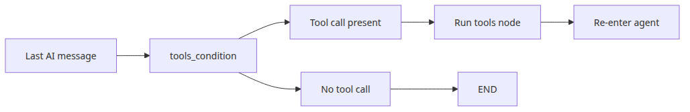
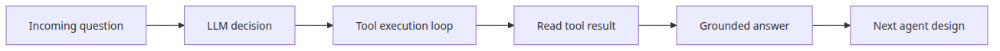

# Tool-calling agents

## Questions this post answers

- What responsibility does `ToolNode` take in a LangGraph agent?
- How do `ChatGroq.bind_tools()` and conditional edges work together?
- How does the graph know when the tool loop should stop?

> A tool-calling agent is a loop: the model decides whether it needs a tool, ToolNode executes the call, and the model reads the result before answering.

Example code: [github.com/yeongseon-books/langgraph-101](https://github.com/yeongseon-books/langgraph-101/tree/main/en/04-tool-calling-agent)

The key question is not whether the LLM can look clever. It is whether the tool path is explicit, inspectable, and easy to extend. In LangGraph 0.4.5, `ToolNode` plus `tools_condition` is the cleanest low-level pattern for that loop.



*Questions this post answers*
## Minimal runnable example


*Tool loop between agent and tools*
```python
import ast
import json
import math
import operator
from typing import Any, Callable

from langchain_core.messages import HumanMessage, SystemMessage
from langchain_core.tools import tool
from langchain_groq import ChatGroq
from langgraph.graph import END, START, MessagesState, StateGraph
from langgraph.prebuilt import ToolNode, tools_condition

ALLOWED_BINARY_OPERATORS = {
    ast.Add: operator.add,
    ast.Sub: operator.sub,
    ast.Mult: operator.mul,
    ast.Div: operator.truediv,
    ast.FloorDiv: operator.floordiv,
    ast.Mod: operator.mod,
    ast.Pow: operator.pow,
}
ALLOWED_UNARY_OPERATORS = {
    ast.UAdd: operator.pos,
    ast.USub: operator.neg,
}
ALLOWED_FUNCTIONS: dict[str, Callable[..., Any]] = {
    name: value
    for name, value in math.__dict__.items()
    if not name.startswith("_") and callable(value)
}
ALLOWED_CONSTANTS = {"pi": math.pi, "e": math.e, "tau": math.tau}

def evaluate_math_expression(expression: str) -> float:
    def _evaluate(node: ast.AST) -> float:
        if isinstance(node, ast.Constant) and isinstance(node.value, (int, float)):
            return float(node.value)
        if isinstance(node, ast.BinOp):
            left = _evaluate(node.left)
            right = _evaluate(node.right)
            operation = ALLOWED_BINARY_OPERATORS.get(type(node.op))
            if operation is None:
                raise ValueError("unsupported operator")
            return float(operation(left, right))
        if isinstance(node, ast.UnaryOp):
            operand = _evaluate(node.operand)
            operation = ALLOWED_UNARY_OPERATORS.get(type(node.op))
            if operation is None:
                raise ValueError("unsupported unary operator")
            return float(operation(operand))
        if isinstance(node, ast.Call) and isinstance(node.func, ast.Name):
            function = ALLOWED_FUNCTIONS.get(node.func.id)
            if function is None or node.keywords:
                raise ValueError("unsupported function")
            arguments = [_evaluate(argument) for argument in node.args]
            return float(function(*arguments))
        if isinstance(node, ast.Name):
            value = ALLOWED_CONSTANTS.get(node.id)
            if value is not None:
                return float(value)
            raise ValueError("unsupported constant")
        raise ValueError("unsupported expression")

    parsed = ast.parse(expression, mode="eval")
    return _evaluate(parsed.body)

@tool
def calculator(expression: str) -> str:
    """Evaluate an arithmetic expression with safe math functions like sqrt(16) or pi * 2."""

    try:
        result = evaluate_math_expression(expression)
    except Exception as exc:
        return f"calculation error: {exc}"
    return str(result)

@tool
def word_stats(text: str) -> str:
    """Return word and character counts for a piece of text."""

    return json.dumps({"words": len(text.split()), "characters": len(text)})

TOOLS = [calculator, word_stats]

def call_model(state: MessagesState):
    llm = ChatGroq(model="llama-3.3-70b-versatile", temperature=0.0, stop_sequences=None).bind_tools(TOOLS)
    system = SystemMessage(
        content="You are a precise assistant. Use tools for calculations or counting tasks."
    )
    response = llm.invoke([system, *state["messages"]])
    return {"messages": [response]}

def build_graph():
    graph = StateGraph(MessagesState)
    graph.add_node("agent", call_model)
    graph.add_node("tools", ToolNode(TOOLS))
    graph.add_edge(START, "agent")
    graph.add_conditional_edges("agent", tools_condition, {"tools": "tools", "__end__": END})
    graph.add_edge("tools", "agent")
    return graph.compile()

if __name__ == "__main__":
    app = build_graph()
    for question in [
        "What is sqrt(144) + 25? Use a tool.",
        "Count the words in this sentence: LangGraph makes tool loops explicit.",
    ]:
        result = app.invoke({"messages": [HumanMessage(content=question)]})
        print(f"Question: {question}")
        print(f"Answer: {result['messages'][-1].content}\n")
```

Runnable file: `/root/Github/langgraph-101/en/04-tool-calling-agent/main.py`

Run it with:

```bash
export GROQ_API_KEY=... && python main.py
```

## What to notice in this code



*Tool call and ToolMessage flow*
- Tool docstrings are the instructions the model actually sees.
- `ToolNode(TOOLS)` owns execution and the resulting `ToolMessage` objects.
- `tools_condition` routes to `tools` only when the last AI message includes tool calls; otherwise it ends the graph.

## Where engineers get confused



*Branching from last AI message*
- If you inline tool execution inside the model loop, retries, logging, and testing become harder than they need to be.
- `bind_tools()` only teaches the model how to request tools. It does not execute anything by itself.
- Deterministic tools are easier to debug. Keep the calculator tool on a strict arithmetic parser instead of raw `eval()`.

## Checklist

- [ ] Do tool descriptions clearly define inputs and outputs
- [ ] Is the `agent -> tools -> agent` loop explicit in the graph
- [ ] Do non-tool answers exit directly to `END`

## Summary



*Grounded answer loop after tool use*
At this point LangGraph starts to feel like an agent runtime rather than a workflow helper. In the next post, we extend the same pattern into a supervisor-worker design where multiple agents cooperate over shared state.

<!-- toc:begin -->
## In this series

- [LangGraph introduction and graph basics](./01-graph-basics.md)
- [State management and checkpoints](./02-state-and-checkpoints.md)
- [Conditional edges and branching](./03-conditional-edges.md)
- **Tool-calling agents (current)**
- Multi-agent systems (upcoming)
- Completing LangGraph (upcoming)

<!-- toc:end -->

---

## References

- [LangGraph tool-calling how-to](https://langchain-ai.github.io/langgraph/how-tos/tool-calling/)
- [ToolNode API reference](https://langchain-ai.github.io/langgraph/reference/prebuilt/#toolnode)
- [LangChain tool concepts](https://python.langchain.com/docs/concepts/tools/)
