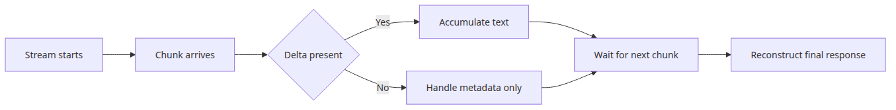
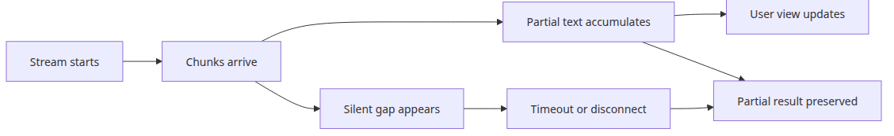
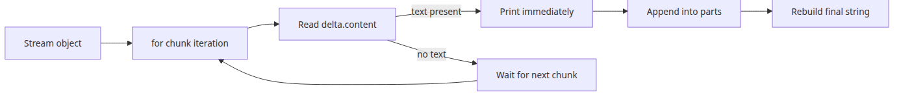
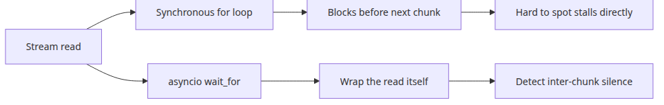
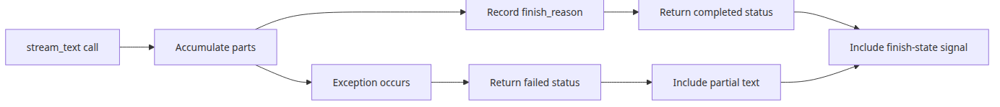
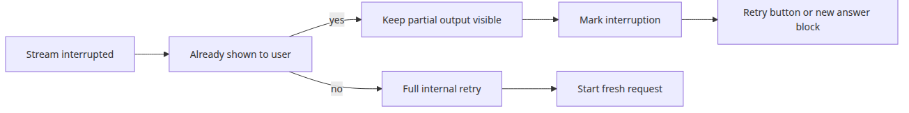

# Streaming in depth — chunk handling and error recovery

> LLM API Production 101 (3/6)

Example code: [github.com/yeongseon-books/llm-api-production-101](https://github.com/yeongseon-books/llm-api-production-101/tree/main/en/03-streaming-in-depth)

Streaming looks flashy in a demo, but in production it is really a protocol problem. Showing the first token quickly makes an application feel alive and reduces abandonment on long answers. That part is obvious. What is less obvious is that `stream=True` changes the failure model. Chunks may arrive without text, the connection may go quiet before it ends, the stream may fail after partial output has already been shown, and the final metadata may never arrive.

That means a streamed response should not be treated like an ordinary completion that simply happens to print early. It is better to think of it as a session with partial state. The application needs to render visible progress, reconstruct a final string for logging or persistence, detect inactivity between chunks, and preserve partial output when something breaks. Without that discipline, you end up with the worst kind of bug report: "sometimes the answer stops halfway through."

This post focuses on the consumer side of the Groq streaming path. We will start with the normal chunk loop, then harden it by treating empty deltas as normal, enforcing read timeouts outside the blocking loop, and returning partial results alongside error states.

The goal is not a clever UI effect. The goal is a streaming consumer that can explain what happened when the stream is incomplete.



*Streaming in depth: chunk handling and error recovery*
---

## Questions this chapter answers

- What does streaming change at the HTTP layer compared to a regular response?
- How do Server-Sent Events (SSE) differ from chunked transfer, and which do LLM APIs actually use?
- How do you safely accumulate and persist a partial response if the stream drops mid-flight?
- When should you buffer token-level chunks into word-level units before rendering?
- Where does usage data come from on a streaming response, and how do you aggregate it?

## Runtime setup

The examples assume Python 3.10 or later and the official `groq` SDK.

```bash
python3 -m venv .venv
source .venv/bin/activate
pip install groq
export GROQ_API_KEY="your-issued-key"
```

---

## What changes when the response is a stream



*Streaming session with partial-state flow*
A non-streaming request usually ends in one of two states: success with a final object, or failure with an exception. Streaming is more complicated because one request can contain both progress and failure.

Imagine a response like this:

- 30 chunks arrive normally
- then no new chunk appears for 12 seconds
- then the connection fails

That request is not a clean success, but it is not an empty failure either. The user may already have read part of the answer. Your server may already have written partial output into logs. A retry may need to decide whether to start over, append a new answer, or surface the interruption clearly.

For that reason, a streamed request is easier to manage if you explicitly track a few pieces of state:

- the text accumulated so far
- the time of the last meaningful chunk
- whether a normal finish signal was observed
- whether the stream ended by timeout, transport failure, or normal completion

That state gives you something much more useful than a raw exception. It gives you an observable timeline.

---

## The baseline chunk loop



*Execution path of the baseline chunk loop*
This is still the starting point.

```python
import os

from groq import Groq

client = Groq(api_key=os.environ["GROQ_API_KEY"])

stream = client.chat.completions.create(
    model="llama-3.1-8b-instant",
    messages=[
        {
            "role": "user",
            "content": "Explain FastAPI dependency injection for beginners.",
        }
    ],
    temperature=0.2,
    stream=True,
)

parts: list[str] = []

for chunk in stream:
    delta = chunk.choices[0].delta.content
    if delta:
        print(delta, end="", flush=True)
        parts.append(delta)

final_text = "".join(parts)
print("\n---")
print(final_text)
```

This loop is useful because it serves two audiences at once. The user sees output immediately, while the application keeps a final reconstructed string for storage, moderation, caching, or later analysis.

It is also incomplete for production. It assumes every loop iteration is meaningful, ignores inactivity, and throws away context if an exception interrupts the stream.

---

## Treating empty chunks as normal

One of the easiest mistakes is assuming that every chunk contains visible text. In practice, some chunks may carry role information, stop signals, or metadata with no new content. A robust consumer should treat that as a normal case.

```python
for chunk in stream:
    choice = chunk.choices[0]
    delta = choice.delta.content

    if delta is not None and delta != "":
        print(delta, end="", flush=True)
        parts.append(delta)

    if choice.finish_reason is not None:
        print(f"\nfinish_reason={choice.finish_reason}")
```

This matters mostly because it keeps the consumer calm. Empty chunks are not necessarily warnings. They are part of the protocol. If you log them as failures, your telemetry becomes noisy and harder to trust.

---

## Enforcing timeouts outside the loop



*Sync loop versus async timeout comparison*
A total request timeout is still useful, but it is not enough for streaming. From the user's point of view, the more direct question is whether progress is still happening. A long answer that keeps producing text is usually acceptable. A silent stream that has produced nothing new for ten seconds often feels broken.

The subtle part is implementation. A plain synchronous `for chunk in stream:` loop cannot detect a true inter-chunk stall by itself, because it is blocked while waiting for the next chunk. Checking `time.monotonic()` inside the loop body only runs after something has already arrived.

To detect real silence between chunks, the timeout has to wrap the read operation itself. Common options are configuring a read timeout in the HTTP client, consuming an async stream with `asyncio.wait_for`, or reading in a background task and applying a deadline to a queue.

The example below shows the async pattern with `asyncio.wait_for` around each streamed read.

```python
import asyncio
import os

from groq import AsyncGroq

INACTIVITY_TIMEOUT_SECONDS = 8.0

client = AsyncGroq(api_key=os.environ["GROQ_API_KEY"])

async def consume_stream(prompt: str) -> dict:
    stream = await client.chat.completions.create(
        model="llama-3.1-8b-instant",
        messages=[{"role": "user", "content": prompt}],
        stream=True,
    )

    parts: list[str] = []

    while True:
        try:
            chunk = await asyncio.wait_for(
                anext(stream),
                timeout=INACTIVITY_TIMEOUT_SECONDS,
            )
        except asyncio.TimeoutError as exc:
            return {"status": "timeout", "text": "".join(parts), "error": str(exc)}
        except StopAsyncIteration:
            return {"status": "completed", "text": "".join(parts)}

        delta = chunk.choices[0].delta.content
        if delta:
            parts.append(delta)
            print(delta, end="", flush=True)

asyncio.run(consume_stream("Explain why Python context managers are useful."))
```

The important idea is not the exact number of seconds. It is the distinction between total duration and visible progress, plus the fact that timeout enforcement has to wrap the read itself.

If you need to stay on a synchronous code path, configure a transport timeout up front so the stream does not wait forever. Still, the example below is only a coarse client timeout, not a precise per-chunk inactivity detector. If you need true inter-chunk timing guarantees, the read itself has to be wrapped as shown in the async example.

```python
import os

from groq import Groq

client = Groq(
    api_key=os.environ["GROQ_API_KEY"],
    timeout=8.0,
)

stream = client.chat.completions.create(
    model="llama-3.1-8b-instant",
    messages=[{"role": "user", "content": "Explain Python generators."}],
    stream=True,
)

for chunk in stream:
    delta = chunk.choices[0].delta.content
    if delta:
        print(delta, end="", flush=True)
```

---

## Keeping partial output on failure



*State preserved in a streaming result object*
When a stream fails, the easiest bad decision is to throw away everything received so far. That makes recovery and debugging harder. The user may already have seen part of the answer. The partial text may reveal whether the problem was a mid-sentence interruption, a code block that never closed, or a provider-side termination.

A better pattern is to return a structured result that always includes accumulated text.

```python
import os

from groq import Groq

def stream_text(prompt: str) -> dict:
    client = Groq(api_key=os.environ["GROQ_API_KEY"])
    stream = client.chat.completions.create(
        model="llama-3.1-8b-instant",
        messages=[{"role": "user", "content": prompt}],
        temperature=0.2,
        stream=True,
    )

    parts: list[str] = []
    finish_reason = None

    try:
        for chunk in stream:
            choice = chunk.choices[0]
            delta = choice.delta.content
            if delta:
                parts.append(delta)
                print(delta, end="", flush=True)

            if choice.finish_reason is not None:
                finish_reason = choice.finish_reason

        return {
            "status": "completed",
            "text": "".join(parts),
            "finish_reason": finish_reason,
            "saw_finish_reason": finish_reason is not None,
        }
    except Exception as exc:
        return {
            "status": "failed",
            "text": "".join(parts),
            "error": str(exc),
            "finish_reason": finish_reason,
            "saw_finish_reason": finish_reason is not None,
        }
```

This wrapper turns a streaming loop into a higher-level result object. The caller can distinguish `completed` and `failed` while still receiving any partial text that was produced before the interruption. Timeout classification is better handled by the transport or async wrapper shown earlier, then mapped into application status at the boundary. The wrapper also preserves the finish-state signal so the caller knows whether the stream ended normally.

That design is especially useful in web applications. A controller can keep the partial output visible, add a notice that generation was interrupted, and decide whether a retry should be automatic or user-triggered.

---

## Signals that the stream may be incomplete

You cannot always prove that one chunk was silently lost, but you can detect suspicious endings.

Common signals include:

- the response ends mid-sentence
- a code block opens but never closes
- the connection ends without a finish reason
- usage metadata is expected but never appears

These checks are not about judging answer quality. They are about checking transport completeness. For Markdown-heavy answers, unmatched code fences are a useful cheap signal. For structured output, a final `json.loads()` check can tell you whether a streamed JSON object likely arrived intact.

The larger point is that production streaming paths should have an idea of what a plausible ending looks like.

---

## Retrying after a streaming failure



*Retry decision after stream interruption*
Retries are harder for streaming than for plain request-response calls because some output may already have been shown to the user.

Two cases are worth separating.

For **internal pipelines**, a full retry is often fine if no human has seen the partial result yet. You can discard the partial text and request a fresh answer.

For **interactive user interfaces**, preserving context is usually better. Once the user has started reading, restarting from the top can feel confusing. In that case, it is often better to keep the partial output visible, clearly mark the interruption, and let the next attempt appear as a new continuation or a second answer block.

That is one of the important operational truths about streaming: emitted tokens are not retractable. Once they have been sent, the retry policy becomes a UX choice as much as an API choice. It also means timeout support should be designed together with the transport instead of improvised inside a blocking iterator body.

Here is a small caller-side recovery example that keeps partial text visible and then decides whether to retry.

```python
result = stream_text("Explain the difference between FastAPI and Flask.")

print("partial_text=")
print(result["text"])

if result["status"] == "completed":
    print("stream completed normally")
else:
    print("stream interrupted")
    print("show retry button to the user")
```

---

## Closing

In this post, we treated streaming as a protocol with partial state rather than a cosmetic output mode. The practical rules are simple: treat empty chunks as normal, enforce read timeouts outside the blocking loop, preserve accumulated text on failure, and check whether the stream ended in a plausible way instead of assuming every interruption is the same.

Structured output and tool calling made the response boundary more explicit. Streaming stretches that same boundary across time. The next topic stays on the operational side and asks a different question: when similar requests keep arriving, how do you avoid paying the full latency and token cost every time?

## Operational checklist

- [ ] Validated an async client that consumes SSE/chunked responses correctly
- [ ] Defined a resume strategy that preserves partial output on disconnect
- [ ] Handled token whitespace and newlines so the UI renders stable text
- [ ] Captured usage data at stream close and fed it into cost metrics
- [ ] Branched separately on mid-stream tool calls and error chunks

<!-- toc:begin -->
## In this series

- [Structured output — JSON mode and response schemas](./01-structured-output.md)
- [Tool calling — connecting functions to the model](./02-tool-calling.md)
- **Streaming in depth — chunk handling and error recovery (current)**
- Caching strategies — reducing cost and latency (upcoming)
- Retry and error handling — making API calls reliable (upcoming)
- Rate limit management — patterns for staying within limits (upcoming)

<!-- toc:end -->

---

## References

- <https://console.groq.com/docs/text-chat>
- <https://developer.mozilla.org/en-US/docs/Web/API/Server-sent_events>
