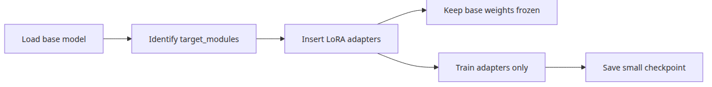
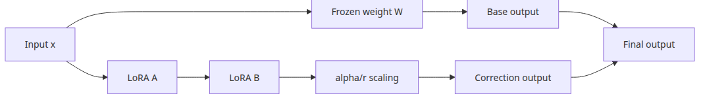
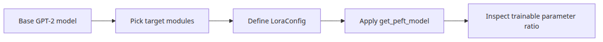
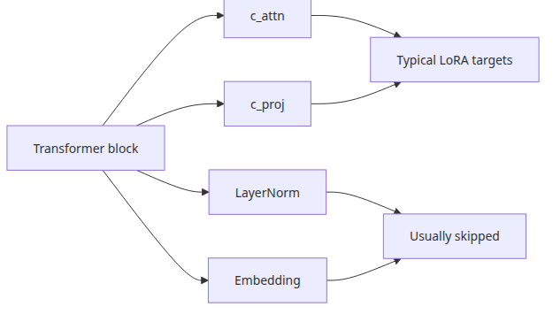
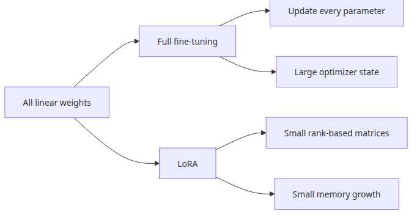

# Configuring LoRA Adapters

## Questions this post answers



*Questions this post answers*

- Which `LoraConfig` fields actually need to be understood?
- What goes wrong when `target_modules` is mis-specified?
- For a tiny GPT-2 class model, how low does the trainable parameter ratio go?
- How does the `lora_alpha / r` ratio (scaling) interact with learning rate?

> A LoRA adapter is not a device for rewriting an entire model — it is a small correction patch attached beside specific linear transformations.

Example code: [github.com/yeongseon-books/llm-finetuning-101](https://github.com/yeongseon-books/llm-finetuning-101/tree/main/en/03-lora)

## Why this matters

From post 3 we touch real model objects. We assume no GPU and use a tiny model like `sshleifer/tiny-gpt2`, but the goal at this stage is not performance — it is **verifying that wiring is correct**. A single typo in `target_modules` makes `print_trainable_parameters()` print 0 with no traceback. Training runs, loss does not move — the most diagnostically painful failure mode in fine-tuning starts here.

Once the adapter wiring is verified in post 3, when training fails to converge in post 4 you can immediately split "is this a data problem or an adapter problem?" You also get to confirm at the code level that the 1.5% ratio you computed by hand in post 1 matches what PEFT actually reports — which means you can estimate the ratio for any base model afterwards.

## Mental model

A LoRA adapter is summarized by:

```
Original forward:  y = W · x

LoRA forward:      y = W · x + (alpha / r) · B · A · x
                          │           │   │
                          │           │   └ rank-r low-rank decomposition
                          │           └ scale factor
                          └ base weight (frozen)
```

- `W` is frozen. No gradient flows through it.
- `A: (in, r)` is typically Gaussian-initialized, `B: (r, out)` is initialized to zero. So at training step 0, `B·A = 0` and the model behaves identically to the base.
- As training proceeds, `B` moves away from zero and the correction kicks in.
- `alpha / r` controls correction magnitude. The convention `alpha = 2 * r` is a sensible default.

This structure means inserting an adapter does not change model behavior at the moment of attachment; behavior shifts only as far as training has progressed.

## Core concepts

| Field | Meaning |
| --- | --- |
| `r` | LoRA rank. Smaller is lighter, larger is more expressive |
| `lora_alpha` | Scale factor. Effective influence is `alpha / r` |
| `lora_dropout` | Dropout applied only on the adapter path (base is untouched) |
| `target_modules` | Names of linear layers where LoRA attaches |
| `bias` | Bias-training policy: `"none"`, `"all"`, `"lora_only"` |
| `task_type` | `CAUSAL_LM`, `SEQ_CLS`, … so PEFT recognizes the head correctly |

## Before vs. after

**Before** — You apply `LoraConfig(r=8, target_modules=["q_proj", "v_proj"])` to GPT-2 verbatim and `print_trainable_parameters()` happily reports `trainable params: 0`. Training runs but loss is flat.

**After** — You inspect GPT-2 and see attention modules are named `c_attn` (Q, K, V fused) and `c_proj`, then change to:

```
trainable params: 1,478,656 || all params: 125,917,184 || trainable%: 1.1745
```

That single line confirms attachment. It also lines up with the 1.5% you computed by hand in post 1.

## What to fix first about the config



*Low-rank decomposition and scaling structure*

`r` is the low-rank dimension, `lora_alpha` is the scale, and `lora_dropout` is dropout on the adapter path only. The most accident-prone field in practice is `target_modules`. Get this list wrong and either nothing attaches, or you attach to layers you did not mean to.



*Fields with real operational impact*

## Step-by-step walkthrough

### Step 1 — Load the base model

```python
from transformers import AutoModelForCausalLM

model = AutoModelForCausalLM.from_pretrained("sshleifer/tiny-gpt2")
print(sum(p.numel() for p in model.parameters()))
```

### Step 2 — Confirm module names

```python
for name, module in model.named_modules():
    if hasattr(module, "weight") and module.weight.dim() == 2:
        print(name, tuple(module.weight.shape))
```

GPT-2 names like `transformer.h.0.attn.c_attn`, `c_proj`. Llama-3 uses `q_proj`, `k_proj`, `v_proj`, `o_proj`. Qwen uses yet another scheme. **Always check directly.**

### Step 3 — Define `LoraConfig`

```python
from peft import LoraConfig, TaskType

config = LoraConfig(
    task_type=TaskType.CAUSAL_LM,
    r=8,
    lora_alpha=16,
    lora_dropout=0.05,
    target_modules=["c_attn", "c_proj"],
    bias="none",
)
```

### Step 4 — Attach the adapter

```python
from peft import get_peft_model

peft_model = get_peft_model(model, config)
peft_model.print_trainable_parameters()
```

If `trainable%` lands in the 1–3% range, attachment succeeded. If it is 0, recheck `target_modules` names.

### Step 5 — Inspect adapter locations

```python
for name, param in peft_model.named_parameters():
    if param.requires_grad:
        print(name, tuple(param.shape))
```

Only parameters ending in `lora_A` and `lora_B` should be trainable. Anything else means a module you did not intend is being trained.

## What to notice in this code



*Choosing target modules for GPT-style models*

- GPT-2 attention/projection modules are named `c_attn` and `c_proj`, so `target_modules` strings must match exactly.
- A `fan_in_fan_out` warning may appear at runtime — that is PEFT correctly accounting for GPT-2's `Conv1D` wrapper, not an error.
- This post's example is for wiring verification only. Actual training is connected via `Trainer` in post 4.
- `c_attn` packs Q, K, V into one matrix, so a single name attaches LoRA to all three projections at once.

## Common mistakes



*Full fine-tuning vs. LoRA parameter scale*

- **Typo in target_modules** — most common failure. `trainable params: 0` with no traceback. Always sanity-check with `print_trainable_parameters()`.
- **Decoupling r and alpha** — setting `r=64, alpha=16` makes the correction so small that little learning happens. Default to `alpha = 2 * r`.
- **Setting `bias="all"` carelessly** — training biases inflates the adapter and makes reverting to the base harder. `"none"` is the default for a reason.
- **Slapping LoRA on every linear layer** — attention QKV alone is often enough. Including the MLP doubles or triples trainable params.
- **Confusing Conv1D with Linear** — GPT-2 uses `transformers.pytorch_utils.Conv1D`, not `nn.Linear`; fan_in/fan_out are reversed. Hand-rolled LoRA misaligns. Trust PEFT to handle it.

## Field notes

- **Maintain a per-model `target_modules` table**: GPT-2 → `["c_attn", "c_proj"]`, Llama → `["q_proj", "v_proj"]` (conservative) or the full `["q_proj","k_proj","v_proj","o_proj","gate_proj","up_proj","down_proj"]` (aggressive). Pin it in the team wiki.
- **Compare `r=8` vs `r=16`**: run twice on the same data and compare loss curves and eval metrics. If there is no meaningful gap, stay at r=8.
- **Merge into base (`merge_and_unload`)**: when inference latency matters, merge the adapter into the base post-training and ship as one model. The merged model behaves like a regular model, not a LoRA model.
- **Save adapter only**: `peft_model.save_pretrained("adapter/")` produces a small (single-digit MB) artifact. The base model is fetched separately from cache.

## Checklist

- [ ] You can explain the meaning of each key `LoraConfig` field.
- [ ] You understand why `target_modules` differs across models.
- [ ] `python main.py` actually attached an adapter and printed a non-zero ratio.
- [ ] `trainable%` landed in the 1–3% range.
- [ ] Only `lora_A` and `lora_B` parameters have `requires_grad=True`.
- [ ] You are ready to push at least one training step through this model in post 4.

## Exercises

1. Sweep `r` over {4, 8, 16, 32} and print how `trainable%` changes. Does it match your hand calculation from post 1?
2. Restrict `target_modules` to `["c_attn"]` only. How much does the ratio drop? Hypothesize how evaluation results would shift.
3. Call `peft_model.merge_and_unload()` and inspect the resulting parameter count. Can this merged model be split back into a LoRA adapter?

## Wrap-up · next post

The point of LoRA configuration is **wiring verification**, not performance tuning. Just by checking where the adapter attaches and how many parameters become trainable, half the work is done.

Post 4 covers the training loop. We push real gradients through this adapter and watch how learning rate / batch size / gradient accumulation reshape the loss curve.

<!-- toc:begin -->
## In this series

- [LLM Fine-tuning Primer](./01-intro.md)
- [Dataset Preparation and Preprocessing](./02-dataset.md)
- **Configuring LoRA Adapters (current)**
- Training Loop and Hyperparameters (upcoming)
- Model Evaluation (upcoming)
- Model Serving (upcoming)

<!-- toc:end -->

---

## References

- [PEFT quicktour](https://huggingface.co/docs/peft/quicktour)
- [Transformers model classes](https://huggingface.co/docs/transformers/index)
- [LoRA paper](https://arxiv.org/abs/2106.09685)
- [PEFT LoraConfig source](https://github.com/huggingface/peft/blob/main/src/peft/tuners/lora/config.py)
