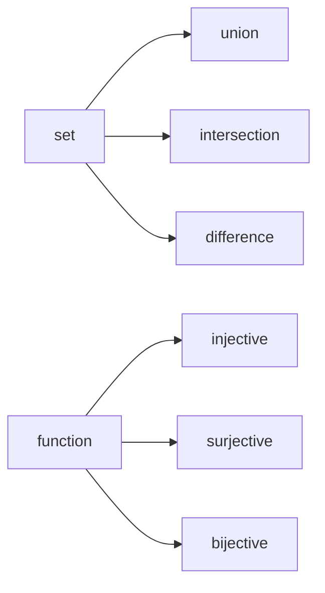

# Sets and Functions

> Math for CS 101 series (3/10)

<!-- a-grade-intro:begin -->

**Core question**: What lies at the *foundation* of *data structures*?

> A *set* is a *collection of elements*; a *function* is a *rule* from *input* to *output*.

<!-- a-grade-intro:end -->

## What You Will Learn

- The definition of a *set*
- *Union*, *intersection*, *difference*
- The definition of a *function*
- *Injective*, *surjective*, *bijective*
- *Composition* of functions

## Why It Matters

Python's *set*, *dict*, *map*, and *filter* are all reinterpretations of *sets and functions*.

## Concept at a Glance



## Key Terms

- **set**: a collection of *distinct* elements.
- **union**: all elements.
- **intersection**: *shared* elements.
- **function**: one *output* per *input*.
- **bijection**: *injective* and *surjective*.

## Before/After

**Before**: handle everything with *lists*.

**After**: handle it with *sets* and *functions*, more clearly.

## Hands-on: Five Steps with Sets and Functions

### Step 1 — Sets

```python
A, B = {1, 2, 3}, {2, 3, 4}
```

### Step 2 — Union, intersection, difference

```python
def ops(A, B):
    return A | B, A & B, A - B
```

### Step 3 — A function

```python
def square(x):
    return x * x
```

### Step 4 — Injective check

```python
def is_injective(f, domain):
    return len({f(x) for x in domain}) == len(list(domain))
```

### Step 5 — Composition

```python
def compose(f, g):
    return lambda x: f(g(x))
```

## What to Notice in This Code

- The *operations* are *one operator* each.
- *Injective* is a *length* comparison.
- *Composition* is a *lambda*.

## Five Common Mistakes

1. **Confusing *list* and *set*.**
2. **Confusing *function* with *relation*.**
3. **Mixing up *injective* and *surjective*.**
4. **Misordering in *composition*.**
5. **Missing the *empty set* case.**

## How This Shows Up in Production

*Permission checks* are *set intersections*, *data mapping* is *function composition*, and *deduplication* is a *set conversion*.

## How a Senior Engineer Thinks

- *Sets* are *clear*.
- *Functions* are *deterministic*.
- *Bijections* are *invertible*.
- *Composition* is a *pipe*.
- The *empty set* is the *base case*.

## Checklist

- [ ] Translate *operations* to *code*.
- [ ] Specify *domain* and *codomain*.
- [ ] Decide *injective/surjective*.
- [ ] Check *composability*.

## Practice Problems

1. Define *injective* in one line.
2. Define *surjective* in one line.
3. Define *composition* in one line.

## Wrap-up and Next Steps

Next, we cover *graphs*.

<!-- toc:begin -->
- [Why Math for CS](./01-why-math-for-cs.md)
- [Logic and Proofs](./02-logic-and-proofs.md)
- **Sets and Functions (current)**
- Graphs (upcoming)
- Combinatorics (upcoming)
- Probability (upcoming)
- Linear Algebra (upcoming)
- Calculus (upcoming)
- Information Theory (upcoming)
- Algorithms and Math (upcoming)
<!-- toc:end -->

## References

- [Sets - Wolfram MathWorld](https://mathworld.wolfram.com/Set.html)
- [Functions - Khan Academy](https://www.khanacademy.org/math/algebra/x2f8bb11595b61c86:functions)
- [Discrete Math - Rosen](https://en.wikipedia.org/wiki/Discrete_Mathematics_and_Its_Applications)
- [Python Set Operations](https://docs.python.org/3/tutorial/datastructures.html#sets)
