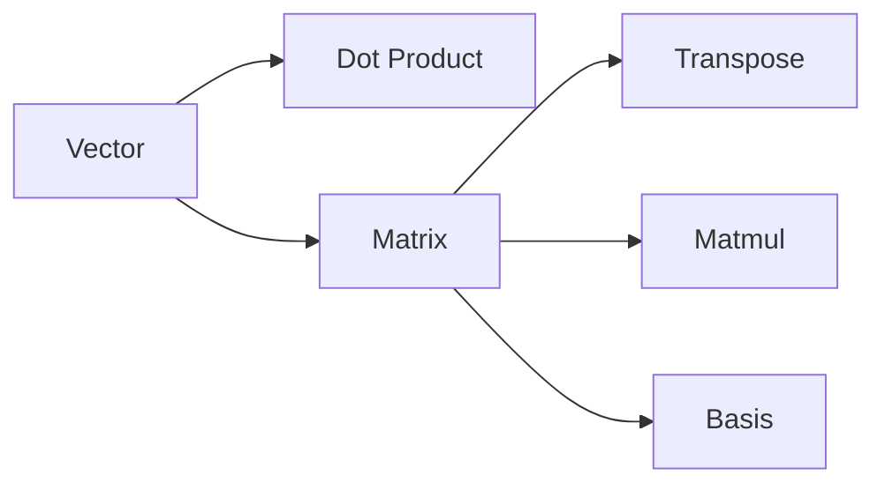

# Linear Algebra

> Math for CS 101 series (7/10)

<!-- a-grade-intro:begin -->

**Core question**: What *language* lets us handle *data* and *transforms* efficiently?

> *Linear algebra* is the *common language* of data and transforms behind *ML*, *graphics*, and *simulation*.

<!-- a-grade-intro:end -->

## What You Will Learn

- What a *vector* means
- What a *matrix* means
- *Dot product* and *angle*
- *Matrix multiplication* and *transpose*
- Intuition for *basis*

## Why It Matters

*Embeddings*, *PCA*, *recommenders*, and *3D transforms* all run on linear algebra.

## Concept at a Glance



## Key Terms

- **vector**: *direction and magnitude*.
- **matrix**: a *collection of vectors*.
- **dot product**: a *similarity* score.
- **transpose**: swap *rows and columns*.
- **basis**: the *axes* of a space.

## Before/After

**Before**: element-wise *for loops*.

**After**: a single *vectorized* line.

## Hands-on: Mini Linear Algebra Kit

### Step 1 — Vector Add

```python
def vadd(a, b):
    return [x + y for x, y in zip(a, b)]
```

### Step 2 — Dot Product

```python
def dot(a, b):
    return sum(x * y for x, y in zip(a, b))
```

### Step 3 — Matrix-Vector

```python
def matvec(M, v):
    return [dot(row, v) for row in M]
```

### Step 4 — Transpose

```python
def transpose(M):
    return [list(col) for col in zip(*M)]
```

### Step 5 — Matrix-Matrix

```python
def matmul(A, B):
    Bt = transpose(B)
    return [[dot(row, col) for col in Bt] for row in A]
```

## What to Notice in This Code

- *Dot product* is the core op.
- *Transpose* is one *zip* call.
- *Matmul* is a *grid of dot products*.

## Five Common Mistakes

1. **Mismatching *row/column* dimensions.**
2. **Assuming matrix multiplication is *commutative*.**
3. **Confusing *dot* and *cross* products.**
4. **Skipping *numpy* and losing performance.**
5. **Thinking *transpose* mutates the original.**

## How This Shows Up in Production

*Embedding search*, *ranking scores*, *camera transforms*, and *neural net forward passes* are all matrix ops.

## How a Senior Engineer Thinks

- *Vectors* are *data*.
- *Matrices* are *transforms*.
- *Vectorization* is *performance*.
- *Basis* is *interpretation*.
- Mind *numerical stability* too.

## Checklist

- [ ] State *dimensions*.
- [ ] *Vectorize* loops.
- [ ] Make *transpose* intent explicit.
- [ ] Inspect *numerical stability*.

## Practice Problems

1. Define the *dot product* in one line.
2. Define *transpose* in one line.
3. State the *condition* for matrix multiplication.

## Wrap-up and Next Steps

Next post: *Calculus*.

<!-- toc:begin -->
- [Why Math for CS](./01-why-math-for-cs.md)
- [Logic and Proofs](./02-logic-and-proofs.md)
- [Sets and Functions](./03-sets-and-functions.md)
- [Graphs](./04-graphs.md)
- [Combinatorics](./05-combinatorics.md)
- [Probability](./06-probability.md)
- **Linear Algebra (current)**
- Calculus (upcoming)
- Information Theory (upcoming)
- Algorithms and Math (upcoming)
<!-- toc:end -->

## References

- [Linear Algebra - 3Blue1Brown](https://www.3blue1brown.com/topics/linear-algebra)
- [Linear Algebra - Khan Academy](https://www.khanacademy.org/math/linear-algebra)
- [Introduction to Linear Algebra - Strang](https://math.mit.edu/~gs/linearalgebra/)
- [NumPy Linear Algebra Documentation](https://numpy.org/doc/stable/reference/routines.linalg.html)
