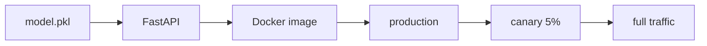

# Model Deployment

> MLOps 101 series (5/10)

<!-- a-grade-intro:begin -->

**Core question**: How do you take a *trained model file* and *expose it to users safely*?

> *Model deployment wraps a model file in an API or batch job and runs it inside a reproducible environment.*

<!-- a-grade-intro:end -->

## What You Will Learn

- Three deployment patterns (online / batch / streaming)
- Building a model API with FastAPI
- Pinning the environment with Docker
- Blue/Green and Canary releases
- Five common pitfalls

## Why It Matters

When people say "deployment is hard," they usually mean *environment drift* and *no rollback*. Containers and gradual rollout are the answer.

## Concept at a Glance



## Key Terms

- **Online inference**: request in, response out.
- **Batch inference**: process large data on a schedule.
- **Blue/Green**: switch between two parallel environments.
- **Canary**: route a small slice of traffic first.
- **Rollback**: revert to the previous version.

## Before/After

**Before**: calling `predict` from a notebook by hand.

**After**: a container exposes an HTTP endpoint.

## Hands-on: Serve a Model with FastAPI

### Step 1 — Prepare a model

```python
import pickle
from sklearn.linear_model import LogisticRegression

m = LogisticRegression().fit([[0], [1], [2], [3]], [0, 0, 1, 1])
with open("model.pkl", "wb") as f:
    pickle.dump(m, f)
```

### Step 2 — FastAPI app

```python
from fastapi import FastAPI
from pydantic import BaseModel
import pickle

app = FastAPI()
model = pickle.load(open("model.pkl", "rb"))

class Req(BaseModel):
    x: float

@app.post("/predict")
def predict(r: Req):
    p = model.predict([[r.x]])[0]
    return {"prediction": int(p)}
```

### Step 3 — Health check

```python
@app.get("/healthz")
def health():
    return {"ok": True, "version": "1.0.0"}
```

### Step 4 — Dockerfile

```dockerfile
FROM python:3.11-slim
WORKDIR /app
COPY requirements.txt .
RUN pip install -r requirements.txt
COPY . .
CMD ["uvicorn", "main:app", "--host", "0.0.0.0", "--port", "8000"]
```

### Step 5 — Build and run

```bash
docker build -t model-api:1.0.0 .
docker run -p 8000:8000 model-api:1.0.0
curl -X POST localhost:8000/predict -H "Content-Type: application/json" -d '{"x": 2.5}'
```

## What to Notice in This Code

- The model is loaded once at startup, not per request.
- Pydantic validates input automatically.
- Health checks let the orchestrator know what is alive.

## Five Common Mistakes

1. **No version tag — you cannot tell which model is live.**
2. **Unpinned `requirements.txt` — broken reproducibility.**
3. **No rollback procedure documented.**
4. **Model and code tightly coupled — hard to swap models.**
5. **Missing input validation — server crashes on bad payloads.**

## How This Shows Up in Production

Recommendation models often run as FastAPI in Docker on Kubernetes. Weekly reports run as batch jobs. Real-time ad ranking runs as streaming inference.

## How a Senior Engineer Thinks

- The model is an artifact, separate from code.
- Canary releases reduce blast radius.
- Health checks plus metrics are non-negotiable.
- Pass the model path through environment variables.
- The image tag is the model version.

## Checklist

- [ ] A `Dockerfile` exists.
- [ ] A health endpoint is exposed.
- [ ] Input schemas are validated.
- [ ] A rollback plan is documented.

## Practice Problems

1. Add a `/version` endpoint that returns the model SHA.
2. Sketch a canary rollout using Nginx weight directives.
3. What changes if you turn this into a batch inference job?

## Wrap-up and Next Steps

Deployment is the start, not the end — *monitoring* is where real life begins. The next post covers *model monitoring*.

<!-- toc:begin -->
- [What is MLOps?](./01-what-is-mlops.md)
- [Experiment Tracking](./02-experiment-tracking.md)
- [Data Versioning](./03-data-versioning.md)
- [Model Training Pipeline](./04-training-pipeline.md)
- **Model Deployment (current)**
- Model Monitoring (upcoming)
- Data Drift and Model Drift (upcoming)
- Retraining (upcoming)
- Feature Store (upcoming)
- Building a Production ML System (upcoming)
<!-- toc:end -->

## References

- [FastAPI documentation](https://fastapi.tiangolo.com/)
- [Docker — Dockerfile best practices](https://docs.docker.com/develop/develop-images/dockerfile_best-practices/)
- [BentoML](https://docs.bentoml.com/)
- [Seldon Core](https://docs.seldon.io/projects/seldon-core/en/latest/)
