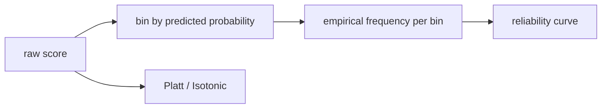

# Calibration

> Model Evaluation 101 series (7/10)

<!-- a-grade-intro:begin -->

**Core question**: When a model says "80% confident," is it actually right 80% of the time?

> *Calibration measures how well predicted probabilities match observed frequencies. It is a different axis from threshold tuning.*

<!-- a-grade-intro:end -->

## What You Will Learn

- The definition and purpose of calibration
- How to read a reliability diagram
- The meaning of Brier score
- Platt scaling and isotonic regression
- Five common pitfalls

## Why It Matters

Systems that multiply probabilities by costs to make decisions need calibration more than AUC.

## Concept at a Glance



## Key Terms

- **Calibration**: predicted probability equals observed frequency.
- **Reliability diagram**: predicted vs observed frequency per bin.
- **Brier score**: mean of `(p - y)^2`. Lower is better.
- **Platt scaling**: a sigmoid post-fit.
- **Isotonic regression**: a non-parametric monotonic fit.

## Before/After

**Before**: "proba is 0.9, very confident."

**After**: check the reliability curve, compare Brier scores, switch to isotonic if needed.

## Hands-on: 5 Steps Through Calibration

### Step 1 — Data and model

```python
from sklearn.datasets import make_classification
from sklearn.model_selection import train_test_split
from sklearn.ensemble import RandomForestClassifier
X, y = make_classification(n_samples=3000, weights=[0.7, 0.3], random_state=0)
Xtr, Xte, ytr, yte = train_test_split(X, y, stratify=y, random_state=42)
rf = RandomForestClassifier(n_estimators=100, random_state=0).fit(Xtr, ytr)
proba = rf.predict_proba(Xte)[:, 1]
```

### Step 2 — Reliability curve

```python
from sklearn.calibration import calibration_curve
frac_pos, mean_pred = calibration_curve(yte, proba, n_bins=10)
for mp, fp in zip(mean_pred, frac_pos):
    print(round(mp, 2), round(fp, 2))
```

### Step 3 — Brier score

```python
from sklearn.metrics import brier_score_loss
print("brier:", brier_score_loss(yte, proba))
```

### Step 4 — Platt scaling

```python
from sklearn.calibration import CalibratedClassifierCV
platt = CalibratedClassifierCV(rf, method="sigmoid", cv=5).fit(Xtr, ytr)
print("brier (platt):", brier_score_loss(yte, platt.predict_proba(Xte)[:, 1]))
```

### Step 5 — Isotonic calibration

```python
iso = CalibratedClassifierCV(rf, method="isotonic", cv=5).fit(Xtr, ytr)
print("brier (isotonic):", brier_score_loss(yte, iso.predict_proba(Xte)[:, 1]))
```

## What to Notice in This Code

- Raw RF probabilities tend to be over- or under-confident.
- Platt scaling is stable on small data.
- Isotonic regression is flexible when data is plentiful.

## Five Common Mistakes

1. Assuming great AUC implies trustworthy probabilities.
2. Fitting calibration on training data.
3. Picking too few or too many bins for the reliability curve.
4. Overfitting isotonic on small samples.
5. Reusing the old threshold after recalibration.

## How This Shows Up in Production

Expected-value bidding (ads, insurance) ties calibrated probabilities directly to revenue.

## How a Senior Engineer Thinks

- AUC and calibration are independent qualities.
- Use a held-out calibration set.
- Brier rolls AUC and calibration into one number.
- Re-tune the threshold after recalibration.
- Recalibrate on drift.

## Checklist

- [ ] I read the reliability diagram.
- [ ] I compare Brier scores.
- [ ] My calibration set is held out.
- [ ] I scheduled recalibration.

## Practice Problems

1. Compare reliability curves of logistic regression and random forest.
2. Compare Brier scores between sigmoid and isotonic calibration.
3. Check whether AUC changes meaningfully after calibration.

## Wrap-up and Next Steps

Calibration is the truth of the probability itself. Next, cross validation tackles the variance of evaluation.

<!-- toc:begin -->
- [Why Model Evaluation Is Hard](./01-why-evaluation-is-hard.md)
- [Train, Validation, and Test](./02-train-val-test.md)
- [The Limits of Accuracy](./03-limits-of-accuracy.md)
- [Precision and Recall](./04-precision-and-recall.md)
- [F1 Score](./05-f1-score.md)
- [ROC and AUC](./06-roc-and-auc.md)
- **Calibration (current)**
- Cross Validation (upcoming)
- Error Analysis (upcoming)
- Building an Evaluation Report (upcoming)
<!-- toc:end -->

## References

- [scikit-learn — Calibration](https://scikit-learn.org/stable/modules/calibration.html)
- [scikit-learn — calibration_curve](https://scikit-learn.org/stable/modules/generated/sklearn.calibration.calibration_curve.html)
- [Wikipedia — Brier score](https://en.wikipedia.org/wiki/Brier_score)
- [Niculescu-Mizil & Caruana 2005](https://www.cs.cornell.edu/~alexn/papers/calibration.icml05.crc.rev3.pdf)
