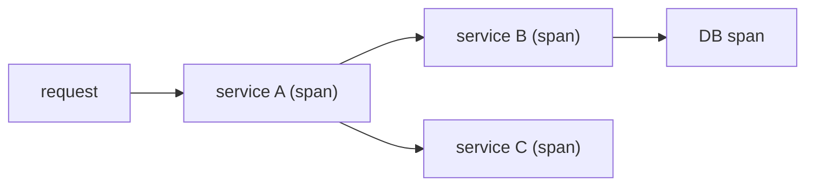

# Distributed Tracing Basics

> Observability 101 series (5/10)

<!-- a-grade-intro:begin -->

**Core question**: When one request crosses *five services*, how do you tell *where it slowed down*?

> *Distributed tracing binds *every span of a single request* under *one trace_id* and shows it as a *flow graph*.*

<!-- a-grade-intro:end -->

## What You Will Learn

- The definition of *span* and *trace*
- What *context propagation* means
- *Sampling* strategies
- Your first trace with *OpenTelemetry*
- Five common pitfalls

## Why It Matters

In a microservice world, finding the cause of a *slow request* with logs and metrics alone is *impossible*. Tracing is the *only answer*.

> *Debugging a distributed system without tracing is *walking a maze blindfolded*.*

## Concept at a Glance



## Key Terms

- **Trace**: the *whole flow* of one request.
- **Span**: a *single segment* inside a trace.
- **Parent / Child**: the *call relationship* between spans.
- **Context propagation**: passing *trace_id* through headers.
- **Sampling**: recording only *some traces*.

## Before/After

**Before**: You *grep* logs and *guess* which service was slow.

**After**: The *slow span* is *immediately* visible in the trace UI.

## Hands-on: Your First Trace in 5 Steps

### Step 1 — Install OpenTelemetry

```bash
pip install opentelemetry-api opentelemetry-sdk \
            opentelemetry-exporter-otlp
```

### Step 2 — Configure tracer

```python
from opentelemetry import trace
from opentelemetry.sdk.trace import TracerProvider
from opentelemetry.sdk.trace.export import (
    BatchSpanProcessor, ConsoleSpanExporter)

trace.set_tracer_provider(TracerProvider())
trace.get_tracer_provider().add_span_processor(
    BatchSpanProcessor(ConsoleSpanExporter()))
tracer = trace.get_tracer("app")
```

### Step 3 — First span

```python
with tracer.start_as_current_span("handle_request") as s:
    s.set_attribute("user_id", 42)
    with tracer.start_as_current_span("db_query"):
        pass
```

### Step 4 — Context propagation (HTTP headers)

```python
from opentelemetry.propagate import inject, extract

headers = {}
inject(headers)                  # before call: inject trace_id
ctx = extract(incoming_headers)  # at receiver: restore from headers
```

### Step 5 — Sampling

```python
from opentelemetry.sdk.trace.sampling import TraceIdRatioBased
TracerProvider(sampler=TraceIdRatioBased(0.1))   # 10% only
```

## What to Notice in This Code

- *One trace = a tree of many spans*.
- The *traceparent* header is the W3C standard.
- *Sampling* is the heart of *cost control*.

## Five Common Mistakes

1. **Storing 100% of traces.** Cost *explodes*.
2. **Failing to *propagate* context.** Traces *break*.
3. **Putting *too many attributes* on a span.** Cardinality explodes.
4. **Losing context in *async* code.** Parent tracking fails.
5. **Reading only traces and *ignoring metrics*.** You miss trend.

## How This Shows Up in Production

OpenTelemetry → *Tempo / Jaeger / Honeycomb*, then Grafana shows *trace ↔ log ↔ metric* on *one screen*.

## How a Senior Engineer Thinks

- *Trace is the *map*, log is the *annotation*.*
- *Let the *framework* propagate context.*
- *Sampling rate = *volume × value*.*
- *Span names follow *verb + noun* (`db_query`, `cache_get`).*
- *Every signal carries *trace_id*.*

## Checklist

- [ ] You see your first span in the *console*.
- [ ] You understand the *traceparent* header.
- [ ] You set a *sampling* rate.
- [ ] Logs include *trace_id*.

## Practice Problems

1. Connect a *trace* across two services via propagation.
2. Use a *different* sampling rate per environment.
3. Write a query that finds the *slowest span* (PromQL/TraceQL).

## Wrap-up and Next Steps

When traces flow, *the flow becomes visible*. Next: *dashboard design*.

<!-- toc:begin -->
- [What Is Observability?](./01-what-is-observability.md)
- [Metrics, Logs, and Traces](./02-metric-log-trace.md)
- [Collecting and Visualizing Metrics](./03-metric-collection.md)
- [Structured Logging](./04-structured-logging.md)
- **Distributed Tracing Basics (current)**
- Dashboard Design (upcoming)
- Alerts and On-Call (upcoming)
- SLI and SLO Basics (upcoming)
- Cost and Cardinality (upcoming)
- A Production-Ready Observability Stack (upcoming)
<!-- toc:end -->

## References

- [OpenTelemetry tracing](https://opentelemetry.io/docs/concepts/signals/traces/)
- [W3C Trace Context](https://www.w3.org/TR/trace-context/)
- [Jaeger architecture](https://www.jaegertracing.io/docs/latest/architecture/)
- [Sampling strategies](https://opentelemetry.io/docs/concepts/sampling/)
