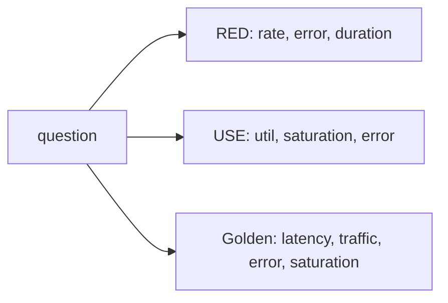

# Dashboard Design

> Observability 101 series (6/10)

<!-- a-grade-intro:begin -->

**Core question**: What separates a *good* dashboard from one that is *wallpaper*?

> *Good dashboards answer *one question*. Patterns like *USE* and *RED* turn panels into *units of meaning*.*

<!-- a-grade-intro:end -->

## What You Will Learn

- *USE* (Utilization, Saturation, Errors)
- *RED* (Rate, Errors, Duration)
- The four *Golden signals*
- Building dashboards as *question units*
- Five common pitfalls

## Why It Matters

Most dashboards are *decoration*. If you do not know *where to look* during an incident, 30 panels are worth *zero*.

> *A dashboard is a *tool that answers*. If it does not answer, delete it.*

## Concept at a Glance



## Key Terms

- **USE**: the *resource* lens.
- **RED**: the *request* lens.
- **Golden signals**: the four axes of *service health*.
- **Heatmap**: distribution *over time*.
- **Annotation**: a *marker* like a deploy.

## Before/After

**Before**: 30 panels, all *interesting*, none *answering*.

**After**: 6 panels; the first screen *immediately* tells you health.

## Hands-on: Dashboard in 5 Steps

### Step 1 — RED panels (requests)

```promql
# Rate
sum(rate(http_requests_total[1m]))
# Errors
sum(rate(http_requests_total{status=~"5.."}[1m]))
# Duration p95
histogram_quantile(0.95, sum by (le) (rate(http_duration_seconds_bucket[5m])))
```

### Step 2 — USE panels (resources)

```promql
# CPU utilization
avg(rate(node_cpu_seconds_total{mode!="idle"}[1m]))
# Memory saturation
1 - node_memory_MemAvailable_bytes / node_memory_MemTotal_bytes
```

### Step 3 — A Golden-signals row

```text
Row: Service Health
  Panel 1: Latency (p50/p95/p99)
  Panel 2: Traffic (req/s)
  Panel 3: Errors (5xx/min)
  Panel 4: Saturation (queue depth)
```

### Step 4 — Annotation: deploy markers

```yaml
annotations:
  - name: deploy
    datasource: prometheus
    expr: changes(build_info[1m]) > 0
```

### Step 5 — Variables to switch environment

```text
$env = staging | production
$service = api | worker | scheduler
```

## What to Notice in This Code

- *RED* is the *outside view*; *USE* is the *inside view*.
- p95 reflects *most user experience*; p99 is the *tail*.
- *Annotations* mark the *cause* of changes.

## Five Common Mistakes

1. **30 panels on *one screen*.** No idea *where to look*.
2. **Everything as *averages*.** Distribution disappears.
3. **No unit labels.** Meaning is *ambiguous*.
4. **No thresholds.** You cannot tell *risky* from *normal*.
5. **Treating dashboards as *art*.** They cease to answer.

## How This Shows Up in Production

The most consulted *Service Overview* dashboard collapses into 6 *RED + USE* panels. Deeper dashboards are *split by role*.

## How a Senior Engineer Thinks

- *A dashboard's title *is* its question.*
- *Six panels per screen — the rest belongs in *drilldown* dashboards.*
- *p95/p99 is closer to *truth* than the average.*
- *Mark deploys with *annotations*.*
- *Panels that do not answer get *deleted*.*

## Checklist

- [ ] You know the four *RED* queries.
- [ ] You know what *USE* means.
- [ ] The first screen is a *health summary*.
- [ ] Deploy *annotations* are visible.

## Practice Problems

1. Build a *RED* dashboard for one service.
2. Build a *USE* dashboard for host resources.
3. Mark *deploy moments* with annotations.

## Wrap-up and Next Steps

Question-driven dashboards change *decision speed*. Next: *alerts and on-call*.

<!-- toc:begin -->
- [What Is Observability?](./01-what-is-observability.md)
- [Metrics, Logs, and Traces](./02-metric-log-trace.md)
- [Collecting and Visualizing Metrics](./03-metric-collection.md)
- [Structured Logging](./04-structured-logging.md)
- [Distributed Tracing Basics](./05-distributed-tracing.md)
- **Dashboard Design (current)**
- Alerts and On-Call (upcoming)
- SLI and SLO Basics (upcoming)
- Cost and Cardinality (upcoming)
- A Production-Ready Observability Stack (upcoming)
<!-- toc:end -->

## References

- [Brendan Gregg — USE Method](https://www.brendangregg.com/usemethod.html)
- [Tom Wilkie — RED Method](https://www.weave.works/blog/the-red-method-key-metrics-for-microservices-architecture/)
- [Google SRE — Golden Signals](https://sre.google/sre-book/monitoring-distributed-systems/)
- [Grafana dashboard best practices](https://grafana.com/docs/grafana/latest/best-practices/)
