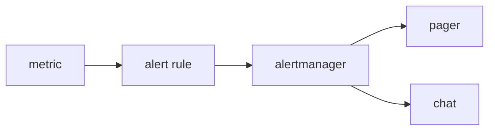

# Alerts and On-Call

> Observability 101 series (7/10)

<!-- a-grade-intro:begin -->

**Core question**: What separates an alert that is *worth waking you at 3am* from one that is *not*?

> *Good alerts are *actionable* and reflect *user impact*. Anything else just leaves *fatigue*.*

<!-- a-grade-intro:end -->

## What You Will Learn

- The three conditions of a *good alert*
- The cost of *alert fatigue*
- *Symptom* vs *cause* alerts
- The basics of *on-call*
- Five common pitfalls

## Why It Matters

Too many alerts *bury* the real signal. On-call *buys sleep* and *spends willpower*. Design is cost.

> *Alerts have a *wake-up cost*. If you do not know it, you go *bankrupt*.*

## Concept at a Glance



## Key Terms

- **Alert rule**: a condition plus a *duration*.
- **Severity**: *page* vs *ticket*.
- **Routing**: who receives it.
- **Silence**: temporary *suppression*.
- **Runbook**: an *action manual* for the alert.

## Before/After

**Before**: 50 alerts/day, all ignored. The real outage *gets missed*.

**After**: 3 alerts/week, *all actionable*.

## Hands-on: Alerts in 5 Steps

### Step 1 — Prometheus alert rule

```yaml
groups:
  - name: api
    rules:
      - alert: HighErrorRate
        expr: sum(rate(http_requests_total{status=~"5.."}[5m]))
              / sum(rate(http_requests_total[5m])) > 0.05
        for: 10m
        labels: { severity: page }
        annotations:
          summary: "5xx > 5% for 10m"
          runbook: "https://wiki/runbook/api-error"
```

### Step 2 — `for` clause to prevent *flap*

```yaml
for: 10m   # too short and noise explodes
```

### Step 3 — Split severity

```yaml
labels:
  severity: page    # wakes you up
  # severity: ticket # business hours
```

### Step 4 — Alertmanager routing

```yaml
route:
  receiver: default
  routes:
    - match: { severity: page }
      receiver: pagerduty
    - match: { severity: ticket }
      receiver: slack-ops
```

### Step 5 — Runbook link

```text
Every alert MUST have a runbook URL.
The runbook covers: meaning, first 3 actions, escalation, related dashboards.
```

## What to Notice in This Code

- `for: 10m` enforces a *duration condition*.
- The `severity` label decides *behavior*.
- An alert without a *runbook* is *half-built*.

## Five Common Mistakes

1. **Every alert is a *page*.** Nights become *hell*.
2. **Alerting only on *cause*.** Disconnected from *user impact*.
3. **No `for` clause.** *Flapping* explodes noise.
4. **No *runbook*.** The receiver *freezes*.
5. **No owner.** Everyone's alert = *no one's alert*.

## How This Shows Up in Production

Most teams put *symptom-based alerts (SLO breaches)* first and *cause-based alerts (CPU 95%)* as backup. PagerDuty / Opsgenie / Grafana OnCall are common.

## How a Senior Engineer Thinks

- *Delete alerts that are not *actionable*.*
- *Symptom > cause. SLO is the standard.*
- *The cost of a page is *sleep*.*
- *On-call is *labor* and deserves compensation.*
- *Alerts without a runbook are *retired immediately*.*

## Checklist

- [ ] Each alert has a *runbook link*.
- [ ] Severity splits into *page/ticket*.
- [ ] `for` is set.
- [ ] On-call *rotation* is in place.

## Practice Problems

1. Write one alert for an SLO breach.
2. Identify one *symptom* alert and one *cause* alert.
3. Write a one-page runbook.

## Wrap-up and Next Steps

Good alerts *protect sleep*. Next: *SLI and SLO basics*.

<!-- toc:begin -->
- [What Is Observability?](./01-what-is-observability.md)
- [Metrics, Logs, and Traces](./02-metric-log-trace.md)
- [Collecting and Visualizing Metrics](./03-metric-collection.md)
- [Structured Logging](./04-structured-logging.md)
- [Distributed Tracing Basics](./05-distributed-tracing.md)
- [Dashboard Design](./06-dashboard-design.md)
- **Alerts and On-Call (current)**
- SLI and SLO Basics (upcoming)
- Cost and Cardinality (upcoming)
- A Production-Ready Observability Stack (upcoming)
<!-- toc:end -->

## References

- [Google SRE — Alerting](https://sre.google/sre-book/practical-alerting/)
- [Prometheus alerting rules](https://prometheus.io/docs/prometheus/latest/configuration/alerting_rules/)
- [Alertmanager docs](https://prometheus.io/docs/alerting/latest/alertmanager/)
- [On-call principles](https://increment.com/on-call/when-the-pager-goes-off/)
