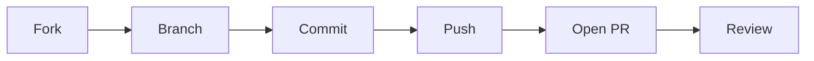

# Creating Pull Requests

> Open Source 101 series (4/10)

<!-- a-grade-intro:begin -->

**Core question**: What does a Pull Request that maintainers *welcome* actually look like?

> Small change, clear description, passing tests.

<!-- a-grade-intro:end -->

## What You Will Learn

- The *fork → branch → PR* flow
- *Commit message* conventions
- Writing a *PR description*
- Responding to *reviews*
- Cleanup *after merge*

## Why It Matters

PR quality decides whether your contribution lands.

## Concept at a Glance



## Key Terms

- **fork**: Your copy of an upstream repo.
- **branch**: A working line of commits.
- **commit**: A unit of change.
- **PR**: A merge request.
- **review**: Code inspection.

## Before/After

**Before**: "I push directly to main."

**After**: "I follow fork, branch, PR, every time."

## Hands-on: Your First PR

### Step 1 — Fork and Clone

```bash
gh repo fork owner/repo --clone
cd repo
```

### Step 2 — Create a Branch

```bash
git checkout -b fix/login-safari
```

### Step 3 — Commit

```bash
git commit -m "fix: handle Safari 15 cookie quirk"
```

### Step 4 — Push

```bash
git push origin fix/login-safari
```

### Step 5 — Open the PR

```bash
gh pr create --title "fix: Safari 15 login" \
  --body "Closes #42"
```

## What to Notice in This Code

- Keep commits small.
- The title is a summary.
- The body is context.

## Five Common Mistakes

1. **Working on main.**
2. **Vague commit messages.**
3. **Opening a PR with no tests.**
4. **Not linking the related issue.**
5. **Ignoring review feedback.**

## How This Shows Up in Production

Companies on trunk-based development also use PRs as the basic review unit.

## How a Senior Engineer Thinks

- A PR is a conversation.
- Small PRs merge fast.
- Tests are evidence.
- Description is courtesy.
- Review is learning.

## Checklist

- [ ] Branch separated.
- [ ] Tests pass.
- [ ] Issue linked.
- [ ] Description clear.

## Practice Problems

1. One line: difference between fork and clone.
2. One line: effect of the *Closes #N* keyword.
3. One line: advantage of a small PR.

## Wrap-up and Next Steps

Next post covers *A Good README*.

<!-- toc:begin -->
- [What Is Open Source](./01-what-is-open-source.md)
- [Understanding Licenses](./02-understanding-licenses.md)
- [Reading Issues](./03-reading-issues.md)
- **Creating Pull Requests (current)**
- A Good README (upcoming)
- Release and Versioning (upcoming)
- Community Management (upcoming)
- The Maintainer Role (upcoming)
- An Open Source Portfolio (upcoming)
- My First Open Source Project (upcoming)
<!-- toc:end -->

## References

- [GitHub PR docs](https://docs.github.com/en/pull-requests)
- [Conventional Commits](https://www.conventionalcommits.org/)
- [How to write a Git commit message](https://cbea.ms/git-commit/)
- [gh CLI](https://cli.github.com/manual/gh_pr_create)
