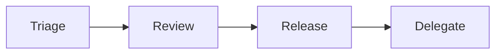

# The Maintainer Role

> Open Source 101 series (8/10)

<!-- a-grade-intro:begin -->

**Core question**: What does a maintainer actually do, and how do they avoid burnout?

> Priorities, delegation, and boundaries.

<!-- a-grade-intro:end -->

## What You Will Learn

- A maintainer's *responsibilities*
- A *triage* routine
- *Delegation* and permissions
- *Burnout* prevention
- Growing a *successor*

## Why It Matters

A maintainer's health is the project's lifespan.

## Concept at a Glance



## Key Terms

- **maintainer**: Project owner.
- **triage**: Sorting work.
- **review**: Inspection.
- **delegate**: Hand off authority.
- **bus factor**: Single point of failure metric.

## Before/After

**Before**: "I handle every issue alone."

**After**: "I delegate authority to trusted contributors."

## Hands-on: A Maintainer Routine

### Step 1 — Weekly Triage

```text
Monday, 30 minutes: label and prioritize
```

### Step 2 — PR Review

```text
Aim for first response within two days
```

### Step 3 — Release

```text
Patch weekly, minor monthly
```

### Step 4 — Delegate

```text
GitHub Org → Teams → write permission
```

### Step 5 — Rest

```markdown
> Maintainer is on vacation Aug 1-14.
```

## What to Notice in This Code

- A routine reduces fatigue.
- Delegation enables sustainability.
- Announcements set expectations.

## Five Common Mistakes

1. **Reviewing every PR alone.**
2. **Not announcing your time off.**
3. **Letting the bus factor stay at 1.**
4. **No labels.**
5. **Not growing a successor.**

## How This Shows Up in Production

A company's Tech Lead carries responsibilities very similar to a maintainer.

## How a Senior Engineer Thinks

- A maintainer is a conductor.
- Delegation is scale.
- Routine is endurance.
- Announcements are boundaries.
- A successor is legacy.

## Checklist

- [ ] Weekly triage.
- [ ] Delegation granted.
- [ ] Time-off announced.
- [ ] Bus factor ≥ 2.

## Practice Problems

1. One line: define bus factor.
2. One line: difference between triage and review.
3. One line: a way to grow a successor.

## Wrap-up and Next Steps

Next post covers *An Open Source Portfolio*.

<!-- toc:begin -->
- [What Is Open Source](./01-what-is-open-source.md)
- [Understanding Licenses](./02-understanding-licenses.md)
- [Reading Issues](./03-reading-issues.md)
- [Creating Pull Requests](./04-creating-pull-requests.md)
- [A Good README](./05-good-readme.md)
- [Release and Versioning](./06-release-and-versioning.md)
- [Community Management](./07-community-management.md)
- **The Maintainer Role (current)**
- An Open Source Portfolio (upcoming)
- My First Open Source Project (upcoming)
<!-- toc:end -->

## References

- [Open Source Guides — Maintainer](https://opensource.guide/best-practices/)
- [Bus factor](https://en.wikipedia.org/wiki/Bus_factor)
- [Maintainer Burnout](https://opensource.guide/maintainer-mental-health/)
- [GitHub Teams](https://docs.github.com/en/organizations/organizing-members-into-teams)
