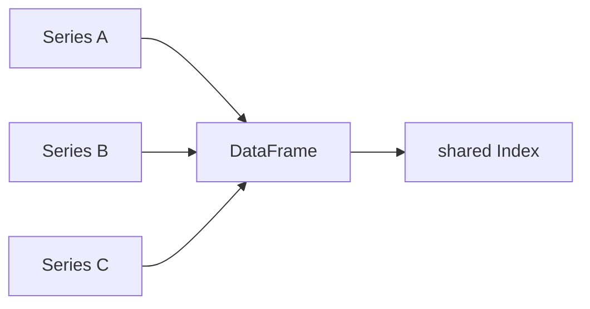

# Series and DataFrame

> Pandas 101 series (2/10)

<!-- a-grade-intro:begin -->

**Core question**: Are *Series* and *DataFrame* *two unrelated things*, or *one family*?

> *A DataFrame is *a collection of Series* sharing the *same label system*.*

<!-- a-grade-intro:end -->

## What You Will Learn

- The *internal structure* of a *Series*
- *Column-oriented* thinking with *DataFrame*
- The role of the *Index*
- A 5-step build-from-scratch
- Five common mistakes

## Why It Matters

*Every Pandas operation* eventually reduces to *Series-level work*. A *DataFrame column is a Series*. Understanding this model makes *everything else easy*.

## Concept at a Glance



## Key Terms

- **Series**: *values + index* — a *NumPy array* with *labels* on top.
- **DataFrame**: a *dict of Series* that share a *common index*.
- **values**: the underlying *NumPy array*.
- **index**: row labels.
- **columns**: column labels.

## Before/After

**Before**: *"A DataFrame is just a table"* — only row-by-row thinking.

**After**: *"A DataFrame is a collection of Series"* — fluent *column-wise operations*.

## Hands-on: Building the Structures Yourself

### Step 1 — Create a Series and inspect

```python
import pandas as pd
s = pd.Series([1.0, 2.0, 3.0], index=["a", "b", "c"], name="x")
print(s.values, s.index, s.name)
```

### Step 2 — Series arithmetic

```python
print(s * 10)
print(s + s)
```

### Step 3 — Build a DataFrame

```python
df = pd.DataFrame({
    "x": [1, 2, 3],
    "y": [10, 20, 30],
}, index=["a", "b", "c"])
print(df)
```

### Step 4 — Column selection returns a Series

```python
col = df["x"]
print(type(col), col)
```

### Step 5 — Automatic index alignment

```python
s1 = pd.Series([1, 2, 3], index=["a", "b", "c"])
s2 = pd.Series([10, 20, 30], index=["b", "c", "d"])
print(s1 + s2)
```

## What to Notice in This Code

- *df["x"]* returns a *Series*.
- Adding two *Series* triggers *automatic index alignment*.
- *NaN* is the *signature of failed alignment*.

## Five Common Mistakes

1. **Confusing *df["x"]* with a *DataFrame*.**
2. **Missing *NaN from index mismatch* during arithmetic.**
3. **Always converting to NumPy via *values* and losing labels.**
4. **Ignoring the *name* attribute.**
5. **Assuming two DataFrames share row order when added.**

## How This Shows Up in Production

A/B test comparison, time series aggregation, joining *data from multiple sources* by *index key* — the *magic of Pandas* is *index alignment*.

## How a Senior Engineer Thinks

- Always be *aware of what the index means*.
- Treat *column selection* as *Series thinking*.
- Use *NaN from misalignment* as a *debugging clue*.
- Reduce dependence on *df.values*.
- Identify Series with *name*.

## Checklist

- [ ] I can distinguish *Series* and *DataFrame*.
- [ ] I can name *index* and *columns*.
- [ ] I know *df["col"]* is a *Series*.
- [ ] I know *index alignment* is *automatic*.

## Practice Problems

1. Build *three Series*, combine them into a *DataFrame*, and confirm the *common index*.
2. Add two Series with *different indexes* and inspect the *NaN positions*.
3. Show in code the *type difference* between *df["x"]* and *df[["x"]]*.

## Wrap-up and Next Steps

A DataFrame is *a collection of Series*. Next we cover *reading CSV and Excel files*.

<!-- toc:begin -->
- [What Is Pandas?](./01-what-is-pandas.md)
- **Series and DataFrame (current)**
- Reading CSV and Excel (upcoming)
- Filtering and Selection (upcoming)
- Handling Missing Values (upcoming)
- groupby (upcoming)
- Merge and Join (upcoming)
- Time Series (upcoming)
- apply and Vectorization (upcoming)
- Real-world Data Analysis (upcoming)
<!-- toc:end -->

## References

- [pandas — Series API](https://pandas.pydata.org/docs/reference/series.html)
- [pandas — DataFrame API](https://pandas.pydata.org/docs/reference/frame.html)
- [pandas — Intro to data structures](https://pandas.pydata.org/docs/user_guide/dsintro.html)
- [Wes McKinney — Python for Data Analysis](https://wesmckinney.com/book/)
