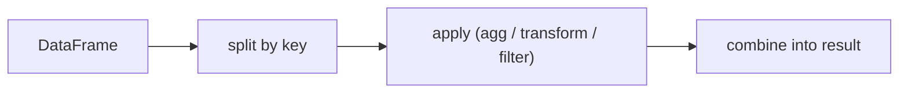

# groupby

> Pandas 101 series (6/10)

<!-- a-grade-intro:begin -->

**Core question**: Is *Pandas groupby* exactly *the same as SQL GROUP BY*?

> *groupby is the *split-apply-combine* pattern. It has three faces: agg, transform, and filter.*

<!-- a-grade-intro:end -->

## What You Will Learn

- The *split-apply-combine* model
- The difference between *agg / transform / filter*
- *Multi-key grouping*
- A 5-step groupby hands-on
- Five common mistakes

## Why It Matters

*Aggregation is the core of analysis*. With *groupby*, *dozens of for-loop lines* collapse into *one*.

## Concept at a Glance



## Key Terms

- **groupby**: *split into groups* by key.
- **agg**: *reduce to one value* per group.
- **transform**: return per-group computation in *original shape*.
- **filter**: keep rows by a *group-level condition*.
- **as_index**: decides whether the *group key* becomes the *index*.

## Before/After

**Before**: *"For-loop over categories"* — slow and long.

**After**: *"groupby + agg"* — *one line* across *all keys*.

## Hands-on: Five groupby Steps

### Step 1 — Prepare data

```python
import pandas as pd
df = pd.DataFrame({
    "city": ["Seoul", "Seoul", "Busan", "Busan"],
    "month": ["Jan", "Feb", "Jan", "Feb"],
    "sales": [100, 120, 80, 95],
})
```

### Step 2 — Simple sum

```python
print(df.groupby("city")["sales"].sum())
```

### Step 3 — agg with multiple stats

```python
print(df.groupby("city").agg(
    total=("sales", "sum"),
    mean=("sales", "mean"),
    n=("sales", "count"),
))
```

### Step 4 — transform

```python
df["share"] = df["sales"] / df.groupby("city")["sales"].transform("sum")
print(df)
```

### Step 5 — filter

```python
big = df.groupby("city").filter(lambda g: g["sales"].sum() > 200)
print(big)
```

## What to Notice in This Code

- *agg* yields *one row per group*; *transform* keeps the *original shape*.
- *Named aggregation* controls *output column names*.
- *filter* returns *rows*, not *booleans*.

## Five Common Mistakes

1. **Confusing *transform* and *agg*.**
2. **Skipping *as_index=False* and getting *surprising indexes*.**
3. **Forgetting *reset_index*, making downstream *joins hard*.**
4. **Missing *brackets* on multi-key groupby.**
5. **Overusing *apply* and getting *slow code*.**

## How This Shows Up in Production

Segment analysis, cohort retention, KPI aggregation — *groupby* powers *business intelligence*. *transform* is the workhorse of *feature engineering*.

## How a Senior Engineer Thinks

- *agg first*, *apply last*.
- Use *named aggregation* for *readable output*.
- Use *transform* to *create features*.
- Treat *multi-key* as a *tuple index*.
- Choose *as_index* *deliberately*.

## Checklist

- [ ] I can explain *split-apply-combine*.
- [ ] I distinguish *agg / transform / filter*.
- [ ] I use *named aggregation*.
- [ ] I do *multi-key* groupby.

## Practice Problems

1. Print *mean and std per category* using *named agg*.
2. Use *transform* to attach the *group mean* back to the original DataFrame.
3. Use *filter* to keep groups whose *sum exceeds a threshold*.

## Wrap-up and Next Steps

groupby is the *engine of analysis*. Next we cover *merge and join*.

<!-- toc:begin -->
- [What Is Pandas?](./01-what-is-pandas.md)
- [Series and DataFrame](./02-series-and-dataframe.md)
- [Reading CSV and Excel](./03-read-csv-and-excel.md)
- [Filtering and Selection](./04-filtering-and-selection.md)
- [Handling Missing Values](./05-missing-values.md)
- **groupby (current)**
- Merge and Join (upcoming)
- Time Series (upcoming)
- apply and Vectorization (upcoming)
- Real-world Data Analysis (upcoming)
<!-- toc:end -->

## References

- [pandas — Group by: split-apply-combine](https://pandas.pydata.org/docs/user_guide/groupby.html)
- [pandas — agg](https://pandas.pydata.org/docs/reference/api/pandas.core.groupby.DataFrameGroupBy.agg.html)
- [pandas — transform](https://pandas.pydata.org/docs/reference/api/pandas.core.groupby.DataFrameGroupBy.transform.html)
- [Wes McKinney — Python for Data Analysis](https://wesmckinney.com/book/)
