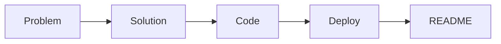

# What is a Portfolio Project

> Portfolio Project 101 series (1/10)

<!-- a-grade-intro:begin -->

**Core question**: *What* truly separates a *homework* from a *portfolio project*?

> Whether the *problem* and the *decision rationale* are *recorded*.

<!-- a-grade-intro:end -->

## What You Will Learn

- The *portfolio project* definition
- What recruiters *actually* look at
- The gap from *school assignments*
- *Minimum components*
- *Evaluation criteria*

## Why It Matters

A *portfolio* is the fastest way to *prove* experience.

## Concept at a Glance



## Key Terms

- **portfolio**: *public work*.
- **case study**: *problem solution result*.
- **README**: the *entry* document.
- **demo**: a *live* run.
- **decision log**: a *record* of choices.

## Before/After

**Before**: Only *code* on GitHub.

**After**: *Problem + demo + README* together.

## Hands-on: Minimal Portfolio

### Step 1 — Define the project

```python
project = {"name": "task-tracker", "problem": "lost team schedules"}
```

### Step 2 — Demo URL

```python
demo_url = "https://demo.example.com"
```

### Step 3 — README skeleton

```python
sections = ["problem", "demo", "stack", "run", "next"]
```

### Step 4 — Decision log

```python
decisions = [{"why": "FastAPI", "trade": "less_admin"}]
```

### Step 5 — One-line pitch

```python
pitch = "A mini SaaS that fixes lost team schedules"
```

## What to Notice in This Code

- A *project* starts from a *problem*.
- The *demo* is a *URL*.
- The *README* has *five sections*.

## Five Common Mistakes

1. **Only *screenshots*.**
2. **A *one-line README*.**
3. **No *decision rationale*.**
4. **The *demo* is *down*.**
5. **Only *feature bragging*.**

## How This Shows Up in Production

Recruiters look for *problem solution result* in *60 seconds*.

## How a Senior Engineer Thinks

- *Problem* matters *most*.
- *Decisions* show *skill*.
- The *demo* must be *alive*.
- The *README* is the *entry*.
- *Small scope*, *finished*.

## Checklist

- [ ] *One-line problem*.
- [ ] *Demo URL*.
- [ ] *Five-section* README.
- [ ] *Decision log*.

## Practice Problems

1. Define *portfolio project* in one line.
2. State the role of a *demo* in one line.
3. State the meaning of *decision log* in one line.

## Wrap-up and Next Steps

Next post: *Traits of a Good Project*.

<!-- toc:begin -->
- **What is a Portfolio Project (current)**
- Traits of a Good Project (upcoming)
- Writing the README (upcoming)
- Building the Demo (upcoming)
- Deploying the Project (upcoming)
- Tests and Documentation (upcoming)
- Recording Tech Decisions (upcoming)
- Summarizing as Blog Posts (upcoming)
- Explaining in Interviews (upcoming)
- Portfolio Improvement Checklist (upcoming)
<!-- toc:end -->

## References

- [GitHub README Best Practices](https://docs.github.com/en/repositories/managing-your-repositorys-settings-and-features/customizing-your-repository/about-readmes)
- [Portfolio for Engineers - Cal Newport](https://calnewport.com/)
- [Show Your Work - Austin Kleon](https://austinkleon.com/show-your-work/)
- [Hiring Without Whiteboards](https://github.com/poteto/hiring-without-whiteboards)
