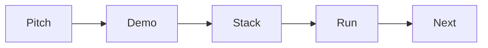

# Writing the README

> Portfolio Project 101 series (3/10)

<!-- a-grade-intro:begin -->

**Core question**: *Why* must a *README* be *clear in 60 seconds*?

> Reviewers reach it *after* scanning *dozens* of projects.

<!-- a-grade-intro:end -->

## What You Will Learn

- A standard *README* shape
- A *problem solution* one-liner
- *Demo* and *screenshots*
- *How to run*
- *Decision rationale*

## Why It Matters

The *README* is the *entry door* to a project.

## Concept at a Glance



## Key Terms

- **pitch**: *one-line* summary.
- **demo**: *URL + screenshot*.
- **stack**: *technology list*.
- **run**: *commands*.
- **next**: *upcoming tasks*.

## Before/After

**Before**: Only *title + install*.

**After**: All *five sections* exist.

## Hands-on: README Skeleton

### Step 1 — Pitch

```markdown
> A mini SaaS that fixes lost team schedules
```

### Step 2 — Demo link

```markdown
[Live Demo](https://demo.example.com)
```

### Step 3 — Stack

```markdown
- FastAPI, PostgreSQL, Docker
```

### Step 4 — Run

```bash
docker compose up
```

### Step 5 — Next tasks

```markdown
- [ ] add notifications
```

## What to Notice in This Code

- The *pitch* is *one* sentence.
- The *demo* is a *link*.
- *Run* is *copy-paste* ready.

## Five Common Mistakes

1. **A *long preface*.**
2. **Only *screenshots*.**
3. **A *complex* run command.**
4. **No *decision rationale*.**
5. **No *next tasks*.**

## How This Shows Up in Production

The *top 10%* of OSS projects share the same five-section shape.

## How a Senior Engineer Thinks

- The *pitch* matters *most*.
- The *demo* must be *alive*.
- *Run* is *one line*.
- *Decisions* are *documented*.
- *Next* uses *checkboxes*.

## Checklist

- [ ] *One-line* pitch.
- [ ] *Demo* link.
- [ ] *Run* command.
- [ ] *Next* checkboxes.

## Practice Problems

1. Define *pitch* in one line.
2. State the *demo* format in one line.
3. State the *run* requirement in one line.

## Wrap-up and Next Steps

Next post: *Building the Demo*.

<!-- toc:begin -->
- [What is a Portfolio Project](./01-what-is-a-portfolio-project.md)
- [Traits of a Good Project](./02-traits-of-a-good-project.md)
- **Writing the README (current)**
- Building the Demo (upcoming)
- Deploying the Project (upcoming)
- Tests and Documentation (upcoming)
- Recording Tech Decisions (upcoming)
- Summarizing as Blog Posts (upcoming)
- Explaining in Interviews (upcoming)
- Portfolio Improvement Checklist (upcoming)
<!-- toc:end -->

## References

- [README Best Practices - GitHub](https://docs.github.com/en/repositories/managing-your-repositorys-settings-and-features/customizing-your-repository/about-readmes)
- [Awesome README](https://github.com/matiassingers/awesome-readme)
- [Make a README](https://www.makeareadme.com/)
- [Standard Readme](https://github.com/RichardLitt/standard-readme)
