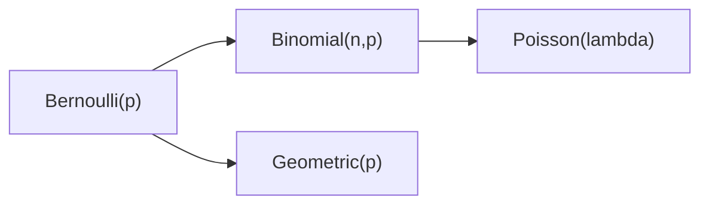

# Discrete Distributions

> Probability 101 series (7/10)

<!-- a-grade-intro:begin -->

**Core question**: Coins, clicks, orders, calls — *most real-world counts* are *reused* across a few discrete distributions. *Which one* fits *when*?

> *If you know the distribution, you can *infer without seeing the data*.*

<!-- a-grade-intro:end -->

## What You Will Learn

- *Bernoulli / Binomial / Geometric / Poisson*
- Each distribution’s *mean / variance*
- Mapping *situations to distributions*
- A 5-step discrete-distribution exercise
- Five common mistakes

## Why It Matters

Most *count data* fits one of these four. Once you set the *parameters*, *mean / variance / probabilities* follow from a *formula*.

> *Distributions are reusable models of the world.*

## Concept at a Glance



## Key Terms

- **Bernoulli(p)**: a single *0/1* trial. E=p, Var=p(1-p).
- **Binomial(n,p)**: sum of *n* Bernoullis. E=np, Var=np(1-p).
- **Geometric(p)**: trials until *first success*. E=1/p.
- **Poisson(λ)**: count per *unit time*. E=Var=λ.
- **Parameters**: numbers that *fix the shape* of a distribution.

## Before / After

**Before**: *“Orders average 5 per hour”* — exact distribution unknown.

**After**: *Poisson(λ=5)* — even *P(0 orders in an hour)* follows from a *formula*.

## Hands-on: 5-step Discrete Distributions

### Step 1 — Bernoulli / Binomial

```python
from scipy import stats
print("Binomial(10, 0.3) P(X=3):", stats.binom.pmf(3, 10, 0.3))
```

### Step 2 — Geometric

```python
from scipy import stats
print("Geometric(0.2) P(X=5):", stats.geom.pmf(5, 0.2))
```

### Step 3 — Poisson

```python
from scipy import stats
print("Poisson(5) P(X=0):", stats.poisson.pmf(0, 5))
```

### Step 4 — Compare mean / variance

```python
from scipy import stats
for d in [stats.binom(10, 0.3), stats.geom(0.2), stats.poisson(5)]:
    print(d.dist.name, d.mean(), d.var())
```

### Step 5 — Simulation

```python
import numpy as np
samples = np.random.default_rng(0).poisson(5, 10_000)
print("mean:", samples.mean(), "var:", samples.var())
```

## What to Notice in This Code

- The same data yields different answers under different *model choices*.
- Poisson assumes *mean = variance*; if violated, consider *Negative Binomial*.
- Binomial fixes the *trial count n*; Geometric counts *trials to first success*.

## Five Common Mistakes

1. **Using *Binomial* where *Geometric* fits.**
2. **Forcing *Poisson* even when *variance ≠ mean*.**
3. **Ignoring the *independent-trials* assumption.**
4. **Estimating *parameters* from *one sample*.**
5. **Confusing *probability* with *likelihood*.**

## How This Shows Up in Production

A/B *conversions* (Binomial), *call-center arrivals* (Poisson), *retry counts* (Geometric), *error counts* (Poisson) — the basics of *count-data* analysis.

## How a Senior Engineer Thinks

- Memorizes the *situation → distribution* map.
- *Names* the assumptions.
- Diagnoses *over-dispersion*.
- Builds *intuition* via simulation.
- Knows *alternatives* like *Negative Binomial*.

## Checklist

- [ ] I know each *parameter* and *E/Var*.
- [ ] I can map a *situation* to a *distribution*.
- [ ] I use *scipy.stats* PMFs.
- [ ] I check for *over-dispersion*.

## Practice Problems

1. With *p = 0.05, n = 200*, compute *P(X ≥ 15)*.
2. If arrivals average *3 per hour*, what is *P(0 in a minute)*?
3. State what it means for the *geometric* distribution to be *memoryless*.

## Wrap-up and Next Steps

Discrete distributions are the *priors of count modeling*. The next episode covers *continuous distributions*.

<!-- toc:begin -->
- [What Is Probability?](./01-what-is-probability.md)
- [Events and Sample Space](./02-events-and-sample-space.md)
- [Conditional Probability](./03-conditional-probability.md)
- [Bayes' Theorem](./04-bayes-theorem.md)
- [Random Variables](./05-random-variables.md)
- [Expectation and Variance](./06-expectation-and-variance.md)
- **Discrete Distributions (current)**
- Continuous Distributions (upcoming)
- Law of Large Numbers and CLT (upcoming)
- Probability in Machine Learning (upcoming)
<!-- toc:end -->

## References

- [Wikipedia — Bernoulli distribution](https://en.wikipedia.org/wiki/Bernoulli_distribution)
- [Wikipedia — Binomial distribution](https://en.wikipedia.org/wiki/Binomial_distribution)
- [Wikipedia — Poisson distribution](https://en.wikipedia.org/wiki/Poisson_distribution)
- [scipy.stats — Discrete](https://docs.scipy.org/doc/scipy/reference/stats.html#discrete-distributions)
