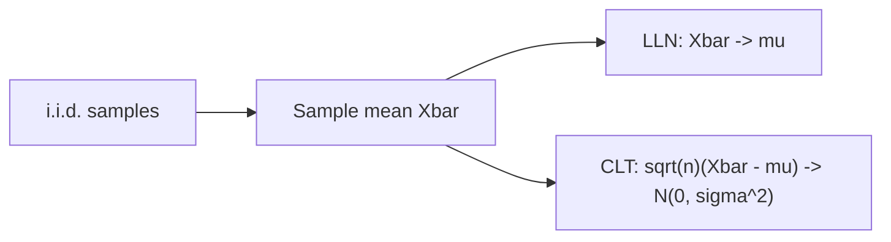

# Law of Large Numbers and CLT

> Probability 101 series (9/10)

<!-- a-grade-intro:begin -->

**Core question**: *Why does the normal distribution show up everywhere*? *Why does the sample mean* converge to the *true mean*?

> *The two pillars of statistics: the *LLN* and the *CLT*.*

<!-- a-grade-intro:end -->

## What You Will Learn

- The *Law of Large Numbers (LLN)*
- The *Central Limit Theorem (CLT)*
- The *distribution of the sample mean*
- A 5-step LLN/CLT exercise
- Five common mistakes

## Why It Matters

*Confidence intervals, hypothesis tests, A/B tests* all rest on the *CLT*. Without the *LLN*, *sample statistics* are meaningless.

> *LLN gives accuracy; CLT gives shape.*

## Concept at a Glance



## Key Terms

- **i.i.d.**: independent and identically distributed.
- **Sample mean X̄**: (X₁+...+Xₙ)/n.
- **LLN**: *X̄ → μ* as n→∞.
- **CLT**: *√n·(X̄ - μ) → N(0, σ²)*.
- **Standard error SE**: σ/√n.

## Before / After

**Before**: *“Sample mean equals population mean.”* — *Unclear when or why*.

**After**: the *LLN* guarantees *convergence*; the *CLT* gives the *distribution of the error*.

## Hands-on: 5-step LLN / CLT

### Step 1 — LLN simulation

```python
import numpy as np
rng = np.random.default_rng(0)
samples = rng.uniform(0, 1, 10_000)
running = np.cumsum(samples) / np.arange(1, len(samples) + 1)
print("means at n=10, 100, 10_000:", running[9], running[99], running[-1])
```

### Step 2 — CLT simulation

```python
import numpy as np
rng = np.random.default_rng(0)
means = [rng.exponential(1, 30).mean() for _ in range(10_000)]
print("mean ~ 1:", np.mean(means), "std ~ 1/sqrt(30):", np.std(means))
```

### Step 3 — Visualize

```python
# Histogram of sample means looks normal
import matplotlib.pyplot as plt
plt.hist(means, bins=40); plt.show()
```

### Step 4 — Standard error

```python
import math
sigma = 1.0
n = 30
print("SE:", sigma / math.sqrt(n))
```

### Step 5 — Independence from population shape

```python
import numpy as np
rng = np.random.default_rng(0)
# Even non-normal populations yield near-normal sample means
for dist in ["uniform", "exponential", "binomial"]:
    if dist == "uniform":
        s = rng.uniform(0, 1, (10_000, 30)).mean(axis=1)
    elif dist == "exponential":
        s = rng.exponential(1, (10_000, 30)).mean(axis=1)
    else:
        s = rng.binomial(10, 0.3, (10_000, 30)).mean(axis=1)
    print(dist, "mean of means:", round(s.mean(), 3))
```

## What to Notice in This Code

- As *n* grows, the *standard error* of *X̄* shrinks like *1/√n*.
- A *non-normal population* still gives *approximately normal* sample means.
- The *CLT* applies to *sums and averages* — *not* to *maxima* (use EVT).

## Five Common Mistakes

1. **Ignoring the *i.i.d.* assumption.**
2. **Forcing CLT on *small n*.**
3. **Ignoring *outliers and heavy tails*.**
4. **Confusing *standard deviation* with *standard error*.**
5. **Confusing the *LLN* with the *gambler’s fallacy*.**

## How This Shows Up in Production

CIs for *A/B conversion deltas*, *average response times* in monitoring, *training-loss averages* in ML — all rest on the *CLT*.

## How a Senior Engineer Thinks

- *Validates* the i.i.d. assumption.
- Asks whether *n is enough*.
- Switches to the *bootstrap* for heavy tails.
- Always reports the *standard error*.
- Knows the *misreadings* of the LLN.

## Checklist

- [ ] I understand the *LLN*.
- [ ] I understand the *CLT* and its limits.
- [ ] I know the *standard error*.
- [ ] I know the *bootstrap* exists.

## Practice Problems

1. Compute the *SE* for *n = 4 vs n = 400*.
2. Show via simulation why *exponential averages* go normal.
3. Explain why the *gambler’s fallacy* is a misreading of the *LLN*.

## Wrap-up and Next Steps

The LLN gives *convergence*; the CLT gives *shape*. The final episode wraps everything into *probability for machine learning*.

<!-- toc:begin -->
- [What Is Probability?](./01-what-is-probability.md)
- [Events and Sample Space](./02-events-and-sample-space.md)
- [Conditional Probability](./03-conditional-probability.md)
- [Bayes' Theorem](./04-bayes-theorem.md)
- [Random Variables](./05-random-variables.md)
- [Expectation and Variance](./06-expectation-and-variance.md)
- [Discrete Distributions](./07-discrete-distributions.md)
- [Continuous Distributions](./08-continuous-distributions.md)
- **Law of Large Numbers and CLT (current)**
- Probability in Machine Learning (upcoming)
<!-- toc:end -->

## References

- [Wikipedia — Law of large numbers](https://en.wikipedia.org/wiki/Law_of_large_numbers)
- [Wikipedia — Central limit theorem](https://en.wikipedia.org/wiki/Central_limit_theorem)
- [3Blue1Brown — CLT](https://www.youtube.com/watch?v=zeJD6dqJ5lo)
- [Stanford CS109 — Notes](https://web.stanford.edu/class/cs109/)
