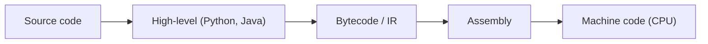

# What Is a Programming Language?

> Programming Languages 101 series (1/10)

<!-- a-grade-intro:begin -->

**Core question**: Why do we use Python instead of assembly, and why do we keep inventing new languages even when Python already works?

> A programming language is not just "syntax for telling a machine what to do." It is a frame that shapes **how we decompose a problem and how we express it**. The fact that the same problem can be solved imperatively, with objects, functionally, or declaratively shows how a language both constrains and expands our thinking. This first episode lays that foundation.

<!-- a-grade-intro:end -->

## What You Will Learn

- The abstraction layers from machine code up to high-level languages
- What a programming language fundamentally does (translation and expression)
- The four paradigms — imperative, object-oriented, functional, declarative
- What "a good language" actually means

## Why It Matters

If you treat a language as just a tool, every new language feels like starting over. But once you see the structure every language shares — variables, expressions, control flow, functions, types — a new language becomes the question of **how it expresses ideas you already know**. Through this series we will pull that shared structure apart, piece by piece.

> "Learning a language" really means learning the way of thinking that language emphasizes.

## Concept at a Glance



The higher up, the easier for humans to read; the lower down, the closer to what the CPU executes directly. A programming language picks a layer and decides what abstractions to offer there. One line of Python can correspond to dozens of lines of assembly.

## Key Terms

- **Syntax**: The grammar of a language — which arrangements of characters are legal.
- **Semantics**: What that syntax actually means or does when executed.
- **Paradigm**: A way of solving problems — imperative, OOP, functional, declarative.
- **Abstraction**: A tool that hides detail and lets us reason in larger units.
- **Translator**: A program that turns source code into something a machine can run (compiler or interpreter).

## Before/After

**Before — adding two numbers in assembly**

```asm
; x86-64 (simplified)
mov rax, 3
mov rbx, 4
add rax, rbx        ; rax = 7
```

You manage register names and instructions yourself. There are no variables. There are no functions.

**After — the same in Python**

```python
total = 3 + 4
print(total)  # 7
```

`total` is now a name. `+` is the symbol you have known since school. Printing the result is one more line. This is the value of abstraction in concrete form.

## Hands-on: One Problem, Four Paradigms

Take a list of integers. Double the even ones and sum them.

### Step 1 — Imperative (procedural)

```python
# 1_imperative.py
nums = [1, 2, 3, 4, 5, 6]
total = 0
for n in nums:
    if n % 2 == 0:
        total += n * 2
print(total)  # 24
```

Steps are spelled out with loops and variables. The most direct, but the longest.

### Step 2 — Object-oriented

```python
# 2_oop.py
class EvenDoubler:
    def __init__(self, nums: list[int]) -> None:
        self.nums = nums

    def total(self) -> int:
        return sum(n * 2 for n in self.nums if n % 2 == 0)

print(EvenDoubler([1, 2, 3, 4, 5, 6]).total())  # 24
```

Data and behavior travel together as an object. Overkill for this size, but the value shows up the moment state appears.

### Step 3 — Functional

```python
# 3_functional.py
from functools import reduce

nums = [1, 2, 3, 4, 5, 6]
result = reduce(
    lambda acc, n: acc + n * 2,
    filter(lambda n: n % 2 == 0, nums),
    0,
)
print(result)  # 24
```

The flow of data becomes a composition of functions. Nothing is mutated.

### Step 4 — Declarative (SQL-flavored)

```python
# 4_declarative.py
import sqlite3
db = sqlite3.connect(":memory:")
db.execute("CREATE TABLE t (n INTEGER)")
db.executemany("INSERT INTO t VALUES (?)", [(i,) for i in [1,2,3,4,5,6]])
row = db.execute("SELECT SUM(n*2) FROM t WHERE n % 2 = 0").fetchone()
print(row[0])  # 24
```

You only stated **what** you want; the DBMS decided **how**. The shortest expression of the same problem.

### Step 5 — Compare the four

The same 24 came from four solutions of different length, readability, and changeability. The point is not which is correct, but **which paradigm fits the problem and the team most naturally**.

## What to Notice in This Code

- The same result, expressed under different paradigms, emphasizes different things.
- Imperative emphasizes steps; OOP emphasizes responsibility; functional emphasizes data flow; declarative emphasizes intent.
- One language often supports several paradigms at once (Python is a clear example).
- "Which paradigm fits this problem?" is a more useful question than "Which language is best?"

## Five Common Mistakes

1. **Treating a language as a feature list.** Two languages with the same features still steer you toward very different code.
2. **Re-learning everything from scratch with each new language.** Variables, expressions, control flow, functions, types are nearly universal. Focus on the differences.
3. **Choosing a language by raw speed.** In most systems the bottleneck is I/O and algorithms, not the language.
4. **Forcing one paradigm onto every problem.** Writing a script in heavyweight OOP, or building a stateful service with pure functions only, both hurt.
5. **Picking the wrong abstraction level.** Python for OS-level work, or Rust for a five-line script — both are pain.

## How This Shows Up in Production

Most organizations do not write everything in one language. Backends in Python, Go, or Java; frontends in JavaScript or TypeScript; data pipelines in SQL and Python; systems software in C or Rust. The pattern is **match the language to the problem domain**, not the other way around.

When you join a team and meet a language you do not know, the first week's job is not to memorize syntax. It is to observe **which paradigm the team leans on and what code review praises**. Once you see that, the syntax follows naturally.

## How a Senior Engineer Thinks

- A language is both a tool and a frame. Looking only at the tool gives you half the picture.
- When learning a new language, map the universal structure first; then dig into what differs.
- Asks "Does this language fit this problem?" before "Is this language good?"
- Knowing one language deeply usually beats knowing ten of them shallowly.
- Tries each new paradigm at least once seriously. It widens the field of view.

## Checklist

- [ ] Can you describe the abstraction stack (high-level → assembly → machine code) in one sentence?
- [ ] Can you tell apart what imperative, OOP, functional, and declarative each emphasize?
- [ ] Have you ever solved one problem two different ways on purpose?
- [ ] Do you map the universal structure first when meeting a new language?
- [ ] Do you reframe "Which language is best?" into "Which language fits this problem?"

## Practice Problems

1. Pick the language you use most. Write a paragraph about which paradigm it emphasizes and what habits that paradigm encourages.
2. Among the four solutions above, predict which would be fastest on a list of 100 million integers. State why. If you have never measured, also write down which tool you would use to measure.
3. Give two situations where "declarative is always best" turns out to be false.

## Wrap-up and Next Steps

A programming language is at once a way to instruct a machine and a frame that constrains how we think. The same problem expressed under different paradigms produces very different code, and that difference shapes the system. Next we will look at the two axes every language is built on — syntax and semantics — and see what each one really means.

<!-- toc:begin -->
- **What Is a Programming Language? (current)**
- Syntax and Semantics (upcoming)
- Type Systems (upcoming)
- Scope and Binding (upcoming)
- Functions and Closures (upcoming)
- Objects and Prototypes (upcoming)
- Memory Management (upcoming)
- Interpreters and Compilers (upcoming)
- Static vs Dynamic Languages (upcoming)
- What Makes a Good Language Design? (upcoming)
<!-- toc:end -->

## References

- [Programming Language Pragmatics (Scott)](https://www.elsevier.com/books/programming-language-pragmatics/scott/978-0-12-410409-9)
- [Structure and Interpretation of Computer Programs](https://mitpress.mit.edu/sites/default/files/sicp/index.html)
- [Concepts, Techniques, and Models of Computer Programming](https://www.info.ucl.ac.be/~pvr/book.html)
- [Python Documentation — The Python Tutorial](https://docs.python.org/3/tutorial/)
