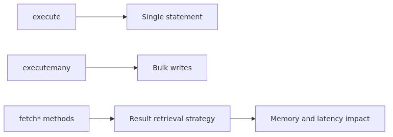

# execute, executemany, and Fetch Patterns

> Python DB-API 101 series (3/10)

---

Every query in DB-API ultimately reduces to five cursor methods: `execute()`, `executemany()`, and `fetchone()`/`fetchall()`/`fetchmany()`. The API surface is tiny, but choosing the wrong fetch method decides whether your service streams gracefully or OOMs at 3 AM. This article walks through each method and the rules for picking one.

<!-- a-grade-intro:begin -->



*execute, executemany, and fetch patterns*
## Key Questions

- When do you reach for execute, executemany, fetchone, fetchall, vs fetchmany?
- How do you process large result sets without blowing up memory?
- What metadata does cursor.description expose?
- What are the key ingredients of a streaming + transformation pipeline?

<!-- a-grade-intro:end -->

## 1. execute - one statement at a time


*execute - one statement at a time*
`cursor.execute(operation, parameters=None)` runs a single SQL statement. SELECT, INSERT, UPDATE, DELETE, and DDL all use the same method.

```python
import sqlite3
conn = sqlite3.connect(":memory:")
cur = conn.cursor()

cur.execute("CREATE TABLE notes (id INTEGER PRIMARY KEY, body TEXT)")
cur.execute("INSERT INTO notes (body) VALUES (?)", ("hello",))
print(cur.lastrowid)   # 1
print(cur.rowcount)    # 1
```

`execute()` returns the cursor itself so chaining is technically possible, but production code keeps one call per line for readability.

## 2. executemany - bulk write


*executemany - bulk write*
When the same statement runs against many parameter sets, use `executemany()`.

```python
rows = [("first",), ("second",), ("third",)]
cur.executemany("INSERT INTO notes (body) VALUES (?)", rows)
print(cur.rowcount)   # 3
conn.commit()
```

`executemany()` is logically equivalent to a Python loop over `execute()`, but drivers apply batch optimizations - typically 2-10x faster. The implementation differs by driver:

- sqlite3: internal loop with prepared-statement reuse, saving parse cost
- psycopg 2/3: `execute_batch()` or `execute_values()` is often faster still
- mysql.connector: rewrites into a multi-row INSERT automatically

A common trap is calling `executemany()` for SELECT. PEP 249 does not define behavior in that case, so the result is driver-specific. Always use plain `execute()` for SELECT.

## 3. fetchone - one row at a time

`fetchone()` returns the next row as a tuple, or `None` when exhausted.

```python
cur.execute("SELECT id, body FROM notes ORDER BY id")
row = cur.fetchone()
while row is not None:
    print(row)         # (1, 'hello')
    row = cur.fetchone()
```

This is memory-safe but verbose. Cursors are iterable, so the idiomatic form is shorter.

```python
cur.execute("SELECT id, body FROM notes ORDER BY id")
for row in cur:
    print(row)
```

`for row in cur` calls `fetchone()` under the hood and never materializes the full result set.

## 4. fetchall - everything at once

`fetchall()` returns the remaining rows as a list.

```python
cur.execute("SELECT id, body FROM notes")
rows = cur.fetchall()
print(rows)   # [(1, 'hello'), (2, 'first'), (3, 'second'), (4, 'third')]
```

For small result sets (a few hundred rows) it is the most convenient and the fastest option. For tens of thousands of rows, RAM balloons in one shot - a classic OOM cause. Reserve `fetchall()` for test fixtures and lookup tables; never use it for queries whose row count depends on user input.

## 5. fetchmany - in chunks


*fetchmany - in chunks*
`fetchmany(size=cursor.arraysize)` returns a fixed number of rows.

```python
cur.execute("SELECT id, body FROM notes")
while True:
    chunk = cur.fetchmany(1000)
    if not chunk:
        break
    process(chunk)
```

`arraysize` is a cursor attribute that defaults to 1. Increasing it lets drivers prefetch rows from the server, cutting round-trips.

```python
cur.arraysize = 500
for row in cur:        # prefetched in batches of 500
    process(row)
```

`fetchmany` is the right tool when an ETL pipeline needs both streaming and batch processing.

## 6. Choosing the right method

| Situation | Pick |
| --- | --- |
| Single row (PK lookup) | `fetchone()` |
| Small result (<= 1000 rows) | `fetchall()` |
| Large result, row by row | `for row in cur` |
| Large result, batched | `fetchmany(N)` |
| Bulk INSERT/UPDATE | `executemany()` |
| Single statement | `execute()` |

## 7. Result metadata

`cursor.description` returns a list of 7-tuples describing the columns of the last SELECT.

```python
cur.execute("SELECT id, body FROM notes LIMIT 1")
cur.fetchone()
for col in cur.description:
    print(col[0], col[1])   # name, type_code
```

To receive rows as dicts, either consume `description` directly or set a row factory (covered in a later episode).

`cursor.rowcount` reports affected rows for INSERT/UPDATE/DELETE. For SELECT it is driver-dependent and frequently -1, so do not trust it.

## 8. Streaming + transformation in practice

Here is an ETL that exports rows to CSV with constant memory usage.

```python
import csv, sqlite3
def export_notes(db_path, csv_path, chunk=500):
    with sqlite3.connect(db_path) as conn:
        cur = conn.cursor()
        cur.arraysize = chunk
        cur.execute("SELECT id, body FROM notes ORDER BY id")
        with open(csv_path, "w", newline="") as f:
            writer = csv.writer(f)
            writer.writerow(["id", "body"])
            while True:
                rows = cur.fetchmany(chunk)
                if not rows:
                    break
                writer.writerows(rows)
```

Memory stays flat regardless of row count.

## 9. Common Mistakes

1. **Calling `fetchall()` on a large result set** - one million rows means one OOM. Default to streaming patterns and never assume the result fits in memory.
2. **Using `executemany()` for SELECT** - PEP 249 does not define this. Behavior varies by driver and produces silent bugs. Use plain `execute()` for SELECT.
3. **Trusting `rowcount` after SELECT** - most drivers return -1 or only set it after a full fetch. Run `SELECT COUNT(*)` separately when you need a count.
4. **Leaving `arraysize` at the default of 1** - on drivers with server-side cursors, you pay a network round-trip per row. Tune to 100-1000 for ETL workloads.
5. **Reusing the same cursor mid-iteration** - executing a new statement on a cursor invalidates its current result set. Use a second cursor or materialize the rows first.

## Key Takeaways

- `execute()` runs a single statement; `executemany()` is the bulk-write variant of the same statement.
- Pick `fetchone`/`fetchall`/`fetchmany`/`for row in cur` based on result size, not habit.
- `for row in cursor` is the streaming default and prevents OOM on large results.
- Tuning `arraysize` enables driver-side prefetching and cuts round-trips.
- Trust `rowcount` only for INSERT/UPDATE/DELETE.

The next episode covers parameter binding and SQL injection defense.

<!-- a-grade-example:begin -->

## Checklist

- [ ] Bulk-inserted rows with executemany in a single call.
- [ ] Used fetchmany to read in chunks and bound memory usage.
- [ ] Built a dict-row helper from cursor.description.
- [ ] Combined a generator with fetchmany for a streaming pipeline.

<!-- a-grade-example:end -->

<!-- toc:begin -->
## In this series

- [Why DB-API 2.0 - The Problem PEP 249 Solved](./01-why-db-api-pep-249.md)
- [Connection and Cursor Lifecycle](./02-connection-cursor-lifecycle.md)
- **execute, executemany, and Fetch Patterns (current)**
- Parameter binding and SQL injection defense (sqlite3, PEP 249) (upcoming)
- Transactions and isolation levels (sqlite3, PEP 249) (upcoming)
- Row factories and type adapters (sqlite3, PEP 249) (upcoming)
- PEP 249 Exception Hierarchy and SQLite Error Handling (upcoming)
- SQLite Connection Management: thread-safety, check_same_thread, and Pooling (upcoming)
- Asynchronous SQLite with aiosqlite (upcoming)
- SQLite Production Patterns: retry, timeout, observability, backup (upcoming)

<!-- toc:end -->

---

## References

- [PEP 249 - Cursor methods](https://peps.python.org/pep-0249/#cursor-methods)
- [Python sqlite3 - Cursor.executemany](https://docs.python.org/3/library/sqlite3.html#sqlite3.Cursor.executemany)
- [psycopg 3 - Server-side cursors](https://www.psycopg.org/psycopg3/docs/advanced/cursors.html)
- [SQLite - Optimizing INSERT performance](https://www.sqlite.org/faq.html#q19)
