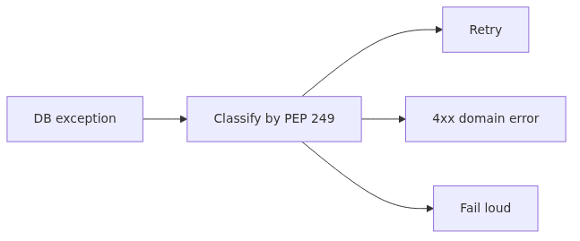
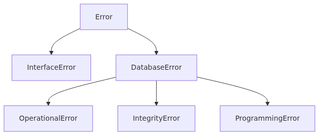
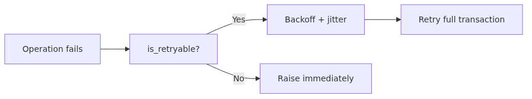

# PEP 249 Exception Hierarchy and SQLite Error Handling

The most common line in database code is `try/except Exception`. Catching everything in one place feels short and convenient, but in production it forces you to treat "irreversible data corruption" and "a lock that will release in 30 ms" with the same weight. PEP 249 introduced eight standard exception classes precisely to solve this, and `sqlite3` maps the error codes that the SQLite engine returns onto that hierarchy.

This post is not about memorizing the mapping table. It is about turning the exception hierarchy into an operational decision tree: "Should I retry this?", "Should I roll back the transaction or leave it open?", "Is this a user input problem or a code bug?" Each PEP 249 class encodes one of those answers.



*PEP 249 exception hierarchy and SQLite error handling*
## Questions this post answers

- What do the eight PEP 249 exceptions mean and how are they related?
- How does `sqlite3` map SQLite error codes (SQLITE_BUSY, SQLITE_CONSTRAINT, ...) to PEP 249 classes?
- Which of `OperationalError`, `IntegrityError`, `ProgrammingError` is safe to retry and which one is a bug?
- What is the difference between BUSY and LOCKED, and how should each be handled?
- What problem do `sqlite3.Error.sqlite_errorcode` and `sqlite_errorname` (Python 3.11+) actually solve?

## Why this matters

A common reaction to seeing `OperationalError: database is locked` in production is one of two extremes: (1) wrap every SQL call in `try/except` and retry forever, or (2) propagate every error to the user. Both are wrong.

Option (1) keeps retrying `IntegrityError`, which never resolves on its own, and locks the worker for minutes. Option (2) turns a 30 ms lock contention into a failed request. The right answer is to react differently per exception class, and that requires the hierarchy to be visible in the code rather than buried in a generic handler.

A second reason: `sqlite3` exception messages are English sentences, so it is tempting to branch on `if "locked" in str(e)`. That code breaks the moment SQLite changes its message wording. Branching on classes and on `sqlite_errorcode` is the only stable strategy.

## Mental Model: An exception is a signal about how to react



*Mental Model: an exception is a signal about how to react*
> An exception class is a signal about how to react in production. Retry, 4xx, or fail-loud should be encoded by the class itself.

Reread the PEP 249 hierarchy with operations in mind:

```
Exception
└── Warning             (warning - usually safe to ignore)
└── Error               (root of all DB errors)
    ├── InterfaceError  (driver itself misused - code bug)
    └── DatabaseError   (engine returned an error)
        ├── DataError           (data type/range - validate input)
        ├── OperationalError    (transient or environmental - retry candidate)
        ├── IntegrityError      (UNIQUE/FK/CHECK violation - never retry)
        ├── InternalError       (driver internal state corrupted - drop connection)
        ├── ProgrammingError    (bad SQL or params - code bug)
        └── NotSupportedError   (feature not supported - code change)
```

Group the leaves into three operational buckets and decisions become easy:

| Bucket | Includes | Reaction |
|--------|----------|----------|
| Code or schema bug | `ProgrammingError`, `InterfaceError`, `NotSupportedError`, `DataError` | Fail immediately. Page the team. Never retry. |
| Business rule violation | `IntegrityError` | Translate to a 4xx for the user. Never retry. |
| Transient environment | `OperationalError` (BUSY, LOCKED, partial IO) | Backoff retry, with a cap. |

`InternalError` is rare but real: when it appears, drop that connection and create a new one rather than reusing it.

## Core Concept: SQLite error codes and the PEP 249 mapping


*SQLite error codes and the PEP 249 mapping*
SQLite defines result codes in two layers. **Primary result codes** like `SQLITE_BUSY` and `SQLITE_CONSTRAINT`, and **extended result codes** like `SQLITE_BUSY_RECOVERY` and `SQLITE_CONSTRAINT_UNIQUE`. The `sqlite3` module looks at the primary code to choose a PEP 249 class.

The mappings you will hit most often:

| SQLite code | PEP 249 class | Meaning | Reaction |
|-------------|---------------|---------|----------|
| `SQLITE_CONSTRAINT_UNIQUE` | `IntegrityError` | UNIQUE violation | Reject the input |
| `SQLITE_CONSTRAINT_FOREIGNKEY` | `IntegrityError` | FK violation | Validate references |
| `SQLITE_CONSTRAINT_CHECK` | `IntegrityError` | CHECK violation | Surface the rule |
| `SQLITE_BUSY` | `OperationalError` | Another connection holds the lock | Backoff retry |
| `SQLITE_LOCKED` | `OperationalError` | Same-connection internal lock conflict | Usually a code structure issue |
| `SQLITE_READONLY` | `OperationalError` | DB file is read-only | Check permissions |
| `SQLITE_CORRUPT` | `DatabaseError` | DB file corrupt | Do NOT retry, restore backup |
| `SQLITE_FULL` | `OperationalError` | Disk full | Free disk |
| `SQLITE_MISUSE` | `ProgrammingError` | API misuse | Code bug |

Notice that `OperationalError` covers both BUSY (retry forever) and CORRUPT (never retry). The class alone is not enough; you also need the code. From Python 3.11 onward, `sqlite3.Error` exposes `sqlite_errorcode` (an integer) and `sqlite_errorname` (a string such as `"SQLITE_BUSY_TIMEOUT"`):

```python
import sqlite3

try:
    conn.execute("INSERT INTO users(email) VALUES (?)", ("a@example.com",))
except sqlite3.Error as exc:
    print(type(exc).__name__, exc.sqlite_errorcode, exc.sqlite_errorname)
```

Pre-3.11 you only have `exc.args[0]` (a string). Production code should target 3.11+ so the branching can be stable.

## Before / After: anti-pattern vs principled handling

### Before: one handler for everything

```python
def create_user(conn, email: str) -> int:
    try:
        cur = conn.execute(
            "INSERT INTO users(email) VALUES (?)", (email,)
        )
        conn.commit()
        return cur.lastrowid
    except Exception as exc:
        logging.error("insert failed: %s", exc)
        return -1
```

Three problems. UNIQUE violation and a full disk produce the same log line. The caller only sees `-1` and cannot decide on a status code. A `BUSY` raised from `commit()` itself disappears into the same bucket.

### After: branch on class, expose intent via domain exceptions

```python
import sqlite3
from typing import NewType

UserId = NewType("UserId", int)

class DuplicateEmail(Exception): ...
class TransientDBError(Exception): ...

def create_user(conn: sqlite3.Connection, email: str) -> UserId:
    try:
        cur = conn.execute(
            "INSERT INTO users(email) VALUES (?)", (email,)
        )
        conn.commit()
        return UserId(cur.lastrowid)
    except sqlite3.IntegrityError as exc:
        if exc.sqlite_errorname == "SQLITE_CONSTRAINT_UNIQUE":
            raise DuplicateEmail(email) from exc
        raise
    except sqlite3.OperationalError as exc:
        if exc.sqlite_errorname in {
            "SQLITE_BUSY", "SQLITE_BUSY_TIMEOUT", "SQLITE_LOCKED"
        }:
            raise TransientDBError(str(exc)) from exc
        raise
```

Domain exceptions (`DuplicateEmail`, `TransientDBError`) let the caller decide policy: 4xx, retry, or 5xx. Anything that is not classified explicitly bubbles up so it cannot be silently swallowed.

## Step by Step: building a safe retry decorator



*Step by Step: building a safe retry decorator*
### Step 1. Classify exceptions

```python
import sqlite3

RETRYABLE_NAMES = {
    "SQLITE_BUSY",
    "SQLITE_BUSY_RECOVERY",
    "SQLITE_BUSY_SNAPSHOT",
    "SQLITE_BUSY_TIMEOUT",
    "SQLITE_LOCKED",
    "SQLITE_LOCKED_SHAREDCACHE",
}

def is_retryable(exc: BaseException) -> bool:
    if not isinstance(exc, sqlite3.OperationalError):
        return False
    name = getattr(exc, "sqlite_errorname", "")
    return name in RETRYABLE_NAMES
```

`IntegrityError`, `ProgrammingError`, and `SQLITE_CORRUPT` all return False.

### Step 2. Exponential backoff with jitter

```python
import functools
import random
import time
from typing import Callable, TypeVar, ParamSpec

P = ParamSpec("P")
R = TypeVar("R")

def retry_on_transient(
    *, max_attempts: int = 5, base_delay: float = 0.05, max_delay: float = 1.0
) -> Callable[[Callable[P, R]], Callable[P, R]]:
    def decorator(fn: Callable[P, R]) -> Callable[P, R]:
        @functools.wraps(fn)
        def wrapper(*args: P.args, **kwargs: P.kwargs) -> R:
            for attempt in range(1, max_attempts + 1):
                try:
                    return fn(*args, **kwargs)
                except Exception as exc:
                    if attempt == max_attempts or not is_retryable(exc):
                        raise
                    delay = min(max_delay, base_delay * (2 ** (attempt - 1)))
                    delay += random.uniform(0, delay * 0.1)  # jitter
                    time.sleep(delay)
            raise RuntimeError("unreachable")
        return wrapper
    return decorator
```

Two points matter. `is_retryable` checks both class and code precisely, and the backoff includes jitter to avoid a thundering herd of workers waking up simultaneously.

### Step 3. Put the entire transaction inside the retried function

```python
@retry_on_transient(max_attempts=5)
def transfer(conn: sqlite3.Connection, src: int, dst: int, amount: int) -> None:
    with conn:  # context manager handles commit/rollback
        conn.execute(
            "UPDATE accounts SET balance = balance - ? WHERE id = ?", (amount, src)
        )
        conn.execute(
            "UPDATE accounts SET balance = balance + ? WHERE id = ?", (amount, dst)
        )
```

The `with conn:` block must live inside the function, so a retry restarts the transaction from scratch. Re-running only `commit()` after a partial transaction breaks atomicity guarantees.

### Step 4. Make retries observable

```python
import logging

log = logging.getLogger("db")

def is_retryable(exc: BaseException) -> bool:
    if not isinstance(exc, sqlite3.OperationalError):
        return False
    name = getattr(exc, "sqlite_errorname", "")
    code = getattr(exc, "sqlite_errorcode", -1)
    retryable = name in RETRYABLE_NAMES
    log.info(
        "db error name=%s code=%s retryable=%s msg=%s",
        name, code, retryable, exc
    )
    return retryable
```

Retry counts, the final outcome, and the last exception code should all flow into your dashboard. A growing retry rate is an early warning of lock contention or disk pressure.

## Common Mistakes

**Branching on string content.** `if "UNIQUE constraint" in str(exc):` breaks the day SQLite changes its wording. Use `sqlite_errorname == "SQLITE_CONSTRAINT_UNIQUE"`.

**Retrying `IntegrityError`.** A UNIQUE violation will not become not-a-violation by waiting. Five inserts of the same email will fail five times.

**Retrying outside `with conn:`.** Restarting only the failing statement after a transaction has begun gives you partial commits. Retry the entire transactional unit.

**Catching `BaseException`.** That swallows `KeyboardInterrupt` and `SystemExit`. Catch `Exception` or narrower.

**Unbounded retries.** A truly stuck external lock will pin a worker forever. Always set `max_attempts` and `max_delay`.

**Reusing a connection after `InternalError`.** Some `InternalError` and `OperationalError(SQLITE_CORRUPT)` cases leave the connection in a bad state. Drop it and open a new one.

## In Practice: integrating with FastAPI

Translating domain exceptions into HTTP status codes:

```python
from fastapi import FastAPI, HTTPException, status

app = FastAPI()

@app.exception_handler(DuplicateEmail)
async def handle_duplicate_email(_, exc: DuplicateEmail):
    raise HTTPException(
        status_code=status.HTTP_409_CONFLICT,
        detail=f"email already exists: {exc.args[0]}",
    )

@app.exception_handler(TransientDBError)
async def handle_transient(_, exc: TransientDBError):
    # The retry decorator already exhausted max_attempts.
    # Tell the client to back off; do not loop again here.
    raise HTTPException(
        status_code=status.HTTP_503_SERVICE_UNAVAILABLE,
        detail="database temporarily unavailable",
    )

@app.post("/users", status_code=201)
def post_user(payload: UserCreate, conn=Depends(get_conn)):
    user_id = create_user(conn, payload.email)
    return {"id": user_id}
```

Do not write a custom handler for `ProgrammingError` or `InterfaceError`. Let them become 500s and route them to your alerting channel (e.g., Sentry). They are bugs, not user-facing situations, and they need a code fix rather than a softer message.

## Checklist

- [ ] Replaced `except Exception` with narrower classes?
- [ ] Retries scoped to `OperationalError` of the BUSY/LOCKED family only?
- [ ] Branching on `sqlite_errorname` / `sqlite_errorcode` (Python 3.11+)?
- [ ] `IntegrityError` translated to a 4xx response, not a 5xx?
- [ ] Retry decorator caps both `max_attempts` and `max_delay`?
- [ ] Backoff includes jitter?
- [ ] The full transaction lives inside the retried function?
- [ ] A path exists to drop a connection on `InternalError`?
- [ ] Retry counts and final outcomes flow into logs/metrics?
- [ ] `ProgrammingError` triggers an alert, not just a log line?

## Exercises

1. **Classify.** Sort the following into retry / 4xx / 5xx: (a) `IntegrityError(SQLITE_CONSTRAINT_FOREIGNKEY)`, (b) `OperationalError(SQLITE_BUSY)`, (c) `OperationalError(SQLITE_CORRUPT)`, (d) `ProgrammingError(SQLITE_MISUSE)`, (e) `DataError`.
2. **Reproduce.** Open two connections. Hold a `BEGIN IMMEDIATE` on one. From the other, with a short `busy_timeout` (e.g., 100 ms), attempt an INSERT to reproduce `SQLITE_BUSY`. Then apply `retry_on_transient` and observe success.
3. **Bug it.** Modify `is_retryable` to return True for `IntegrityError` and observe what happens when you insert a duplicate (count attempts, total delay).
4. **Generalize.** Refactor the decorator to accept a classification function, so you can plug in a PostgreSQL classifier without rewriting the loop.

## Wrap-up and Next

- Re-grouping PEP 249 into "code bug / business rule / transient environment" makes the right reaction obvious for each exception.
- `sqlite3` maps SQLite codes to PEP 249 classes, but `OperationalError` mixes retry-safe and retry-unsafe cases, so always inspect `sqlite_errorname`.
- Retry only BUSY/LOCKED; translate `IntegrityError` into a domain exception and a 4xx.
- Retry the entire transactional block, cap attempts, add jitter, and log codes.

The next post moves from errors to connections themselves: SQLite's thread-safety modes, `check_same_thread`, per-thread vs shared connections, and connection management in FastAPI.

<!-- toc:begin -->
## In this series

- [Why DB-API 2.0 - The Problem PEP 249 Solved](./01-why-db-api-pep-249.md)
- [Connection and Cursor Lifecycle](./02-connection-cursor-lifecycle.md)
- [execute, executemany, and Fetch Patterns](./03-execute-fetch-patterns.md)
- [Parameter binding and SQL injection defense (sqlite3, PEP 249)](./04-parameter-binding-sql-injection.md)
- [Transactions and isolation levels (sqlite3, PEP 249)](./05-transactions-isolation.md)
- [Row factories and type adapters (sqlite3, PEP 249)](./06-row-factories-adapters.md)
- **PEP 249 Exception Hierarchy and SQLite Error Handling (current)**
- SQLite Connection Management: thread-safety, check_same_thread, and Pooling (upcoming)
- Asynchronous SQLite with aiosqlite (upcoming)
- SQLite Production Patterns: retry, timeout, observability, backup (upcoming)

<!-- toc:end -->

## References

- [PEP 249 — Python Database API 2.0](https://peps.python.org/pep-0249/)
- [`sqlite3` — DB-API 2.0 interface for SQLite](https://docs.python.org/3/library/sqlite3.html)
- [SQLite Result and Error Codes](https://www.sqlite.org/rescode.html)
- [SQLite: File Locking and Concurrency](https://www.sqlite.org/lockingv3.html)
- [What's New in Python 3.11 — sqlite3](https://docs.python.org/3/whatsnew/3.11.html#sqlite3)
