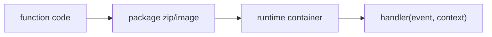

# Function as a Service

> Serverless 101 series (2/10)

<!-- a-grade-intro:begin -->

**Core question**: *how* does a *function* actually run on the *cloud*?

> *FaaS* runs *functions* briefly inside *containers* and returns *only the result*.

<!-- a-grade-intro:end -->

## What You Will Learn

- the *FaaS* execution model
- *handler* signatures
- *runtime* selection
- *packaging* and the *deployment unit*
- *concurrency* and *isolation*

## Why It Matters

Without the *base assumptions* of *FaaS*, your intuition for *cold start, concurrency, memory* will all be off.

## Concept at a Glance



## Key Terms

- **handler**: the *entry point* function.
- **runtime**: the *language environment* (Python, Node, etc.).
- **deployment package**: a *zip* or *container image*.
- **concurrency**: number of *parallel* *instances*.
- **memory size**: *memory* and *CPU* are *coupled*.

## Before/After

**Before**: a *server* with a *process* under *systemd*.

**After**: upload a *zip*; the *platform* runs it.

## Hands-on: Packaging and Execution

### Step 1 — Pin dependencies

```python
"""
requirements.txt:
requests==2.32.0
"""
```

### Step 2 — Write the handler

```python
import json

def handler(event, context):
    return {"statusCode": 200, "body": json.dumps({"ok": True})}
```

### Step 3 — Package

```python
import zipfile, pathlib

def package(src_dir, out):
    with zipfile.ZipFile(out, "w") as z:
        for p in pathlib.Path(src_dir).rglob("*"):
            z.write(p, p.relative_to(src_dir))
```

### Step 4 — Inspect memory effect

```python
def memory_to_cpu(mb):
    return mb / 1769  # ~1 vCPU at ~1769MB
```

### Step 5 — Simulate concurrency

```python
import concurrent.futures as cf

def burst(handler, n):
    with cf.ThreadPoolExecutor(max_workers=n) as ex:
        return list(ex.map(lambda i: handler({"i": i}, None), range(n)))
```

## What to Notice in This Code

- Treat the *handler* like a *pure function*.
- On many platforms, *memory* sets *CPU*.
- *Concurrency* balances *cost* and *latency*.

## Five Common Mistakes

1. **Relying on *global state* for caching.**
2. **Heavy *dependencies* worsening *cold start*.**
3. **Setting *memory* too *low*.**
4. **Not knowing the *concurrency limit*.**
5. **Leaving the *runtime EOL* unaddressed.**

## How This Shows Up in Production

It is widely used for *HTTP APIs, S3 triggers, queue consumers* — any *short unit* of work.

## How a Senior Engineer Thinks

- Keep the *handler small*.
- *Memory* tuning is the core of *cost reduction*.
- Consider *container image* options.
- *Runtime updates* are *periodic chores*.
- View *concurrency* as a *budget*.

## Checklist

- [ ] *Dependencies* minimized.
- [ ] *Memory/CPU* tuned.
- [ ] *Runtime* current.
- [ ] *Concurrency* limit known.

## Practice Problems

1. In one line, the *handler* signature.
2. In one line, the relation of *memory* and *CPU*.
3. In one line, the relation of *concurrency* and *cost*.

## Wrap-up and Next Steps

Next, we look at *Triggers* and *Events*.

<!-- toc:begin -->
- [What is Serverless?](./01-what-is-serverless.md)
- **Function as a Service (current)**
- Trigger and Event (upcoming)
- Cold Start (upcoming)
- Scaling (upcoming)
- State Management (upcoming)
- Queue and Event-driven Architecture (upcoming)
- Observability (upcoming)
- Cost (upcoming)
- Designing a Serverless App (upcoming)
<!-- toc:end -->

## References

- [AWS Lambda handler](https://docs.aws.amazon.com/lambda/latest/dg/python-handler.html)
- [Lambda container images](https://docs.aws.amazon.com/lambda/latest/dg/images-create.html)
- [Cloud Functions runtimes](https://cloud.google.com/functions/docs/runtime-support)
- [Azure Functions hosting](https://learn.microsoft.com/azure/azure-functions/functions-scale)
