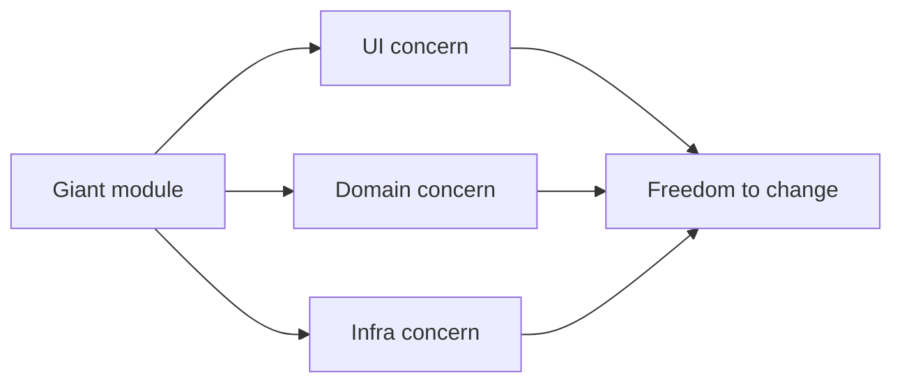

# Separation of Concerns

> Software Design 101 series (2/10)

<!-- a-grade-intro:begin -->

**Core question**: How can you tell that a module is doing too much?

> When it changes for more than one reason, it already does too much.

<!-- a-grade-intro:end -->

## What You Will Learn

- A definition of "concern"
- Coupling and cohesion
- A practical procedure for splitting responsibilities
- Cross-cutting concerns
- Balancing separation against integration

## Why It Matters

When concerns blend together you must understand everything to change one thing. Separation lowers the cost of the next change.

> Separation is not a cost; it is a gift of options.

## Concept at a Glance



Three concerns separated, three independent timelines.

## Key Terms

- **Concern**: One thing the system cares about.
- **Coupling**: Interdependence between modules. Lower is better.
- **Cohesion**: Relatedness inside a module. Higher is better.
- **Cross-cutting concern**: A concern (logging, security) that crosses many modules.
- **Boundary**: The seam between concerns.

## Before/After

**Before**

```python
def process_order(req):
    # parse + validate + price + store + email + respond
    ...
```

**After**

```python
def process_order(req):
    cmd = parse(req)               # input
    order = build_order(cmd)       # domain
    saved = save_order(order)      # infra
    notify(saved)                  # comms
    return to_response(saved)      # output
```

Each line handles a single concern.

## Hands-on: Five Steps to Separate Concerns

### Step 1 — List reasons to change

```python
# 1_reasons.py
# Why does the Order module change?
# - pricing policy change
# - DB schema change
# - notification channel change
# Three reasons → three responsibilities.
```

Reasons to change = responsibility candidates.

### Step 2 — Split domain from infra

```python
# 2_domain_infra.py
# Domain knows nothing about IO.
def calculate_total(items, member): ...
# Infra uses the domain.
def save(order): db.execute(...)
```

Domain core + infra adapters.

### Step 3 — Split input/process/output

```python
# 3_io.py
def parse(req): ...    # input
def handle(cmd): ...   # process
def render(res): ...   # output
```

The function reads as a single line.

### Step 4 — Extract cross-cutting concerns

```python
# 4_cross.py
def with_logging(fn):
    def w(*a, **k):
        # logging
        return fn(*a, **k)
    return w
```

Use decorators or middleware to consolidate.

### Step 5 — Inspect integration points

```python
# 5_seam.py
# Inspect where the separated concerns meet (the seams).
def app(req):
    return render(handle(parse(req)))
```

Seams should be few and explicit.

## What to Notice in This Code

- Each module has one reason to change.
- The domain knows nothing about IO.
- Cross-cutting concerns do not pollute the domain.

## Five Common Mistakes

1. **Layer names without separation.** Code stays coupled.
2. **Cross-cutting concerns inside the domain.** Tests break.
3. **Splitting too finely.** Integration cost grows.
4. **Unclear interfaces after separation.** Seams blur.
5. **Premature performance fear.** Usually safe to measure first.

## How This Shows Up in Production

Strong teams add lints that forbid external imports inside domain packages. Boundaries are enforced by code.

## How a Senior Engineer Thinks

- Splits responsibilities along reasons to change.
- Keeps the domain ignorant of IO.
- Consolidates cross-cutting concerns.
- Sees separation and integration as a tradeoff.
- Keeps seams few and explicit.

## Checklist

- [ ] Does each module have one reason to change?
- [ ] Is the domain free of IO libraries?
- [ ] Are cross-cutting concerns consolidated?
- [ ] Are seams explicit?
- [ ] Does the separation justify the integration cost?

## Practice Problems

1. Write down three reasons to change one module of yours.
2. Split one function into input/process/output.
3. Move every external import out of your domain code into adapters.

## Wrap-up and Next Steps

Separation of concerns is the starting point of all design. Next: the unit of separation — modules and boundaries.

<!-- toc:begin -->
- [What Is Software Design?](./01-what-is-software-design.md)
- **Separation of Concerns (current)**
- Modules and Boundaries (upcoming)
- Dependency Direction (upcoming)
- Interfaces and Abstraction (upcoming)
- Layered Architecture (upcoming)
- Data Flow Design (upcoming)
- Reducing Change Impact (upcoming)
- Design Principles (upcoming)
- Practicing Design with a Small Project (upcoming)
<!-- toc:end -->

## References

- [Separation of Concerns (Dijkstra)](https://www.cs.utexas.edu/users/EWD/transcriptions/EWD04xx/EWD447.html)
- [A Philosophy of Software Design](https://web.stanford.edu/~ouster/cgi-bin/aposd.php)
- [Hexagonal Architecture (Cockburn)](https://alistair.cockburn.us/hexagonal-architecture/)
- [Clean Architecture (Uncle Bob)](https://blog.cleancoder.com/uncle-bob/2012/08/13/the-clean-architecture.html)
