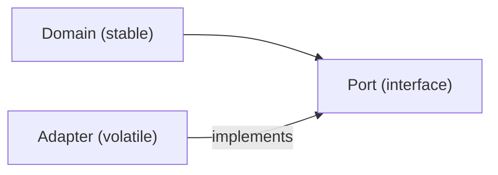

# Dependency Direction

> Software Design 101 series (4/10)

<!-- a-grade-intro:begin -->

**Core question**: Why does the direction of a dependency matter so much?

> Because the way arrows point decides who pays the cost of change. Make the core ignorant of the details and you buy yourself freedom.

<!-- a-grade-intro:end -->

## What You Will Learn

- How dependency relates to coupling
- Stable versus volatile modules
- The Dependency Inversion Principle (DIP)
- The ports and adapters pattern
- The freedom you gain from controlling direction

## Why It Matters

Code is a graph. Where the arrows point determines whether a change in one place leaks into another.

> Stable things must not depend on volatile things.

## Concept at a Glance



Details point toward the core.

## Key Terms

- **Dependency**: If A imports or calls B, then A depends on B.
- **Stable module**: Changes rarely; usually the more abstract side.
- **Volatile module**: DB, HTTP, third-party SaaS. Changes often.
- **DIP (Dependency Inversion Principle)**: The core depends on abstractions; details implement those abstractions.
- **Port / Adapter**: The core defines an interface (port) that an external adapter implements.

## Before / After

**Before**

```python
# domain knows the DB directly
import psycopg2

def charge(user_id, amount):
    conn = psycopg2.connect(...)
    conn.execute("UPDATE wallet SET ...")
```

**After**

```python
# domain only knows an abstraction
class WalletRepo:
    def debit(self, user_id, amount): ...

def charge(repo: WalletRepo, user_id, amount):
    repo.debit(user_id, amount)
```

Swapping the DB no longer shakes the domain.

## Hands-on: Five Steps to Fix Dependency Direction

### Step 1 — Draw the arrows

```python
# 1_arrows.py
# On paper, draw which module imports which.
# If the core imports the details, that is a red flag.
```

You can only fix what you can see.

### Step 2 — Define the abstraction in the core

```python
# 2_port.py
from typing import Protocol

class WalletRepo(Protocol):
    def debit(self, user_id: str, amount: int) -> None: ...
```

The core declares the shape it needs.

### Step 3 — Implement in the adapter

```python
# 3_adapter.py
class PostgresWalletRepo:
    def debit(self, user_id, amount):
        # concrete SQL implementation
        ...
```

The detail conforms to the abstraction, not the other way around.

### Step 4 — Compose at the edge

```python
# 4_compose.py
def main():
    repo = PostgresWalletRepo()
    charge(repo, "u-1", 1000)
```

The domain has no idea which implementation showed up.

### Step 5 — Test with a fake

```python
# 5_fake.py
class FakeRepo:
    def __init__(self): self.calls = []
    def debit(self, u, a): self.calls.append((u, a))

def test_charge():
    repo = FakeRepo()
    charge(repo, "u-1", 500)
    assert repo.calls == [("u-1", 500)]
```

You can verify the domain without any database.

## What to Notice in This Code

- The domain is free of external libraries.
- The abstraction lives on the domain side, not the infrastructure side.
- Composition only happens at the edge (`main`, the composition root).

## Five Common Mistakes

1. **Putting the interface in the infrastructure folder.** The dependency flips back.
2. **Slicing abstractions too thin.** A hundred ports is the same as none.
3. **Business logic inside the adapter.** The domain is leaking out.
4. **Composing inside the domain.** A `new PostgresRepo()` shows up where it should not.
5. **Applying DIP everywhere.** Use it only across real stable / volatile boundaries.

## How This Shows Up in Production

DIP shines around payments, notifications, and third-party SaaS integrations. Vendor swaps and mocks happen without touching the domain.

## How a Senior Engineer Thinks

- They keep the dependency graph in their head.
- They never let an arrow run from the volatile side into the stable side.
- They notice instantly when the domain imports infrastructure.
- They let the domain decide the number and shape of ports.
- They keep composition in one place.

## Checklist

- [ ] Does the domain avoid importing infrastructure?
- [ ] Are ports defined on the domain side?
- [ ] Is composition concentrated at the edge?
- [ ] Can the domain be tested with fake adapters?
- [ ] Is the number of ports kept reasonable?

## Practice Problems

1. Pick one external module the domain currently imports. Is it worth flipping with DIP?
2. Split out a payment module's DB call into a port and an adapter.
3. Write a domain unit test that uses a fake adapter.

## Wrap-up and Next Steps

Once direction is right, the cost of change drops. Next up we look at the tools that hold that direction in place — interfaces and abstraction.

<!-- toc:begin -->
- [What Is Software Design?](./01-what-is-software-design.md)
- [Separation of Concerns](./02-separation-of-concerns.md)
- [Modules and Boundaries](./03-modules-and-boundaries.md)
- **Dependency Direction (current)**
- Interfaces and Abstraction (upcoming)
- Layered Architecture (upcoming)
- Data Flow Design (upcoming)
- Reducing Change Impact (upcoming)
- Design Principles (upcoming)
- Small Design Practice (upcoming)
<!-- toc:end -->

## References

- [Robert C. Martin — Dependency Inversion Principle](https://web.archive.org/web/20110714224327/http://www.objectmentor.com/resources/articles/dip.pdf)
- [Hexagonal Architecture (Alistair Cockburn)](https://alistair.cockburn.us/hexagonal-architecture/)
- [Clean Architecture — Dependency Rule](https://blog.cleancoder.com/uncle-bob/2012/08/13/the-clean-architecture.html)
- [Ports and Adapters Pattern](https://herbertograca.com/2017/09/14/ports-adapters-architecture/)
