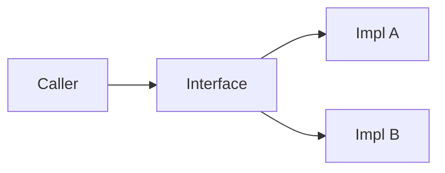

# Interfaces and Abstraction

> Software Design 101 series (5/10)

<!-- a-grade-intro:begin -->

**Core question**: What makes one interface clearly better than another?

> It speaks the caller's intent and survives even when the implementation changes underneath.

<!-- a-grade-intro:end -->

## What You Will Learn

- The role of an interface
- Matching the right level of abstraction
- Reducing branching with polymorphism
- The Liskov Substitution Principle (LSP)
- Patterns for a well-designed interface

## Why It Matters

An interface is a promise. When the promise is small and clear, both sides stay free.

> Write interfaces in the user's language, not the implementer's.

## Concept at a Glance



The caller knows one shape; multiple implementations sit behind it.

## Key Terms

- **Interface**: The shape of a callable promise.
- **Abstraction level**: How well it matches the caller's vocabulary.
- **Polymorphism**: The same call dispatches to multiple implementations.
- **LSP (Liskov Substitution)**: A subtype must work wherever the supertype works, no surprises.
- **Leaky abstraction**: An interface that lets internal details slip out.

## Before / After

**Before**

```python
def notify(kind, user, msg):
    if kind == "email": send_email(user, msg)
    elif kind == "sms": send_sms(user, msg)
    elif kind == "push": send_push(user, msg)
```

**After**

```python
class Notifier:
    def send(self, user, msg): ...

def notify(notifier: Notifier, user, msg):
    notifier.send(user, msg)
```

The branching disappears, and a new channel is easy to add.

## Hands-on: Five Steps to a Good Interface

### Step 1 — Name in the caller's language

```python
# 1_naming.py
# Bad: process_data()
# Good: charge_user()
```

The name should carry the intent.

### Step 2 — Match the abstraction level

```python
# 2_level.py
# Bad: send_bytes_over_tcp(host, port, payload)
# Good: notify(user, message)
```

Hide the things the caller does not care about.

### Step 3 — Few arguments, clear intent

```python
# 3_params.py
# Bad: charge(u, a, c, r, m, x, y)
# Good: charge(user, amount, *, reason)
```

Once you cross four positional arguments, get suspicious.

### Step 4 — Verify LSP

```python
# 4_lsp.py
class Bird:
    def fly(self): ...

class Penguin(Bird):
    def fly(self): raise NotImplementedError
# Callers break — Bird itself needs a redesign.
```

When the subtype breaks the supertype's promise, the interface is wrong.

### Step 5 — Several small interfaces

```python
# 5_isp.py
class Reader:
    def read(self): ...

class Writer:
    def write(self, x): ...
# Better than one giant IO interface.
```

Do not force a read-only caller to depend on writes.

## What to Notice in This Code

- The interface name reads in the caller's vocabulary.
- The argument list is short and meaningful.
- Swapping implementations does not ripple through the caller.

## Five Common Mistakes

1. **Implementer-flavored method names.** Names like `flush_buffer` show up at the interface.
2. **Parameter explosion.** An interface that takes seven arguments.
3. **LSP violations.** A subtype throws or narrows the contract.
4. **One giant interface.** A clear ISP violation.
5. **Leaky abstraction.** `get_redis_client()` exposed in the interface.

## How This Shows Up in Production

Payment gateways, repositories, notification channels — all places where a clean interface earns its keep. The vendor changes; the caller never notices.

## How a Senior Engineer Thinks

- They design from the caller's seat.
- One interface does one thing well.
- An LSP violation makes them suspect the type hierarchy.
- A growing parameter list signals blurred intent.
- Leaking implementation terms means raising the abstraction level.

## Checklist

- [ ] Do method names speak the caller's language?
- [ ] Are the arguments few?
- [ ] Do subtypes honor the supertype's contract?
- [ ] Does the interface carry a single responsibility?
- [ ] Are implementation details kept inside?

## Practice Problems

1. Pick one interface in your code and reduce its argument count.
2. Split a monolithic interface into two narrower ones.
3. Find an LSP violation in your codebase and write down what should change.

## Wrap-up and Next Steps

A good interface is a unit of freedom. Next up we look at how interfaces compose into structure — layered architecture.

<!-- toc:begin -->
- [What Is Software Design?](./01-what-is-software-design.md)
- [Separation of Concerns](./02-separation-of-concerns.md)
- [Modules and Boundaries](./03-modules-and-boundaries.md)
- [Dependency Direction](./04-dependency-direction.md)
- **Interfaces and Abstraction (current)**
- Layered Architecture (upcoming)
- Data Flow Design (upcoming)
- Reducing Change Impact (upcoming)
- Design Principles (upcoming)
- Small Design Practice (upcoming)
<!-- toc:end -->

## References

- [Liskov Substitution Principle (Barbara Liskov)](https://www.cs.cmu.edu/~wing/publications/LiskovWing94.pdf)
- [Interface Segregation Principle](https://web.archive.org/web/20150905081110/http://www.objectmentor.com/resources/articles/isp.pdf)
- [Joshua Bloch — How to Design a Good API](https://www.youtube.com/watch?v=heh4OeB9A-c)
- [Designing Data-Intensive Applications — Abstractions](https://dataintensive.net/)
