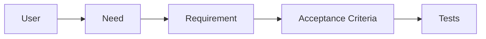

# Understanding Requirements

> Software Engineering 101 series (2/10)

<!-- a-grade-intro:begin -->

**Core question**: Is hearing a requirement the same as understanding it?

> Solving the wrong problem precisely is the most expensive kind of waste.

<!-- a-grade-intro:end -->

## What You Will Learn

- What makes a requirement good
- User stories and acceptance criteria
- Functional vs non-functional requirements
- Question patterns that remove ambiguity
- Why requirements live in writing

## Why It Matters

Over half of code defects originate at the requirements stage. The later you find them, the cost grows exponentially.

> The most expensive code is code you rewrite.

## Concept at a Glance



Requirements only become real when they map to tests.

## Key Terms

- **Functional requirement**: what the system does.
- **Non-functional requirement**: how well it must do it (performance, security, availability).
- **User story**: "As a role, I want X so that Y" — one line.
- **Acceptance Criteria (AC)**: the conditions that mark "done".
- **INVEST**: the six attributes of a good story.

## Before/After

**Before — Vague**

```text
"Build a search feature"
```

**After — Measurable**

```text
A user (role) searches the product catalog (scope) by keyword (input)
and gets results sorted by relevance (sort) within 500ms (performance).
```

One sentence sets the quality of the outcome.

## Hands-on Step by Step

### Step 1 — Write a User Story

```text
# 1_story.txt
As a registered user, I want a password-reset link via email so that
I can quickly recover account access.
```

Role - action - value.

### Step 2 — Acceptance Criteria

```text
# 2_ac.txt
- Email arrives within 60 seconds for a registered address
- Link expires after 30 minutes
- Token is invalidated immediately after use
- Identical response for unregistered emails (avoid leaking)
```

Phrased so they can be tested.

### Step 3 — Non-functional Requirements

```text
# 3_nfr.txt
- Availability: 99.9% monthly
- Security: single-use token
- Observability: send/use counters streamed to SIEM
```

NFRs decide operational cost.

### Step 4 — Ambiguity-Hunting Questions

```text
# 4_questions.txt
- Who uses this?
- How often?
- What happens on failure?
- Where do we measure?
- What is "done"?
```

Append 5W1H to expose vagueness.

### Step 5 — Capture in the Wiki/Ticket

```text
# 5_doc.md
- Context
- User story
- Acceptance criteria
- Non-functional requirements
- Decision log (options and reason chosen)
```

A spoken agreement does not exist.

## What to Notice in This Code

- "Verifiable" is the start of a good requirement.
- Acceptance criteria become PR-merge gates.
- Pinning NFRs early is always cheaper.
- A decision log shrinks future debugging time.

## Five Common Mistakes

1. **Designing the moment you hear the requirement.** Vagueness hardens into code.
2. **Accepting "something like X".** Not measurable.
3. **Ignoring NFRs.** They explode in production.
4. **Merging PRs without ACs.** No definition of done.
5. **No change history.** "Why is it this way?" repeats forever.

## How This Shows Up in Production

PM, designers, and engineers run a discovery meeting and capture requirements in an RFC or PRD. Jira/Linear tickets carry ACs as checkboxes that map directly into the PR description.

## How a Senior Engineer Thinks

- Cannot state the "why" in one line? Do not start.
- Pin NFRs before writing code.
- Automate ACs as tests.
- Capture decisions in RFCs/ADRs.
- Resolve ambiguity in conversation, not in code.

## Checklist

- [ ] Does the story have role, action, and value?
- [ ] Are the acceptance criteria measurable?
- [ ] Are non-functional requirements stated?
- [ ] Is there a decision log?
- [ ] Does the PR description map to the ACs?

## Practice Problems

1. Rewrite one feature in your project as a user story.
2. Pick a story without ACs and write five.
3. Name two NFRs that would cause incidents if ignored.

## Wrap-up and Next Steps

Good requirements are measurable. Next we look at the step before code — design vs implementation.

<!-- toc:begin -->
- [What Is Software Engineering?](./01-what-is-software-engineering.md)
- **Understanding Requirements (current)**
- Design vs Implementation (upcoming)
- Code Review (upcoming)
- Testing Strategy (upcoming)
- Version Control and Release (upcoming)
- Documentation (upcoming)
- Collaboration Process (upcoming)
- Maintenance and Tech Debt (upcoming)
- What Makes Good Software (upcoming)
<!-- toc:end -->

## References

- [Mike Cohn — User Stories Applied](https://www.mountaingoatsoftware.com/books/user-stories-applied)
- [Atlassian — INVEST in Good Stories](https://www.atlassian.com/agile/project-management/user-stories)
- [Joel Spolsky — Painless Functional Specifications](https://www.joelonsoftware.com/2000/10/02/painless-functional-specifications-part-1-why-bother/)
- [ISO/IEC/IEEE 29148 — Requirements Engineering](https://www.iso.org/standard/72089.html)
