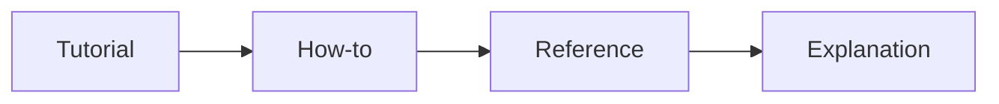

# Documentation

> Software Engineering 101 series (7/10)

<!-- a-grade-intro:begin -->

**Core question**: If the code is good, do you really need docs?

> Code answers "how". Documentation answers "why" and "when".

<!-- a-grade-intro:end -->

## What You Will Learn

- The minimum sections of a useful README
- Recording decisions with ADRs
- Docstrings and type hints
- Runbooks and onboarding documents
- The Diataxis four quadrants (tutorial / how-to / reference / explanation)

## Why It Matters

Without docs, every question routes through a person. The moment a person becomes the bottleneck, team speed depends on their work hours.

> Documentation is the infrastructure of async collaboration.

## Concept at a Glance



Diataxis splits docs by reader intent.

## Key Terms

- **README**: First impression and entry point.
- **ADR**: A short record of a decision and its reasoning.
- **Docstring**: The usage contract of a function or class.
- **Runbook**: Step-by-step procedure for incidents.
- **Diataxis**: Four-quadrant documentation model.

## Before/After

**Before — one giant wiki**

```text
"It's all on the wiki" -> nobody knows where
```

**After — four quadrants + index**

```text
docs/tutorials/  docs/how-to/  docs/reference/  docs/explanation/
```

Folders split by reader intent.

## Hands-on: A Small Doc Set

### Step 1 — README in 5 blocks

```markdown
# 1_readme.md
## What — one-sentence description
## Why — why it exists
## Quick start — working in 60 seconds
## Configuration — env var table
## Links — go deeper
```

The reader sees value within 60 seconds.

### Step 2 — One-page ADR

```markdown
# 2_adr.md
# ADR 0012: introduce cache
- Context, Decision, Alternatives, Consequences
- Date, Owners
```

A decision outlives the code that implements it.

### Step 3 — Docstring and types

```python
# 3_docstring.py
def compute_invoice(amount: int, tax_rate: float) -> int:
    """Return cents amount including tax.

    Raises:
        ValueError: when amount is negative.
    """
```

The signature is half the documentation.

### Step 4 — Runbook

```markdown
# 4_runbook.md
## Symptom
- 5xx error rate > 2% for 5 min
## Diagnose
1. Check Grafana dashboard X
2. Look at the latest deploy log
## Action
- Roll back immediately (`kubectl rollout undo ...`)
```

It must be followable at 3 a.m.

### Step 5 — Onboarding checklist

```markdown
# 5_onboarding.md
- [ ] Clone repo, run dev environment
- [ ] Land first PR (typo fix)
- [ ] Shadow first incident within a week
```

Designs the new hire's first thirty days.

## What to Notice in This Code

- Splitting by intent makes docs findable.
- ADRs make decisions recoverable.
- Runbooks reduce the cost of 3 a.m. incidents.
- The README is both first impression and recruiting tool.

## Five Common Mistakes

1. **Everything in one wiki page.** Nobody finds anything.
2. **Auto-generated docs only.** Intent disappears.
3. **Mixed tense.** Trust leaks.
4. **Unrehearsed runbooks.** The first run is the real incident.
5. **No doc owner.** It rots into a lie.

## How This Shows Up in Production

Mature teams use docs-as-code (markdown in the repo, change via PR, build in CI). New features ship as RFC -> code -> doc updates inside one PR.

## How a Senior Engineer Thinks

- Documentation is the infrastructure of async collaboration.
- Code is "how"; docs are "why" and "when".
- A repo with a weak README is a future debt.
- Every doc needs an owner and a last_reviewed date.
- Review docs as carefully as code.

## Checklist

- [ ] Are the 5 README blocks present?
- [ ] Do major decisions have ADRs?
- [ ] Do docstrings express usage contracts?
- [ ] Is there an incident runbook?
- [ ] Does every document have an owner?

## Practice Problems

1. Rewrite your repo README into the 5 blocks.
2. Convert one recent decision into an ADR.
3. Write a one-page runbook for your last real incident.

## Wrap-up and Next Steps

Documentation frees people. Next, we look at how those people work together — the collaboration process.

<!-- toc:begin -->
- [What is Software Engineering?](./01-what-is-software-engineering.md)
- [Understanding Requirements](./02-understanding-requirements.md)
- [Design vs Implementation](./03-design-vs-implementation.md)
- [Code Review](./04-code-review.md)
- [Testing Strategy](./05-testing-strategy.md)
- [Version Control and Release](./06-version-control-and-release.md)
- **Documentation (current)**
- Collaboration Process (upcoming)
- Maintenance and Tech Debt (upcoming)
- What Makes Good Software (upcoming)
<!-- toc:end -->

## References

- [Diataxis Framework](https://diataxis.fr/)
- [The Documentation System — Daniele Procida](https://documentation.divio.com/)
- [Write the Docs — Documentation Guide](https://www.writethedocs.org/guide/)
- [Google — Documentation Best Practices](https://google.github.io/styleguide/docguide/best_practices.html)
