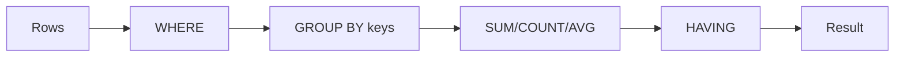

# GROUP BY and Aggregates

> SQL 101 series (5/10)

<!-- a-grade-intro:begin -->

**Core question**: A single total is easy. Why is *one total per category* harder, and how does *HAVING* differ from *WHERE*?

> *Aggregation is *shrinking rows to make meaning*.*

<!-- a-grade-intro:end -->

## What You Will Learn

- When *GROUP BY* runs and what *aggregate functions* do
- The split between *WHERE* and *HAVING*
- Multi-column grouping
- Handling *NULL* groups
- Five common mistakes

## Why It Matters

Most dashboard numbers come from a GROUP BY. *Daily revenue, orders per user, average per country* — same shape every time. Miss *NULL* or *join cardinality* and the numbers *lie*.

> *Aggregation compresses rows. That means knowing *what gets dropped*.*

## Concept at a Glance



## Key Terms

- **Aggregate function**: `SUM, COUNT, AVG, MIN, MAX`, etc.
- **Grouping key**: the column rows are bucketed by.
- **HAVING**: a condition on *aggregate output*.
- **NULL group**: NULL is *its own group*.
- **Distinct count**: `COUNT(DISTINCT x)` — count after deduplication.

## Before/After

**Before**: `SELECT user_id, SUM(total) FROM orders;` — *error*. `user_id` must be grouped.

**After**: `SELECT user_id, SUM(total) FROM orders GROUP BY user_id;` — *correct aggregate*.

## Hands-on: Five Aggregations

### Step 1 — Simple total

```sql
SELECT COUNT(*) AS total_users FROM users;
```

### Step 2 — Per category

```sql
SELECT country, COUNT(*) AS users
FROM users
GROUP BY country;
```

### Step 3 — Multiple keys

```sql
SELECT country, signup_at::date AS day, COUNT(*) AS users
FROM users
GROUP BY country, day;
```

### Step 4 — HAVING

```sql
SELECT country, COUNT(*) AS users
FROM users
GROUP BY country
HAVING COUNT(*) > 100;
```

### Step 5 — DISTINCT count

```sql
SELECT country, COUNT(DISTINCT user_id) AS active_users
FROM events
GROUP BY country;
```

## What to Notice in This Code

- WHERE runs *before* aggregation, HAVING *after*.
- `COUNT(*)` includes NULL rows, `COUNT(col)` does not.
- `COUNT(DISTINCT)` is *expensive*. On big tables, consider *approximate functions*.

## Five Common Mistakes

1. **Forgetting a GROUP BY column.** Every *non-aggregated* column in SELECT must be grouped.
2. **Aggregate condition in WHERE.** `WHERE COUNT(*) > 1` is an *error*. Use HAVING.
3. **Treating `AVG` as if NULL counts as 0.** It is *excluded*.
4. **Sums *inflated* after a join.** Cardinality is 1:N.
5. **Grouping by *too many columns*.** Each group is one row, so the result *means nothing*.

## How This Shows Up in Production

*Daily Active Users (DAU)*, *revenue by country*, *average rating per product* — the building blocks of analytics. Heavy aggregations move into *materialized views*.

## How a Senior Engineer Thinks

- *Separate *pre-* and *post-aggregate* conditions in your head.*
- *Assume NULL can *skew* metrics.*
- *Watch the *cost* of DISTINCT COUNT.*
- *For join + aggregate, *aggregate the small side first*.*
- *Group keys must be *interpretable*.*

## Checklist

- [ ] I know the difference between WHERE and HAVING.
- [ ] I know `COUNT(*)` vs `COUNT(col)`.
- [ ] I can group by multiple columns.
- [ ] I know what a NULL group means.

## Practice Problems

1. Compute *users per country* and *active users per country* together.
2. Filter to users with *at least 100 orders*.
3. Compute *daily DAU* from an events table.

## Wrap-up and Next Steps

GROUP BY makes meaning by *shrinking rows*. Next: *Subquery*.

<!-- toc:begin -->
- [What Is SQL?](./01-what-is-sql.md)
- [SELECT Basics](./02-select-basics.md)
- [WHERE and Conditions](./03-where-and-conditions.md)
- [JOIN](./04-join.md)
- **GROUP BY and Aggregates (current)**
- Subquery (upcoming)
- Window Function (upcoming)
- INSERT, UPDATE, DELETE (upcoming)
- Index and Query Plan (upcoming)
- Practical Analysis SQL (upcoming)
<!-- toc:end -->

## References

- [PostgreSQL — GROUP BY](https://www.postgresql.org/docs/current/tutorial-agg.html)
- [PostgreSQL — Aggregate Functions](https://www.postgresql.org/docs/current/functions-aggregate.html)
- [Mode — GROUP BY](https://mode.com/sql-tutorial/sql-group-by/)
- [SQLBolt — Aggregates](https://sqlbolt.com/lesson/select_queries_with_aggregates)
