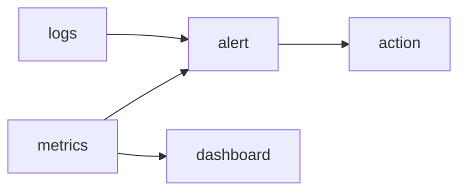

# Monitoring

> SRE 101 series (5/10)

<!-- a-grade-intro:begin -->

**Core question**: *What* do you need to know, and *when*, to take *action*?

> *Monitoring* is *measurement* that leads to *action*.

<!-- a-grade-intro:end -->

## What You Will Learn

- The *four golden signals*
- *Metrics* and *logs*
- *Alert* design
- *Dashboard* principles
- Managing *alert fatigue*

## Why It Matters

A flood of *alerts* drowns the *real* problem.

## Concept at a Glance



## Key Terms

- **golden signals**: *latency, traffic, errors, saturation*.
- **alert**: an *action-required* signal.
- **threshold**: a *limit value*.
- **dashboard**: a *status screen*.
- **paging**: a *call-out notification*.

## Before/After

**Before**: collect *every* possible metric.

**After**: only *alert* on metrics that lead to *action*.

## Hands-on: Measuring the Four Signals

### Step 1 — Latency

```python
def latency_p95(samples):
    s = sorted(samples)
    return s[int(0.95 * len(s)) - 1]
```

### Step 2 — Traffic

```python
def rps(reqs, seconds):
    return reqs / seconds
```

### Step 3 — Errors

```python
def error_ratio(err, total):
    return err / total
```

### Step 4 — Saturation

```python
def saturation(used, capacity):
    return used / capacity
```

### Step 5 — Alert rule

```python
def should_page(err_ratio, p95_ms, sat):
    return err_ratio > 0.01 or p95_ms > 500 or sat > 0.9
```

## What to Notice in This Code

- The *four signals* are a *shared language*.
- An *alert* must be *actionable*.
- A *dashboard* should tell a *story*.

## Five Common Mistakes

1. **Alerting on *everything*.**
2. **Monitoring only *averages*.**
3. **Ignoring *saturation*.**
4. **Dashboards that are *graph graveyards*.**
5. **Letting *alert fatigue* fester.**

## How This Shows Up in Production

You combine *Prometheus* metrics with *Loki* logs in a single *Grafana* view.

## How a Senior Engineer Thinks

- An *alert* is a *scheduled phone call*.
- A *dashboard* answers a *question*.
- *Metrics* connect to *customer experience*.
- *Alert fatigue* is a *KPI*.
- *Operations* deserves *design*, too.

## Checklist

- [ ] *Four signals* defined.
- [ ] *Thresholds* agreed.
- [ ] *Dashboards* curated.
- [ ] *Alert fatigue* measured.

## Practice Problems

1. Name the *four golden signals* in one line.
2. Define *saturation* in one line.
3. Define *paging* in one line.

## Wrap-up and Next Steps

Next, we cover *incident response*.

<!-- toc:begin -->
- [What is SRE?](./01-what-is-sre.md)
- [Reliability](./02-reliability.md)
- [SLI, SLO, SLA](./03-sli-slo-sla.md)
- [Error Budget](./04-error-budget.md)
- **Monitoring (current)**
- Incident Response (upcoming)
- Postmortem (upcoming)
- Reducing Toil (upcoming)
- Capacity Planning (upcoming)
- Building Operable Systems (upcoming)
<!-- toc:end -->

## References

- [Monitoring Distributed Systems - Google SRE Book](https://sre.google/sre-book/monitoring-distributed-systems/)
- [Practical Alerting - Google SRE Book](https://sre.google/sre-book/practical-alerting/)
- [USE Method - Brendan Gregg](https://www.brendangregg.com/usemethod.html)
- [Prometheus Best Practices](https://prometheus.io/docs/practices/alerting/)
