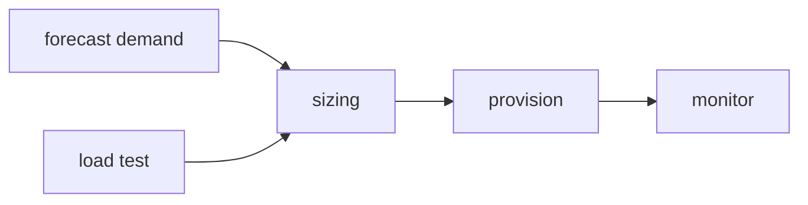

# Capacity Planning

> SRE 101 series (9/10)

<!-- a-grade-intro:begin -->

**Core question**: How do you *prepare* for *next year's traffic*?

> *Capacity planning* is the work of *aligning supply with demand* using *numbers*.

<!-- a-grade-intro:end -->

## What You Will Learn

- The *definition* of *capacity planning*
- *Demand forecasting*
- Sizing *headroom*
- *Load testing*
- The *cost* trade-off

## Why It Matters

Without a *forecast*, the next *traffic spike* takes the service *down*.

## Concept at a Glance



## Key Terms

- **demand forecast**: predicted *future demand*.
- **headroom**: *spare* capacity.
- **load test**: a *load experiment*.
- **scaling unit**: a unit of *expansion*.
- **lead time**: how long *procurement* takes.

## Before/After

**Before**: scale up based on *last quarter's* traffic.

**After**: scale up using a *forecast* and a *load test*.

## Hands-on: Modeling Capacity

### Step 1 — Trend line

```python
def linear_forecast(history, weeks_ahead):
    base = history[-1]
    growth = (history[-1] - history[0]) / max(len(history) - 1, 1)
    return base + growth * weeks_ahead
```

### Step 2 — Headroom

```python
def headroom(target_util, current_util):
    return max(0, target_util - current_util)
```

### Step 3 — Load-test result

```python
def max_rps(samples):
    return max(samples)
```

### Step 4 — Node count

```python
def nodes(predicted_rps, rps_per_node):
    return -(-predicted_rps // rps_per_node)
```

### Step 5 — Cost

```python
def cost(nodes, monthly_per_node):
    return nodes * monthly_per_node
```

## What to Notice in This Code

- The *forecast* is *data-driven*.
- *Headroom* absorbs *variability*.
- *Cost* is read *together* with capacity.

## Five Common Mistakes

1. **Replicating the *past* with no *forecast*.**
2. **Zero *headroom* leaves you exposed.**
3. **Skipping *load tests*.**
4. **Ignoring *lead time*.**
5. **Treating *cost* as a separate problem.**

## How This Shows Up in Production

A peak event like *Black Friday* is *modeled* months ahead.

## How a Senior Engineer Thinks

- *Forecasts* improve with *iteration*.
- *Headroom* is *insurance*.
- *Load tests* belong on a *schedule*.
- *Lead time* shapes the *strategy*.
- *Cost* is part of *capacity*.

## Checklist

- [ ] *Forecast model*.
- [ ] *Headroom policy*.
- [ ] *Load-test schedule*.
- [ ] *Cost analysis*.

## Practice Problems

1. Define *headroom* in one line.
2. Define *load test* in one line.
3. Define *lead time* in one line.

## Wrap-up and Next Steps

The final episode is *Building Operable Systems*.

<!-- toc:begin -->
- [What is SRE?](./01-what-is-sre.md)
- [Reliability](./02-reliability.md)
- [SLI, SLO, SLA](./03-sli-slo-sla.md)
- [Error Budget](./04-error-budget.md)
- [Monitoring](./05-monitoring.md)
- [Incident Response](./06-incident-response.md)
- [Postmortem](./07-postmortem.md)
- [Reducing Toil](./08-reducing-toil.md)
- **Capacity Planning (current)**
- Building Operable Systems (upcoming)
<!-- toc:end -->

## References

- [Software Engineering in SRE - Google SRE Book](https://sre.google/sre-book/software-engineering-in-sre/)
- [Capacity Planning - High Scalability](http://highscalability.com/blog/category/capacity-planning)
- [The Art of Capacity Planning - O'Reilly](https://www.oreilly.com/library/view/the-art-of/9780596518578/)
- [Load Testing - Grafana k6](https://grafana.com/docs/k6/latest/)
