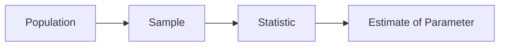

# Sample and Population

> Statistics 101 series (4/10)

<!-- a-grade-intro:begin -->

**Core question**: We almost never see the *whole population* — yet we draw confident conclusions. *How can a sample resemble the population* well enough to make that work?

> *Inference is the art of speaking about the whole through a part.*

<!-- a-grade-intro:end -->

## What You Will Learn

- The relationship between *population, sample, and estimate*
- The *power* of *random sampling*
- *Five sources* of sampling bias
- A 5-step sample design exercise
- Five common mistakes

## Why It Matters

*Every statistical conclusion* starts from a *sample*. With a *bad sample*, even a *perfect analysis* gives a *wrong conclusion*.

> *Garbage sample → Garbage decision.*

## Concept at a Glance



## Key Terms

- **Population**: the *whole group* we want to learn about.
- **Sample**: the *subset* we pulled from the population.
- **Parameter**: the *true value* in the population (μ, σ).
- **Statistic**: a value computed from the sample (x̄, s).
- **Sampling Bias**: when the sample *fails to represent* the population.

## Before / After

**Before**: *“Average website satisfaction is 4.5/5.”* — Only respondents were analyzed.

**After**: *“200 respondents / 10,000 visitors — 2% response rate, possibly skewed toward satisfied users → interpret cautiously.”*

## Hands-on: 5-step Sample Design

### Step 1 — Define the population

```text
Population: "active users on our website over the last 30 days"
```

### Step 2 — Sampling frame

```python
import pandas as pd
users = pd.read_csv("active_users.csv")  # population list
print(len(users))
```

### Step 3 — Random sampling

```python
sample = users.sample(n=500, random_state=42)
```

### Step 4 — Collect responses

```python
responses = collect_survey(sample.user_id)
print("response rate:", len(responses) / len(sample))
```

### Step 5 — Check for bias

```python
print("plan dist (sample):", sample.plan.value_counts(normalize=True))
print("plan dist (pop):",    users.plan.value_counts(normalize=True))
```

## What to Notice in This Code

- *Defining the population* is the *start* of the sample.
- *random_state* guarantees *reproducibility*.
- *Response rate* and *segment distribution* expose *bias*.

## Five Common Mistakes

1. **Treating a *convenience sample* as if it were representative.**
2. **Analyzing *only respondents*.** Non-respondents differ.
3. **Blindly trusting *N=30*.**
4. **Skipping the *population definition*.**
5. **Slicing by *time order* instead of *randomly*.**

## How This Shows Up in Production

A/B testing, surveys, quality inspections, pre-launch beta tests — in all of these, *sample design* determines *result quality*. Techniques like *stratified sampling* and *cluster sampling* show up often.

## How a Senior Engineer Thinks

- Write the *population* in a sentence.
- *Pin* the *random_state*.
- *Report* response rate and segments.
- *Name biases openly* instead of hiding them.
- Set sample size *statistically*, not by feel.

## Checklist

- [ ] I write the *population* in one line.
- [ ] I do *random sampling*.
- [ ] I report the *response rate*.
- [ ] I compare *segment distributions*.

## Practice Problems

1. Define the *population, sample, and statistics* for *members of your club*.
2. Explain the difference between a *convenience sample* and a *random sample* in one sentence.
3. Write how you would *interpret a survey* with a *30% response rate*.

## Wrap-up and Next Steps

Sample design is the *foundation of statistics*. The next episode enters the world of *estimation*, where we use samples to *guess at population parameters*.

<!-- toc:begin -->
- [What Is Statistics?](./01-what-is-statistics.md)
- [Mean, Median, and Variance](./02-mean-median-variance.md)
- [Distributions](./03-distributions.md)
- **Sample and Population (current)**
- Estimation (upcoming)
- Confidence Interval (upcoming)
- Hypothesis Testing (upcoming)
- Correlation and Regression (upcoming)
- Understanding p-value (upcoming)
- Statistical Thinking (upcoming)
<!-- toc:end -->

## References

- [Pew Research — Sampling Methodology](https://www.pewresearch.org/our-methods/u-s-surveys/)
- [scikit-learn — Stratified Sampling](https://scikit-learn.org/stable/modules/cross_validation.html)
- [OpenIntro — Sampling Principles](https://www.openintro.org/book/os/)
- [Wikipedia — Selection Bias](https://en.wikipedia.org/wiki/Selection_bias)
