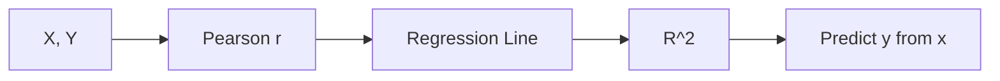

# Correlation and Regression

> Statistics 101 series (8/10)

<!-- a-grade-intro:begin -->

**Core question**: When two variables *move together*, what does that *prove*? *How strongly* and *in what way* do they move?

> *Correlation is companionship; regression is predictable companionship.*

<!-- a-grade-intro:end -->

## What You Will Learn

- The meaning of the *Pearson correlation coefficient*
- *Simple linear regression*
- The meaning of *R²*
- A 5-step regression exercise
- Five common mistakes

## Why It Matters

*Revenue ~ ad spend*, *study time ~ score* — *relationships* are the *start of all analysis*. Correlation and regression are the tools that *put a relationship into numbers*.

> *Correlation is not causation.*

## Concept at a Glance



## Key Terms

- **Pearson r**: strength of *linear correlation* (-1 to +1).
- **Spearman ρ**: *rank-based* correlation — robust to non-linearity.
- **Simple Linear Regression**: y = β0 + β1·x + ε.
- **R²**: the *fraction of variance* the model *explains*.
- **Residual**: actual − predicted. *Residuals* are central to *model diagnostics*.

## Before / After

**Before**: *“Ad spend and revenue have correlation 0.6.”* — Type of relationship is *unknown*.

**After**: *“sales = 1,200 + 4.2·ads (R²=0.36) — every $10K of spend predicts +$4.2K of revenue.”*

## Hands-on: 5-step Regression

### Step 1 — Data

```python
import numpy as np, pandas as pd
ads = np.array([10, 20, 30, 40, 50, 60])
sales = np.array([1300, 1280, 1320, 1360, 1410, 1450])
```

### Step 2 — Correlation

```python
print("r:", np.corrcoef(ads, sales)[0, 1])
```

### Step 3 — Fit a regression

```python
from sklearn.linear_model import LinearRegression
X = ads.reshape(-1, 1)
model = LinearRegression().fit(X, sales)
print("β1:", model.coef_[0], "β0:", model.intercept_)
```

### Step 4 — R²

```python
print("R^2:", model.score(X, sales))
```

### Step 5 — Residuals

```python
import matplotlib.pyplot as plt
resid = sales - model.predict(X)
plt.scatter(model.predict(X), resid); plt.axhline(0); plt.show()
```

## What to Notice in This Code

- Correlation gives *direction and strength*; regression gives a *predictable equation*.
- *R²* lives in *0 to 1*; closer to 1 means *higher explanatory power*.
- *Patterns in residuals* point to *non-linearity*.

## Five Common Mistakes

1. **Confusing *correlation* with *causation*.**
2. **Letting *outliers* inflate the *correlation*.**
3. **Using *Pearson* on a *non-linear* relationship.**
4. **Calling a model good from *R² alone*.**
5. **Skipping *residual diagnostics*.**

## How This Shows Up in Production

Revenue forecasting, price ~ demand, ads ~ conversion, usage ~ churn — used everywhere in *business decisions*. It scales into *multivariate*, *logistic*, and *time-series* regression.

## How a Senior Engineer Thinks

- Knows the *correlation → causation* trap.
- *Always* visualizes.
- *Diagnoses residuals*.
- Reads *R²* alongside *effect size*.
- Separates *prediction* from *interpretation*.

## Checklist

- [ ] I know *correlation ≠ causation*.
- [ ] I know the difference between *Pearson and Spearman*.
- [ ] I understand *R²*.
- [ ] I check *residuals*.

## Practice Problems

1. Build *study time ~ score* data and compare *r* with *R²*.
2. Cite a *spurious correlation* mistakenly read as causation.
3. Explain why *Pearson* is *weak* on non-linear relationships.

## Wrap-up and Next Steps

Correlation and regression are the most basic tools for *expressing relationships as numbers*. The next episode goes deep into the *true meaning of the p-value*.

<!-- toc:begin -->
- [What Is Statistics?](./01-what-is-statistics.md)
- [Mean, Median, and Variance](./02-mean-median-variance.md)
- [Distributions](./03-distributions.md)
- [Sample and Population](./04-sample-and-population.md)
- [Estimation](./05-estimation.md)
- [Confidence Interval](./06-confidence-interval.md)
- [Hypothesis Testing](./07-hypothesis-testing.md)
- **Correlation and Regression (current)**
- Understanding p-value (upcoming)
- Statistical Thinking (upcoming)
<!-- toc:end -->

## References

- [scikit-learn — Linear Regression](https://scikit-learn.org/stable/modules/linear_model.html)
- [Khan Academy — Correlation](https://www.khanacademy.org/math/statistics-probability/describing-relationships-quantitative-data)
- [Spurious Correlations (Vigen)](https://www.tylervigen.com/spurious-correlations)
- [Wikipedia — Anscombe's Quartet](https://en.wikipedia.org/wiki/Anscombe%27s_quartet)
