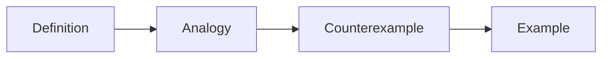

# Explaining Concepts

> Technical Writing 101 series (4/10)

<!-- a-grade-intro:begin -->

**Core question**: How do you make a *first-time reader* grasp a *concept* right away?

> *Analogies* and *counterexamples* must travel *together*.

<!-- a-grade-intro:end -->

## What You Will Learn

- A *one line* definition
- Using an *analogy*
- Using a *counterexample*
- Using a *diagram*
- Building a *worked example*

## Why It Matters

If the *concept* stays blurry, everything after it is a *sandcastle*.

## Concept at a Glance



## Key Terms

- **definition**: A *one line definition*.
- **analogy**: An *analogy*.
- **counterexample**: A *counterexample*.
- **worked example**: An *example with the steps shown*.
- **misconception**: A *common mistake in understanding*.

## Before/After

**Before**: "*Async* means *running at the same time*." (Wrong.)

**After**: "*Async* means *doing other work while you wait*."

## Hands-on: One Concept Explained

### Step 1 — Definition

```python
definition = "A cache stores frequent answers ahead of time"
```

### Step 2 — Analogy

```python
analogy = "Side dishes you keep at the front of the fridge"
```

### Step 3 — Counterexample

```python
counterexample = "Data you read only once does not belong in a cache"
```

### Step 4 — Code example

```python
cache = {}
cache["user:1"] = {"name": "Jimin"}
```

### Step 5 — Common misconception

```python
misconception = "A cache can grow forever"
```

## What to Notice in This Code

- The *definition* is *one line*.
- The *analogy* is *everyday*.
- The *counterexample* draws the *boundary*.

## Five Common Mistakes

1. **A *long* definition.**
2. **A *stretched* analogy.**
3. **No *counterexample*.**
4. **A *huge* code example.**
5. **Skipping the *common misconception*.**

## How This Shows Up in Production

The best internal wiki pages always open with *definition*, *analogy*, *counterexample*, and *example*.

## How a Senior Engineer Thinks

- The *definition* is *one line*.
- The *analogy* sits in the *familiar zone*.
- The *counterexample* is the *boundary*.
- The *example* is *runnable*.
- The *misconception* is *broken first*.

## Checklist

- [ ] One line *definition*.
- [ ] One *analogy*.
- [ ] One *counterexample*.
- [ ] *Five lines or fewer* of example code.

## Practice Problems

1. Write the length of a *definition* in one line.
2. Write the meaning of *counterexample* in one line.
3. Write the definition of a *worked example* in one line.

## Wrap-up and Next Steps

The next post is *Explaining Example Code*.

<!-- toc:begin -->
- [What Is Technical Writing](./01-what-is-technical-writing.md)
- [Defining the Reader](./02-defining-the-reader.md)
- [Title and Structure](./03-title-and-structure.md)
- **Explaining Concepts (current)**
- Explaining Example Code (upcoming)
- Using Figures and Tables (upcoming)
- Writing the README (upcoming)
- Writing Tutorials (upcoming)
- Blog vs Documentation (upcoming)
- Pre-publish Checklist (upcoming)
<!-- toc:end -->

## References

- [Made to Stick - Heath Brothers](https://heathbrothers.com/books/made-to-stick/)
- [Explain Like I am Five - Reddit](https://www.reddit.com/r/explainlikeimfive/)
- [Refactoring UI - Adam Wathan](https://www.refactoringui.com/)
- [Mental Models - Farnam Street](https://fs.blog/mental-models/)
