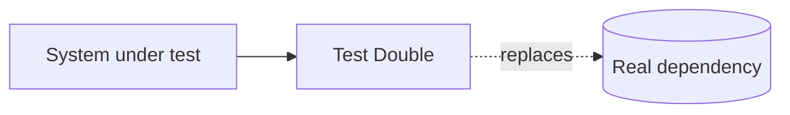

# Test Double

> Testing 101 series (5/10)

<!-- a-grade-intro:begin -->

**Core question**: Can we *verify behavior* without *really calling* the DB or external API?

> Test doubles swap *real dependencies* for *stand-ins*. Each kind has *a different role*.

<!-- a-grade-intro:end -->

## What You Will Learn

- The definition of a *test double* and the five kinds
- *When to use which* kind
- The difference between *Stub vs Mock vs Fake*
- Problems caused by *overusing* doubles

## Why It Matters

Tests must be *fast and deterministic*. Calling a real payment API is *slow and unstable*. Test doubles turn external dependencies into *controllable stand-ins*.

> Used well: *fast trust*. Used poorly: *false trust*.

## Concept at a Glance



## Key Terms (Meszaros' five)

- **Dummy**: a placeholder object that is *only passed around*.
- **Stub**: a fake that *returns canned answers*.
- **Spy**: a stub that also *records calls*.
- **Mock**: a double with *pre-set expectations* that get verified.
- **Fake**: a *simple real implementation* (for example, an in-memory DB).

## Before/After

**Before (calling the dependency directly)**

```python
def test_send_welcome_email():
    user = create_user("a@b.com")
    send_welcome_email(user)   # *real SMTP* call
```

**After (replaced by a Stub)**

```python
class FakeMailer:
    def __init__(self): self.sent = []
    def send(self, to, body): self.sent.append((to, body))

def test_send_welcome_email():
    mailer = FakeMailer()
    send_welcome_email(User("a@b.com"), mailer=mailer)
    assert mailer.sent == [("a@b.com", "Welcome!")]
```

## Hands-on: Five Doubles in Five Steps

### Step 1 — Dummy

```python
def test_dummy_passthrough():
    user = User(email="a@b.com", logger=None)  # logger is *not used*
    assert user.email == "a@b.com"
```

### Step 2 — Stub

```python
class StubClock:
    def now(self): return "2026-05-04"

def test_uses_stub_clock():
    assert greet(StubClock()) == "Hello, today is 2026-05-04"
```

### Step 3 — Spy

```python
class SpyMailer:
    def __init__(self): self.calls = []
    def send(self, to, body): self.calls.append((to, body))

def test_spy_records_calls():
    m = SpyMailer(); send_welcome("a@b.com", m)
    assert len(m.calls) == 1
```

### Step 4 — Mock (unittest.mock)

```python
from unittest.mock import MagicMock

def test_mock_with_expectation():
    repo = MagicMock()
    repo.find.return_value = User(email="a@b.com")
    assert get_user(1, repo).email == "a@b.com"
    repo.find.assert_called_once_with(1)
```

### Step 5 — Fake (in-memory)

```python
class InMemoryUserRepo:
    def __init__(self): self._db = {}
    def add(self, u): self._db[u.id] = u
    def find(self, id): return self._db.get(id)
```

## What to Notice in This Code

- *Dummy* only fills *a slot*.
- *Stub* adds *answers*; *Spy* adds *records*; *Mock* adds *expectations*.
- *Fake* behaves *like the real thing* but stays *small and fast*.

## Five Common Mistakes

1. **Reaching for a *Mock* everywhere.** Tests become *brittle*.
2. **Asserting on *implementation details*.** Refactors become *impossible*.
3. **A *Fake too far from the real thing* — bugs found in tests differ from production.**
4. **Verifying only the *call count* of a Spy.** Also check *the result*.
5. **Building a Stub *where a Dummy* would do.** *Wasted effort*.

## How This Shows Up in Production

Most unit tests get by with just *Stubs and Fakes*. *Mocks* are reserved for cases where *the interaction itself* is the thing being verified (sending email, calling payments, ...).

## How a Senior Engineer Thinks

- Defaults to *Fake/Stub*, uses Mock only when needed.
- Verifies *outcomes, not behavior*.
- Hides external dependencies behind a *thin interface*.
- Keeps a Fake *honoring the same contract* as the real thing.
- Can describe *what a test verifies* in one line.

## Checklist

- [ ] You can *distinguish* the five kinds.
- [ ] You wrote tests using *Stub and Fake*.
- [ ] You used Mock *only for interaction verification*.
- [ ] External deps are isolated by *an interface*.

## Practice Problems

1. Build `send_welcome` and test it with *both* a Stub and a Mock.
2. Note *what kind of bug* each style catches.
3. Build an *in-memory Repo Fake* and test the business logic on top of it.

## Wrap-up and Next Steps

Test doubles *tame external dependencies*. The next post zooms into the two most common kinds — *Mock and Stub*.

<!-- toc:begin -->
- [What Is Testing?](./01-what-is-testing.md)
- [Unit Test](./02-unit-test.md)
- [Integration Test](./03-integration-test.md)
- [E2E Test](./04-e2e-test.md)
- **Test Double (current)**
- Mock and Stub (upcoming)
- Test Coverage (upcoming)
- Regression Test (upcoming)
- Running Tests in CI (upcoming)
- Building a Test Strategy (upcoming)
<!-- toc:end -->

## References

- [Martin Fowler — Test Double](https://martinfowler.com/bliki/TestDouble.html)
- [Meszaros — xUnit Test Patterns](http://xunitpatterns.com/Test%20Double.html)
- [unittest.mock docs](https://docs.python.org/3/library/unittest.mock.html)
- [Martin Fowler — Mocks Aren't Stubs](https://martinfowler.com/articles/mocksArentStubs.html)
