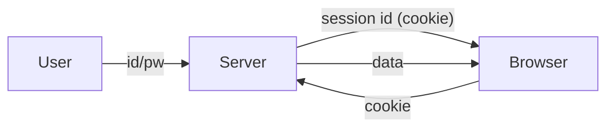

# Authentication and Sessions

> Web Development 101 series (6/10)

<!-- a-grade-intro:begin -->

**Core question**: HTTP is *stateless* — so how does a server *remember* who you are?

> Cookies, sessions, JWTs, and OAuth — four tools that lay *memory* on top of *no memory*.

<!-- a-grade-intro:end -->

## What You Will Learn

- The difference between authentication and authorization
- How cookies and sessions actually work
- The structure of a JWT (token-based auth)
- The OAuth flow for third-party login
- Common security mistakes and defenses

## Why It Matters

Almost every app has login. A weak design lets *account takeover* happen in one line. Knowing the names and roles of the tools blocks most disasters.

> Auth is not a *feature* — it is *foundation*.

## Concept at a Glance



The server issues a *session id*; the browser sends it on every request.

## Key Terms

- **Authentication**: confirms *who* you are (login).
- **Authorization**: decides *what* you can do (permission).
- **Session**: user state held by the server.
- **Cookie**: a per-domain key/value the browser stores.
- **JWT**: a signed *self-describing* token (no server-side memory needed).

## Before/After

**Before (password on every call)**

```python
requests.get("/api/me", auth=("alice", "secret"))  # leaks the password
```

**After (session cookie)**

```python
s = requests.Session()
s.post("/login", json={"id": "alice", "pw": "secret"})
s.get("/api/me")  # cookie sent automatically
```

The password flows *once*.

## Hands-on: Build a Login in 5 Steps

### Step 1 — Flask session login

```python
# app.py
from flask import Flask, session, request, jsonify
app = Flask(__name__)
app.secret_key = "dev-only-change-me"

USERS = {"alice": "secret"}

@app.post("/login")
def login():
    data = request.get_json()
    if USERS.get(data["id"]) == data["pw"]:
        session["user"] = data["id"]
        return jsonify(ok=True)
    return jsonify(ok=False), 401

@app.get("/me")
def me():
    user = session.get("user")
    if not user: return jsonify(error="unauth"), 401
    return jsonify(user=user)
```

### Step 2 — Confirm the cookie

```bash
curl -c c.txt -X POST -H "Content-Type: application/json" -d '{"id":"alice","pw":"secret"}' http://localhost:5000/login
curl -b c.txt http://localhost:5000/me  # → {"user":"alice"}
```

### Step 3 — Logout

```python
@app.post("/logout")
def logout():
    session.clear()
    return jsonify(ok=True)
```

### Step 4 — Issue a JWT (alternative)

```python
# jwt_demo.py
import jwt, time
SECRET = "dev"
token = jwt.encode({"sub": "alice", "exp": time.time() + 3600}, SECRET, algorithm="HS256")
print(jwt.decode(token, SECRET, algorithms=["HS256"]))
```

### Step 5 — Call with Authorization header

```python
import requests
requests.get("/api/me", headers={"Authorization": f"Bearer {token}"})
```

## What to Notice in This Code

- Sessions need *server memory or a DB*.
- JWT only needs signature checks — fits distributed systems.
- Cookies must set `HttpOnly`, `Secure`, and `SameSite`.

## Five Common Mistakes

1. **Storing passwords in plain text.** Always *hash* (bcrypt, argon2).
2. **Putting secrets inside a JWT.** JWT is *signed, not encrypted*.
3. **Leaving cookie options blank.** XSS and CSRF risks.
4. **Tokens with no expiration.** One leak lasts forever.
5. **Checking permissions only once.** Check on every protected endpoint.

## How This Shows Up in Production

Web apps use *session cookies* with CSRF tokens. Mobile, SPA, and microservice setups commonly use *JWT*. Third-party login (Google, GitHub) uses *OAuth 2.0* — you never see the user's password.

## How a Senior Engineer Thinks

- *Hash* passwords; *short-lived* tokens.
- Cookies default to *HttpOnly + Secure + SameSite=Lax*.
- Authorization in *middleware*, applied uniformly.
- Split lifetimes with *refresh tokens*.
- Design assuming a breach — make every credential revocable.

## Checklist

- [ ] You know authentication vs authorization.
- [ ] You know session vs JWT tradeoffs.
- [ ] You use at least one password-hash function.
- [ ] You know three cookie security flags.
- [ ] You can describe the OAuth flow in one line.

## Practice Problems

1. Build login/logout with Flask sessions; observe the cookie in DevTools.
2. Issue a JWT and verify it gets rejected after expiration.
3. Apply auth middleware to one endpoint; ensure unauthenticated calls get 401.

## Wrap-up and Next Steps

Auth is *foundation*. Next, we look at the database connection that makes user data *permanent*.

<!-- toc:begin -->
- [How the Web Works](./01-how-the-web-works.md)
- [HTML, CSS, and JavaScript](./02-html-css-javascript.md)
- [The Browser and the DOM](./03-browser-and-dom.md)
- [HTTP and APIs](./04-http-and-api.md)
- [Frontend and Backend](./05-frontend-and-backend.md)
- **Authentication and Sessions (current)**
- Connecting to a Database (upcoming)
- Deployment (upcoming)
- Performance and Caching (upcoming)
- Building a Small Web App (upcoming)
<!-- toc:end -->

## References

- [HTTP cookies (MDN)](https://developer.mozilla.org/en-US/docs/Web/HTTP/Cookies)
- [Flask sessions](https://flask.palletsprojects.com/en/latest/quickstart/#sessions)
- [JWT introduction](https://jwt.io/introduction)
- [OAuth 2.0 simplified](https://www.oauth.com/)
