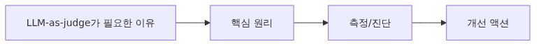
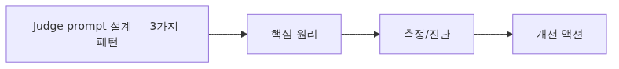
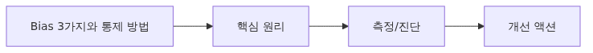

# LLM-as-Judge — 모델로 모델을 평가하기

> AI Evaluation 101 시리즈 (4/10)

사람이 모든 응답을 평가할 수 없을 때, 강력한 LLM에게 채점을 맡기는 방법이 LLM-as-judge입니다. 이 글은 judge prompt 작성, bias 통제, 사람 평가와의 일치도 측정을 다룹니다.

---


*LLM-as-Judge - 모델로 모델을 평가하기*

## LLM-as-judge가 필요한 이유



*LLM-as-judge가 필요한 이유*
Ep3에서 다룬 deterministic metrics(BLEU, ROUGE, Exact Match)는 정답이 짧고 명확할 때만 잘 작동합니다. 하지만 실제 LLM 응답은 다음과 같은 경우가 많습니다.

- 정답이 여러 개인 자유 형식 답변 (예: "이 코드를 설명해 줘")
- 톤, 명확성, 유용성 같은 주관적 품질
- 사람이 직접 채점하기에는 너무 많은 데이터 (수천~수만 건)

이때 **강력한 LLM(GPT-4, Claude Opus 등)에게 채점을 맡기는 방식**이 LLM-as-judge입니다. 사람보다 빠르고, deterministic metrics보다 유연합니다.

| 평가 방식 | 속도 | 비용 | 자유 형식 처리 | 일관성 |
|----------|------|-----|--------------|--------|
| Human | 느림 | 매우 비쌈 | 우수 | 평가자별 편차 |
| Deterministic | 매우 빠름 | 거의 무료 | 약함 | 100% 재현 가능 |
| LLM-as-judge | 빠름 | 중간 | 우수 | 70~90% (prompt 의존) |

---

## Judge prompt 설계 — 3가지 패턴



*Judge prompt 설계 - 3가지 패턴*
### 패턴 1: Single scoring (1~5점 척도)

가장 단순한 방식입니다. judge에게 응답 하나를 보여주고 점수를 매기게 합니다.

```python
# eval/judge_single.py
from openai import OpenAI

client = OpenAI()

JUDGE_PROMPT = """당신은 엄격한 평가자입니다. 아래 질문과 답변을 보고 1~5점으로 채점하세요.

질문: {question}
답변: {answer}

채점 기준:
- 5: 정확하고 완전하며 명확함
- 4: 정확하지만 일부 누락 또는 모호함
- 3: 부분적으로 정확함
- 2: 대부분 부정확함
- 1: 완전히 부정확하거나 무관함

먼저 한 문장으로 근거를 쓰고, 마지막 줄에 'Score: N' 형식으로 점수만 출력하세요.
"""

def judge_single(question: str, answer: str) -> tuple[int, str]:
    response = client.chat.completions.create(
        model="gpt-4o",
        messages=[{"role": "user", "content": JUDGE_PROMPT.format(
            question=question, answer=answer
        )}],
        temperature=0,  # 재현성 확보
    )
    text = response.choices[0].message.content
    # 마지막 줄에서 점수 추출
    last_line = text.strip().split("\n")[-1]
    score = int(last_line.replace("Score:", "").strip())
    return score, text

if __name__ == "__main__":
    score, reasoning = judge_single(
        "Python에서 list와 tuple의 차이는?",
        "list는 변경 가능하고 tuple은 변경 불가능합니다."
    )
    print(f"점수: {score}\n근거: {reasoning}")
```

**장점**: 단순합니다. 한 응답씩 독립 평가가 가능합니다.
**단점**: 점수 인플레이션이 발생합니다. judge가 대부분 4~5점을 줍니다.

### 패턴 2: Pairwise comparison (둘 중 하나)

두 응답을 동시에 보여주고 더 나은 쪽을 고르게 합니다. 모델 A vs 모델 B 비교에 적합합니다.

```python
# eval/judge_pairwise.py
PAIRWISE_PROMPT = """질문에 대한 두 답변 중 어느 쪽이 더 나은지 선택하세요.

질문: {question}
답변 A: {answer_a}
답변 B: {answer_b}

다음 중 하나로 답하세요: 'A', 'B', 'Tie'
근거를 한 문장으로 먼저 쓰고, 마지막 줄에 'Verdict: X' 형식으로 답만 출력하세요.
"""

def judge_pairwise(question: str, answer_a: str, answer_b: str) -> str:
    response = client.chat.completions.create(
        model="gpt-4o",
        messages=[{"role": "user", "content": PAIRWISE_PROMPT.format(
            question=question, answer_a=answer_a, answer_b=answer_b
        )}],
        temperature=0,
    )
    text = response.choices[0].message.content
    last_line = text.strip().split("\n")[-1]
    return last_line.replace("Verdict:", "").strip()
```

**장점**: 점수 인플레이션이 없습니다. 사람의 직관과 잘 맞습니다.
**단점**: 절대 품질을 알 수 없습니다 (둘 다 나빠도 하나는 뽑힘).

### 패턴 3: Reference-based (정답 비교)

정답이 있을 때, 응답이 정답과 의미적으로 일치하는지 묻습니다.

```python
# eval/judge_reference.py
REFERENCE_PROMPT = """답변이 정답과 의미적으로 일치하는지 판단하세요.

질문: {question}
정답: {reference}
답변: {answer}

답변이 정답의 핵심 내용을 모두 담고 있으면 'PASS', 빠진 내용이 있거나 틀리면 'FAIL'.
근거를 한 문장 쓰고 마지막 줄에 'Result: PASS' 또는 'Result: FAIL'만 출력하세요.
"""
```

**장점**: 정답이 있는 QA 데이터셋에 적합합니다. BLEU/ROUGE보다 의미 비교가 잘 됩니다.
**단점**: 정답을 미리 만들어야 합니다.

---

## Bias 3가지와 통제 방법



*Bias 3가지와 통제 방법*
LLM judge는 사람과 다른 방식으로 편향됩니다. 다음 3가지 bias를 알아야 합니다.

### Bias 1: Position bias (위치 편향)

Pairwise 평가에서 judge는 **첫 번째 답변을 더 자주 선택**하는 경향이 있습니다 (GPT-4 기준 약 60% A 선택). 통제 방법은 **순서를 바꿔서 두 번 평가**하는 것입니다.

```python
# eval/debias_position.py
def judge_pairwise_debiased(question: str, ans_a: str, ans_b: str) -> str:
    v1 = judge_pairwise(question, ans_a, ans_b)  # A=ans_a, B=ans_b
    v2 = judge_pairwise(question, ans_b, ans_a)  # A=ans_b, B=ans_a (swap)

    # v2의 A는 사실 ans_b이므로 결과를 뒤집어서 비교
    flip = {"A": "B", "B": "A", "Tie": "Tie"}
    v2_normalized = flip[v2]

    if v1 == v2_normalized:
        return v1  # 일관됨
    return "Tie"  # 순서에 따라 달라지면 무승부 처리
```

### Bias 2: Length bias (길이 편향)

긴 답변이 짧고 정확한 답변보다 높게 평가되는 경향이 있습니다. 통제 방법:

- Judge prompt에 명시: "답변 길이는 채점에 영향을 주지 않습니다. 핵심 정보의 정확성만 평가하세요."
- 길이를 정규화한 추가 metric을 함께 봄 (예: score / log(length))

### Bias 3: Self-preference bias (자기 선호 편향)

GPT-4가 GPT-4 응답을 채점하면, 다른 모델 응답보다 자기 모델 응답을 더 선호합니다. 통제 방법:

- Generator 모델과 judge 모델을 다르게 선택 (예: Claude로 생성, GPT-4로 평가)
- 가능하면 두 judge로 cross-validation

---

## 사람과의 일치도 측정 — Cohen's kappa


*사람과의 일치도 측정 - Cohen's kappa*
Judge가 실제로 믿을 만한지 어떻게 압니까? **사람이 채점한 50~100건과 judge 점수를 비교**해서 일치도를 측정합니다. 단순 정확도(percentage agreement)는 우연히 맞는 경우를 보정하지 못하므로, **Cohen's kappa**를 사용합니다.

```python
# eval/agreement.py
from sklearn.metrics import cohen_kappa_score

# 사람 평가자가 50개 샘플을 1~5로 채점
human_scores  = [5, 4, 3, 5, 2, 4, 5, 3, 4, 5, ...]  # len=50
judge_scores  = [5, 4, 4, 5, 2, 3, 5, 3, 4, 4, ...]  # len=50

# Cohen's kappa: -1 ~ 1 (1=완전 일치, 0=우연 수준, <0=무작위 이하)
kappa = cohen_kappa_score(human_scores, judge_scores, weights="quadratic")
print(f"Cohen's kappa: {kappa:.3f}")

# 해석 기준 (Landis & Koch, 1977):
# 0.0~0.2: 약함
# 0.2~0.4: 보통
# 0.4~0.6: 중간
# 0.6~0.8: 양호
# 0.8~1.0: 매우 우수
```

**경험적 기준**: kappa 0.6 이상이면 production에서 judge를 신뢰할 수 있습니다. 0.4 미만이면 prompt를 다시 설계해야 합니다.

---

## 비용 — judge는 공짜가 아닙니다

GPT-4o 기준 judge call 한 번에 약 $0.01~0.03 듭니다. 1만 건 평가 시 $100~300입니다. 비용 관리 전략:

- **CI에서는 샘플링**: 매 PR마다 전체 1만 건이 아닌 100건만 평가
- **Tier 분리**: 빠른 deterministic metrics → 의심스러운 샘플만 LLM judge로 재평가
- **Cheaper judge**: 단순 PASS/FAIL은 GPT-4o-mini로 충분 (10x 저렴)

---

## Common Mistakes

### Mistake 1: judge prompt를 한 번 쓰고 끝

Judge prompt는 평가 데이터셋만큼 중요한 자산입니다. 첫 prompt는 거의 항상 부족합니다. **사람 평가자 50건과의 kappa를 측정하면서 prompt를 3~5회 반복 개선**해야 합니다.

### Mistake 2: Position bias를 무시

Pairwise 평가에서 순서를 바꿔보지 않으면 결과의 절반이 위치 편향에서 옵니다. **반드시 양방향으로 평가**하세요.

### Mistake 3: 같은 모델로 생성하고 평가

GPT-4로 응답을 생성하고 GPT-4로 채점하면 점수가 부풀려집니다. **다른 family의 모델로 평가**하거나 사람 평가와 cross-check 하세요.

### Mistake 4: temperature를 0으로 설정하지 않음

Judge call에서 temperature가 0이 아니면, 같은 응답을 두 번 채점할 때 점수가 다릅니다. **재현성을 위해 항상 temperature=0**.

### Mistake 5: 사람 평가 baseline 없이 judge만 신뢰

Judge가 90점을 줬다고 좋은 응답이 아닙니다. **production 출시 전 반드시 50~100건을 사람이 직접 채점**하고 judge와의 kappa를 측정하세요.

---

## 핵심 요약

- LLM-as-judge는 자유 형식 응답 평가에 강력합니다. 단, judge prompt 품질이 결과를 좌우합니다.
- 3가지 패턴: single scoring(단순), pairwise(점수 인플레이션 없음), reference-based(정답 비교).
- 3가지 bias: position(순서 swap), length(prompt 명시), self-preference(다른 모델 사용)을 통제하세요.
- Cohen's kappa로 사람과의 일치도를 측정합니다. **0.6 이상이 production 신뢰 기준**입니다.
- Temperature=0, 비용 관리(샘플링/tier 분리), 사람 평가 baseline은 필수입니다.

다음 글에서는 단순 점수가 아닌 **여러 차원의 rubric**으로 채점하는 방법을 다룹니다.
## 참고 자료

- [Zheng et al. (2023). Judging LLM-as-a-Judge with MT-Bench and Chatbot Arena (NeurIPS)](https://arxiv.org/abs/2306.05685)
- [Anthropic — Evaluating Claude (judge prompting guide)](https://docs.anthropic.com/en/docs/build-with-claude/develop-tests)
- [OpenAI Evals — model-graded evaluations](https://github.com/openai/evals/blob/main/docs/eval-templates.md)
- [scikit-learn — Cohen's kappa score](https://scikit-learn.org/stable/modules/generated/sklearn.metrics.cohen_kappa_score.html)
