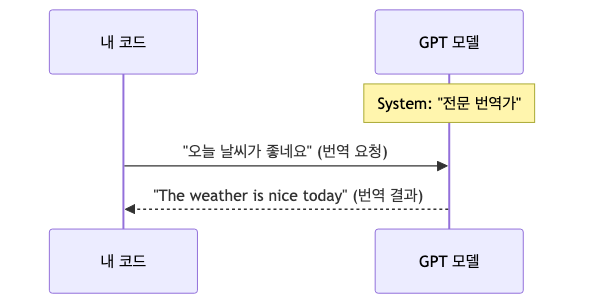

# AI API 첫 걸음 — OpenAI API로 첫 번째 요청 보내기

> AI 웹 개발 입문 시리즈 (1/7)

최근 ChatGPT 같은 서비스 덕분에 인공지능이 우리 곁에 훌쩍 다가왔습니다. 아마 많은 개발자분들이 웹사이트에서 대화를 나누며 코드를 짜거나 문서를 정리하는 경험을 해보셨을 겁니다. 그런데 "이걸 내가 만드는 서비스에 넣으려면 어떻게 해야 하지?"라는 궁금증이 생기는 지점부터가 진짜 시작입니다.

웹사이트에서 ChatGPT를 쓰는 것과 API를 사용하는 것의 차이는 **레스토랑에서 음식을 주문하는 것과 재료를 사서 직접 요리하는 것**의 차이와 비슷합니다. 레스토랑(웹사이트)은 정해진 메뉴판과 공간에서 편하게 음식을 즐길 수 있지만, 내가 원하는 대로 간을 맞추거나 다른 요리와 조합하기는 어렵습니다. 반면 API라는 재료를 손에 넣으면, 내 서비스의 디자인에 맞게 UI를 입히고, 기존 데이터베이스와 연동하며, 세상에 없던 새로운 'AI 요리'를 만들어낼 수 있습니다.

이 글은 AI 웹 개발 입문 시리즈의 첫 번째 글로, AI API의 개념을 잡고 OpenAI API를 통해 생애 첫 번째 요청을 보내는 과정을 다룹니다. 복잡한 이론보다는 "일단 화면에 결과를 띄워보는 것"에 집중해 보겠습니다.

---

<!-- a-grade-intro:begin -->
## 핵심 질문

AI API를 처음 호출할 때 무엇을 알아야 비용·실패·보안 사고 없이 안전하게 시작할 수 있을까요?

이 글은 그 질문에 답하기 위해 OpenAI API 첫 호출의 핵심 개념과 실무 고려사항을 단계별로 살펴봅니다.

<!-- a-grade-intro:end -->

## AI API가 뭔가요?

API(Application Programming Interface)는 서로 다른 프로그램이 대화하기 위한 약속입니다. 그렇다면 **AI API**는 무엇일까요? 쉽게 말해 "똑똑한 두뇌를 빌려 쓰는 통로"라고 이해하면 쉽습니다.

우리는 LLM(Large Language Model, 거대 언어 모델)이라는 큰 모델을 직접 구축하거나 내 컴퓨터에 설치하기 어렵습니다. 너무 크고 무겁기 때문입니다. 대신 OpenAI 같은 회사들이 이 모델을 자기네 서버에 띄워두고, 우리가 필요할 때마다 인터넷으로 질문을 던지고 답을 받을 수 있게 문을 열어두었습니다. 그 문이 바로 AI API입니다.

여러분이 Python 코드로 "안녕?"이라고 API에 보내면, OpenAI의 서버에 있는 모델이 이를 해석해서 "반가워요!"라는 응답을 돌려줍니다. 우리는 이 통로로 데이터를 주고받기만 하면 됩니다.


*AI API 호출의 기본 흐름*

---

## 주요 AI API 제공자 소개

현재 시장에는 여러 '두뇌 빌려주는 회사'들이 있습니다. 각자 특징이 조금씩 다르니 가볍게 살펴보고 넘어가겠습니다.

- **OpenAI**: 현재 가장 유명한 GPT 모델을 제공합니다. 생태계가 가장 넓고 문서화가 잘 되어 있어 입문에 최적입니다.
- **Anthropic**: 'Claude'라는 모델을 만듭니다. 글쓰기가 자연스럽고 안전성을 강조하는 것이 특징입니다.
- **Google**: 'Gemini' 모델을 제공하며, 구글 클라우드 인프라와의 연동이 강력하고 긴 문맥을 이해하는 능력이 좋습니다.

이 시리즈에서는 가장 표준적으로 쓰이는 **OpenAI API**를 기준으로 실습을 진행하겠습니다.

---

## OpenAI API 시작하기

API를 호출하려면 먼저 '출입증'이 필요합니다. 이를 **API Key**라고 부릅니다.

1. **계정 생성**: [OpenAI Platform](https://platform.openai.com/)에 접속해 가입합니다.
2. **API Key 발급**: 왼쪽 메뉴의 `API Keys` 탭에서 `Create new secret key`를 눌러 키를 생성합니다. 
   - **주의**: 이 키는 한 번만 보여주니 따로 안전하게 저장해 두세요. 절대 GitHub 같은 공용 공간에 올리면 안 됩니다.
3. **결제 수단 등록**: API는 쓴 만큼 돈을 내는 구조입니다. `Settings > Billing`에서 소액(예: 5달러)을 먼저 충전해 두어야 정상적으로 동작합니다.

환경 설정은 Python이 설치되어 있다는 가정하에 다음 명령어로 라이브러리를 설치하는 것으로 충분합니다.

```bash
# tested on 2026-04-29
pip install "openai>=2.0"
```

---

## 첫 번째 API 호출

이제 실제로 Python 코드를 작성해 GPT에게 말을 걸어보겠습니다. 복잡한 설정 없이 딱 필요한 코드만 적어보겠습니다.

```python
import os
from openai import OpenAI

# 실제 키는 환경 변수 OPENAI_API_KEY로 주입합니다.
client = OpenAI(api_key=os.environ.get("OPENAI_API_KEY"))

# GPT에게 요청 보내기
response = client.chat.completions.create(
    model="gpt-4o-mini",
    messages=[
        {"role": "user", "content": "AI API 개발을 시작하는 개발자에게 응원의 한마디 해줘!"}
    ]
)

# 결과 출력
print(response.choices[0].message.content)
```

위 코드를 실행하면 GPT가 생성한 응답이 터미널에 출력됩니다. 여기서 `model`은 어떤 모델을 쓸지 정하는 것이고, `messages`는 우리가 건네는 대화 내용입니다. **역할(role)**과 **내용(content)**을 구분해서 넣는 형식을 눈여겨보세요.

참고로 OpenAI에는 API 표면이 두 가지 있습니다. 오래전부터 널리 쓰인 방식은 지금 예제처럼 `chat.completions`를 호출하는 **Chat Completions API**이고, 최근에는 도구 사용·웹 검색·파일 검색처럼 에이전트형 워크플로에 더 잘 맞는 **Responses API**도 제공됩니다. 이 시리즈는 예제가 가장 많고 이식성이 좋은 Chat Completions를 기준으로 설명하지만, 실제로 에이전트 중심 기능을 만들 계획이라면 Responses API의 개념도 함께 알아두면 좋습니다.

---

## API 응답 구조 이해하기

API가 돌려주는 응답은 **JSON**이라는 구조화된 데이터 형식입니다. 라이브러리가 객체로 변환해주긴 하지만, 내부가 어떻게 생겼는지 한 번 뜯어보는 것이 중요합니다.

```json
{
  "id": "chatcmpl-123...",
  "object": "chat.completion",
  "created": 1677652288,
  "model": "gpt-4o-mini-2024-07-18",
  "choices": [
    {
      "index": 0,
      "message": {
        "role": "assistant",
        "content": "AI API 개발을 시작하는 분께는 작은 자동화부터 붙여보라고 권하고 싶습니다. 한 번 연결해 보면 다음 단계가 훨씬 또렷해집니다."
      },
      "finish_reason": "stop"
    }
  ],
  "usage": {
    "prompt_tokens": 25,
    "completion_tokens": 12,
    "total_tokens": 37
  }
}
```

- **choices**: GPT가 생성한 답변들이 들어있습니다. 보통은 하나만 요청하므로 첫 번째 항목(`[0]`)을 꺼내 씁니다.
- **message**: 그 안에 실제 답변 내용(`content`)과 답변하는 주체의 역할(`role`)이 들어있습니다.
- **usage**: 이번 요청에서 **토큰**을 얼마나 썼는지 보여줍니다. 이게 곧 비용입니다.


*API 응답 JSON의 핵심 필드*

---

## 비용은 얼마나 드나요?

API를 쓸 때 가장 걱정되는 게 비용일 겁니다. OpenAI API는 글자 수와 비슷한 개념인 **토큰(Token)** 단위로 과금합니다. 

영어 기준으로 1,000토큰은 약 750단어 정도입니다. 우리가 방금 보낸 짧은 질문과 답변은 대략 50~100토큰 내외입니다. 다만 모델별 가격은 수시로 바뀌니, 정확한 금액은 OpenAI Pricing 페이지에서 그때그때 확인하는 습관을 들이는 편이 안전합니다.

연습 단계에서는 비용이 크게 부담되지 않는 경우가 많지만, 나중에 배울 긴 문맥 처리나 더 큰 모델(`gpt-4o`)을 쓸 때는 토큰 관리가 중요해집니다. 지금은 **"내가 쓴 만큼만 낸다"**는 감각만 익히면 충분합니다.


*입력 토큰 수와 응답 비용의 관계*

---

## 실습: 10줄 코드로 한→영 번역기 만들기

배운 내용을 응용해서 실용적인 도구를 하나 만들어보겠습니다. GPT에게 "너는 번역가야"라고 역할을 부여하면 아주 훌륭한 번역기가 됩니다.

```python
import os
from openai import OpenAI

client = OpenAI(api_key=os.environ.get("OPENAI_API_KEY"))

def translate_ko_to_en(text):
    response = client.chat.completions.create(
        model="gpt-4o-mini",
        messages=[
            {"role": "system", "content": "너는 한국어를 영어로 아주 자연스럽게 번역해주는 전문 번역가야."},
            {"role": "user", "content": f"다음 문장을 번역해줘: '{text}'"}
        ]
    )
    return response.choices[0].message.content

# 테스트
print(translate_ko_to_en("오늘 날씨가 정말 좋네요. 산책 가고 싶어요!"))
```

여기서 핵심은 **system role**입니다. GPT에게 페르소나를 입혀서 대답의 톤과 매너를 정해 둘 수 있습니다. 단순한 질문보다 더 일관된 답변을 유도할 때 특히 유용합니다.



*번역 요청을 만드는 System Prompt와 User Prompt 구성*

---

## 마무리

첫 번째 요청을 성공적으로 보냈다면 이제 API 호출의 기본 감각은 잡은 셈입니다. 남이 만든 웹사이트를 쓰는 단계에서 한 걸음 더 나아가, AI를 내 코드 안으로 가져오는 출발선에 선 것입니다.

오늘 살펴본 핵심은 다음과 같습니다.

- **AI API**는 거대한 지능 모델을 내 서비스와 연결해주는 통로입니다.
- **API Key**는 보안이 가장 중요하며, 절대 노출되지 않도록 관리해야 합니다.
- **JSON 응답 구조**를 이해하면 원하는 데이터만 쏙쏙 골라 쓸 수 있습니다.
- **토큰 기반 과금** 체계를 알면 효율적으로 비용을 관리할 수 있습니다.

다음 글에서는 AI API 활용의 핵심인 **Prompt Engineering: GPT가 원하는 답을 내놓게 하는 기술**을 다뤄보겠습니다. 같은 모델을 써도 어떻게 질문하느냐에 따라 결과가 크게 달라지기 때문입니다.
---

## 참고 자료

- [OpenAI API Reference](https://platform.openai.com/docs/api-reference)
- [Microsoft Learn: Introduction to Azure OpenAI Service](https://learn.microsoft.com/training/paths/introduce-azure-openai-service/)
- [Python OpenAI Library GitHub](https://github.com/openai/openai-python)

---
