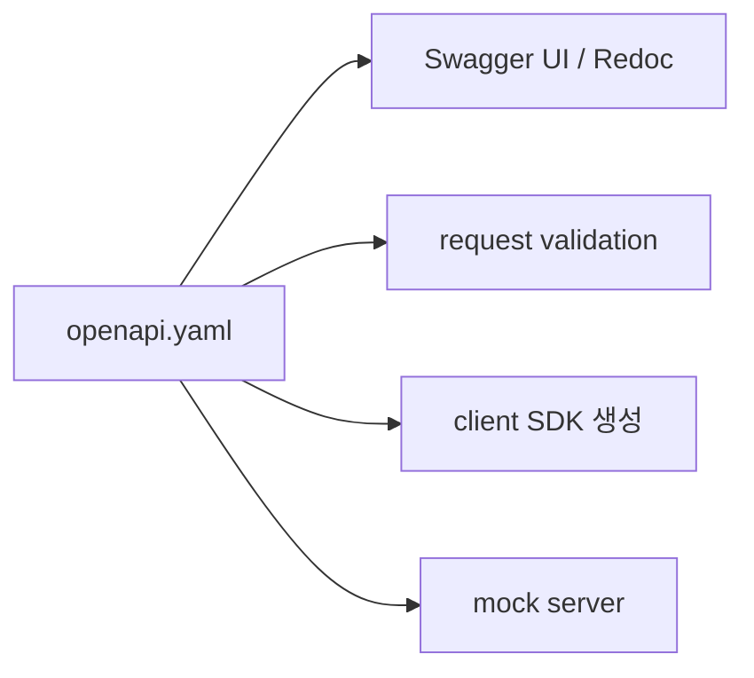

# OpenAPI와 Swagger

> API Design 101 시리즈 (8/10)

<!-- a-grade-intro:begin -->

**핵심 질문**: API의 *모든 약속* 을 한 파일에 담을 수 있다면, 어떤 일이 벌어질까요?

> 문서·검증·클라이언트·목 서버가 *전부 자동* 으로 따라옵니다.

<!-- a-grade-intro:end -->

## 이 글에서 배울 것

- OpenAPI 3 스펙의 구조
- Swagger UI / Redoc
- code-first vs schema-first
- 자동 클라이언트 생성
- spec drift를 막는 방법

## 왜 중요한가

스펙 파일 하나가 *문서 + 검증 + 코드 생성 + 목 서버* 를 모두 만들어 줍니다. 손으로 쓴 문서는 *항상* 코드와 어긋납니다 — 자동화가 답입니다.

> *Single source of truth* 를 가지세요.

## 개념 한눈에 보기



## 핵심 용어 정리

- **OpenAPI**: API 스펙의 표준 (구 Swagger spec).
- **Swagger UI**: spec을 *클릭 가능한 문서* 로 보여 줌.
- **Redoc**: 같은 spec의 더 읽기 쉬운 렌더러.
- **Code-first**: 코드의 데코레이터에서 spec을 *생성*.
- **Schema-first**: spec 파일을 *먼저* 쓰고 코드는 *생성*.

## Before/After

**Before (수기 문서)**

```
README.md "GET /users/{id} returns user. id is integer."
```

**After (OpenAPI 일부)**

```yaml
paths:
  /users/{id}:
    get:
      parameters:
        - name: id
          in: path
          required: true
          schema: {type: integer}
      responses:
        '200':
          description: User
          content:
            application/json:
              schema: {$ref: '#/components/schemas/User'}
```

## 실습: OpenAPI 5단계

### 1단계 — 최소 spec

```yaml
# openapi.yaml
openapi: 3.0.0
info: {title: Demo API, version: '1.0'}
paths:
  /health:
    get:
      responses:
        '200': {description: OK}
```

브라우저에서 Swagger UI 로 띄우면 *호출 버튼* 까지 생깁니다.

### 2단계 — components/schemas

```yaml
components:
  schemas:
    User:
      type: object
      required: [id, name]
      properties:
        id: {type: integer}
        name: {type: string}
```

스키마는 *재사용* — `$ref` 로 참조.

### 3단계 — code-first (FastAPI)

```python
# 3_codefirst.py
from fastapi import FastAPI
from pydantic import BaseModel

class User(BaseModel):
    id: int; name: str

app = FastAPI()
@app.get("/users/{uid}")
def user(uid: int) -> User: return User(id=uid, name="Y")
# /docs 와 /openapi.json 이 자동 생성
```

### 4단계 — Swagger UI / Redoc

```
GET /docs        # Swagger UI (시도해 보기)
GET /redoc       # Redoc (읽기 좋음)
GET /openapi.json
```

같은 spec의 *두 가지 얼굴*.

### 5단계 — 클라이언트 생성

```bash
# 5_gen.sh
openapi-generator-cli generate \
  -i openapi.json -g python -o ./client
```

수십 개 SDK 가 *명령 한 줄* 로.

## 이 코드에서 주목할 점

- spec 이 *코드와 함께* 자랍니다.
- 같은 스키마가 검증·문서·SDK 에 *동시에* 쓰입니다.
- 손으로 쓰는 문서가 사라집니다.

## 자주 하는 실수 5가지

1. **spec과 코드가 *따로*.** 시간이 가면 *반드시* 어긋남.
2. **examples 없음.** 클라이언트 입장에서 *호출이 안 보임*.
3. **에러 응답 누락.** 200 만 정의 — 4xx/5xx는 *비밀*.
4. **버전 미기록.** spec 자체에 *version* 이 없으면 변경 추적 불가.
5. **public spec 에 내부 정보.** 내부 endpoint·필드 노출.

## 실무에서는 이렇게 쓰입니다

GitHub 도 OpenAPI spec 을 *공개* 합니다 (`api.github.com/openapi`). 사내에서도 *PR 마다 spec 이 변경* 되는지 CI 가 검사하면 drift 가 사라집니다. FastAPI 와 NestJS 같은 프레임워크는 *기본으로* spec 을 내보냅니다.

## 시니어 엔지니어는 이렇게 생각합니다

- *어느 쪽이든* 한 가지를 정한다 — code-first 또는 schema-first, 섞지 않음.
- spec 을 *git에 커밋* 하고 PR diff 로 본다.
- examples 를 *반드시* 채운다 — 사용자가 *복붙* 으로 시작한다.
- 4xx/5xx 도 spec 에 명시.
- public 과 internal spec 을 *분리* 한다.

## 체크리스트

- [ ] spec 이 코드와 동기화되는가 (CI 가 검사)?
- [ ] 모든 endpoint에 examples 가 있는가?
- [ ] 4xx/5xx 가 spec 에 정의되어 있는가?
- [ ] components/schemas 가 *재사용* 되는가?
- [ ] public/internal spec 이 분리되어 있는가?

## 연습 문제

1. 자신의 가장 큰 endpoint 를 OpenAPI 로 표현해 보세요.
2. 위 3단계 FastAPI 앱에 `POST /users` 를 추가하세요.
3. spec 변경을 *PR 검토* 항목으로 만드는 워크플로를 적어 보세요.

## 정리 및 다음 단계

OpenAPI 는 API 의 *프로토콜이자 문서이자 코드* 입니다. 다음 글에서는 약속이 *바뀔 때* 의 규율 — versioning — 을 봅니다.

<!-- toc:begin -->
- [API란 무엇인가?](./01-what-is-an-api.md)
- [REST 기본](./02-rest-basics.md)
- [리소스 설계](./03-resource-design.md)
- [HTTP method와 status code](./04-http-methods-and-status.md)
- [Request와 response schema](./05-request-and-response-schema.md)
- [Pagination과 filtering](./06-pagination-and-filtering.md)
- [Error response 설계](./07-error-response-design.md)
- **OpenAPI와 Swagger (현재 글)**
- Versioning (예정)
- 좋은 API 문서 만들기 (예정)
<!-- toc:end -->

## 참고 자료

- [OpenAPI Specification](https://spec.openapis.org/oas/latest.html)
- [Swagger UI](https://swagger.io/tools/swagger-ui/)
- [Redoc](https://redocly.com/redoc/)
- [FastAPI: Automatic docs](https://fastapi.tiangolo.com/features/)
