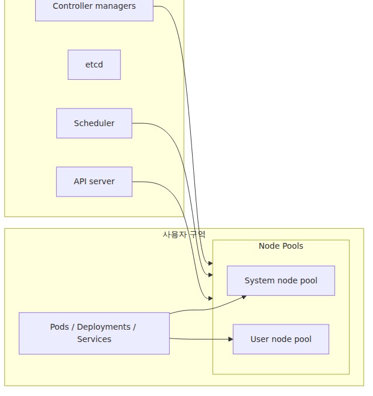
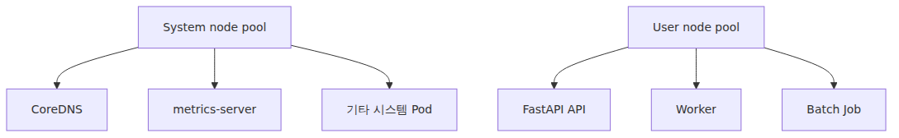

# 클러스터 아키텍처 — Control Plane과 Node Pool

> Azure Kubernetes Service 101 시리즈 (2/7)

AKS를 이해할 때 가장 먼저 분리해야 하는 것은 “클러스터의 두뇌”와 “실제로 컨테이너가 돌아가는 자리”입니다. 이 둘을 섞어서 보면 업그레이드, 비용, 장애 대응, 스케일링이 다 흐려집니다. AKS에서는 이 경계를 Azure가 꽤 명확하게 그어 둡니다.

이번 글은 그 경계를 읽는 연습입니다. Control Plane이 무엇을 맡고, System node pool과 User node pool이 왜 나뉘며, Spot과 일반 노드를 언제 써야 하는지까지 한 번에 묶어 보겠습니다.

---

<!-- a-grade-intro:begin -->
## 핵심 질문

Control Plane과 Node Pool을 어떻게 나누면 운영이 안전해질까요?

이 글은 그 질문에 답하기 위해 AKS 클러스터 아키텍처의 핵심 결정과 운영 함정을 살펴봅니다.

<!-- a-grade-intro:end -->

## 클러스터를 반으로 자르면 보이는 것



*Control Plane과 Node Pool의 책임 경계*
왼쪽은 Azure가 관리하는 영역이고, 오른쪽은 사용자가 더 직접 다루는 영역입니다. 이 그림 하나만 정확히 기억해도 “왜 Control Plane 비용은 따로 안 내는가”, “왜 노드 수를 내가 정하는가”, “왜 스케일링이 Pod 수와 Node 수로 나뉘는가”가 자연스럽게 이어집니다.

---

## Control Plane은 무엇을 하나

Control Plane은 Kubernetes의 의사결정 계층입니다.

- **API server**: 모든 선언과 조회의 출입구입니다. `kubectl apply`, `kubectl get`, CI/CD 파이프라인, 컨트롤러 모두 이 API에 붙습니다.
- **etcd**: 클러스터의 원하는 상태와 실제 상태 정보를 저장합니다.
- **Scheduler**: 새 Pod를 어느 노드에 올릴지 결정합니다.
- **Controller 계열**: Deployment의 복제본 수, Node 상태, Endpoint 목록 같은 자잘하지만 필수적인 루프를 계속 돌립니다.

AKS에서는 이 부분을 Azure가 배치하고 운영합니다. 사용자는 API를 사용하지만, API server VM을 직접 보거나 etcd 백업 토폴로지를 설계하는 일은 일반적으로 하지 않습니다.

이것이 관리형 Kubernetes의 실제 체감 포인트입니다. 직접 구축한 클러스터라면 장애 분석의 시작점이 Control Plane일 때가 많지만, AKS에서는 사용자 관심이 더 자주 **Node Pool과 워크로드 레벨**로 내려옵니다.

---

## Node Pool은 무엇을 하나

Node Pool은 같은 설정을 가진 노드 VM 묶음입니다. VM 크기, OS SKU, 스케일 설정, 노드 개수 같은 특성이 풀 단위로 움직입니다.

AKS에서 Pod는 결국 Node Pool 안의 어떤 노드 위에 올라갑니다. 따라서 다음 질문은 거의 항상 Node Pool 질문으로 바뀝니다.

- 어떤 VM 크기를 쓸 것인가
- 시스템 워크로드와 앱 워크로드를 분리할 것인가
- Spot으로 비용을 아낄 것인가
- 오토스케일 범위를 어디까지 둘 것인가

Pod는 Kubernetes의 논리 단위지만, 비용과 용량은 Node Pool이 먹습니다.

---

## System node pool과 User node pool

AKS의 Node Pool 설계에서 가장 먼저 익혀야 하는 구분입니다.



*시스템 풀과 사용자 풀의 역할 분리*
### System node pool

System node pool은 클러스터 자체를 유지하는 데 필요한 Pod가 우선 올라가는 풀입니다.

- CoreDNS
- metrics-server
- 기타 클러스터 애드온

AKS 문서에서도 시스템 Pod는 system pool에 두고, 애플리케이션 Pod는 user pool에 두는 방향을 권장합니다. 한 개의 풀만 있는 작은 실습 클러스터에서는 앱 Pod가 system pool에 올라갈 수도 있지만, 운영 환경에서는 분리하는 편이 낫습니다.

### User node pool

User node pool은 여러분의 애플리케이션 워크로드를 위한 풀입니다.

- 웹 API
- 비동기 워커
- CronJob
- 배치 처리

이 분리가 주는 이점은 단순합니다. 앱 하나가 리소스를 과도하게 먹거나 잘못된 설정으로 노드를 불안정하게 만들어도, 클러스터 필수 구성 요소와 충돌할 가능성을 줄일 수 있습니다.

---

## 왜 system과 user를 분리해야 하나

운영에서 이 분리는 곧 안정성입니다.

1. 시스템 Pod와 앱 Pod가 같은 자리를 두고 경쟁하지 않습니다.
2. User node pool만 별도 스케일링하기 쉬워집니다.
3. Spot 노드를 user pool에만 붙이는 전략을 만들 수 있습니다.
4. Windows node pool이 필요한 경우에도 Linux system pool을 유지하면서 확장할 수 있습니다.

실제로는 다음 식으로 생각하면 편합니다.

> System node pool은 클러스터를 살리는 자리이고, User node pool은 비즈니스 코드를 실행하는 자리입니다.

---

## Node Pool은 몇 개가 적당한가

처음부터 많이 나눌 필요는 없습니다. 보통은 아래 순서로 커집니다.

### 작은 시작

- system pool 1개
- user pool 1개

이 구조만으로도 대부분의 입문 시나리오는 충분합니다.

### 조금 더 커지면

- latency-sensitive API용 user pool
- batch/worker용 user pool
- Spot 전용 user pool
- GPU나 메모리 최적화 VM용 specialized pool

즉 Node Pool은 “팀 조직도”보다 “워크로드 특성”에 따라 나누는 편이 낫습니다. 같은 팀이 운영하더라도 API와 배치의 자원 패턴이 다르면 풀을 나누는 쪽이 훨씬 읽기 쉽습니다.

---

## Spot node pool과 일반 node pool

비용 얘기로 넘어가면 Spot을 빼기 어렵습니다.

### 일반 node pool

일반 VM 기반 풀입니다.

- 안정성이 우선일 때
- 중단이 부담스러운 API 서버
- 베이스라인 용량을 책임질 노드

### Spot node pool

Azure의 남는 용량을 할인된 가격에 쓰는 풀입니다.

- 비용 절감 효과가 큽니다.
- 대신 축출될 수 있습니다.
- 따라서 없어져도 되는 워크로드에만 올려야 합니다.

대표적인 예시는 다음과 같습니다.

- 재시도가 쉬운 비동기 워커
- 대기열 기반 처리
- 중단에 강한 배치 작업

사용자 트래픽을 바로 받는 핵심 API의 유일한 실행 자리를 Spot에만 두는 설계는 피하는 편이 좋습니다.

---

## 스케줄러는 이 풀들을 어떻게 보나

Kubernetes 스케줄러는 “Node Pool” 객체를 직접 배치 대상으로 보지 않고, 그 안의 개별 노드를 봅니다. 다만 AKS에서는 각 노드가 어떤 풀에 속하는지가 라벨과 설정으로 드러납니다.

여기서 중요한 감각은 다음과 같습니다.

- Node Pool은 관리 단위
- Node는 실제 스케줄 대상
- Pod는 라벨, taint, affinity를 통해 특정 성격의 노드로 유도됨

운영에서는 이 관계가 곧 배치 정책입니다. 예를 들어 system pool에 `CriticalAddonsOnly=true:NoSchedule` taint를 두면 앱 Pod가 실수로 그쪽에 올라가는 일을 줄일 수 있습니다.

---

## 업그레이드와 Node Pool

클러스터 업그레이드를 생각할 때도 이 경계가 유용합니다.

- Control Plane 버전 업그레이드
- Node Pool 버전 업그레이드
- 노드 이미지 업그레이드

이 셋은 같은 말이 아닙니다. Control Plane이 먼저 올라가고, 그 다음 각 Node Pool이 따라가는 흐름을 자주 봅니다. 따라서 “클러스터 버전을 올렸다”는 말만으로는 충분하지 않습니다. **어느 풀까지 올라갔는지**를 같이 봐야 합니다.

---

## 운영 관점에서 꼭 기억할 제한들

AKS 문서에서 반복되는 실무 포인트를 정리하면 이렇습니다.

- 적어도 하나의 system node pool은 항상 있어야 합니다.
- system pool은 Linux여야 합니다.
- user pool은 Linux 또는 Windows가 될 수 있습니다.
- Spot은 user pool에 사용하는 것이 원칙입니다.
- 운영 환경에서는 system pool을 최소 2개 노드, 권장 3개 노드 이상으로 보는 것이 안전합니다.

입문 단계에서는 “처음 생성되는 기본 풀은 system pool이고, 앱은 user pool로 분리한다”만 기억해도 충분합니다.

---

## 아키텍처를 읽는 가장 실용적인 질문

AKS 클러스터를 받았을 때 아래 질문을 바로 던질 수 있으면 구조가 보이기 시작합니다.

1. system pool과 user pool이 분리되어 있는가
2. user pool은 몇 종류이며, 각 풀의 목적이 무엇인가
3. Spot이 붙어 있는가
4. autoscaler 최소/최대 값은 어떻게 잡혀 있는가
5. 워크로드가 정말 의도한 풀에 올라가고 있는가

이 질문들은 아키텍처 다이어그램보다 더 실무적입니다. 구조는 결국 비용과 장애 양상을 바꾸기 때문입니다.

---

이 글은 Azure Kubernetes Service 101 시리즈의 2화입니다. 1화에서 AKS의 관리 경계를 잡았다면, 이번 화는 그 경계를 Control Plane과 Node Pool 구조로 구체화한 셈입니다. 이제 이 구조를 실제 클러스터 생성과 FastAPI 배포 절차로 연결해 보면 개념이 훨씬 빠르게 굳습니다.

---

## 빠르게 확인하기

```bash
kubectl get nodes -o wide
kubectl get pods -n kube-system
```

## 시니어 엔지니어는 이렇게 생각합니다

- **Control Plane은 추상화의 경계다** — 내부를 안 봐도 되지만 SLA·버전 정책은 알아야 합니다.
- **Node Pool은 워크로드 단위로 자른다** — system·user·spot을 분리해야 장애 격리가 됩니다.
- **system 풀을 보호한다** — 사용자 워크로드가 system 풀에 들어가면 클러스터가 흔들립니다.
- **노드 크기는 평균이 아니라 분포로 결정한다** — p99 부하가 실제 비용·안정성을 결정합니다.
- **자동 업그레이드 정책을 명시한다** — 수기 업그레이드는 누락되기 쉬우므로 채널을 정합니다.

## 운영 체크리스트

- [ ] control plane 컴포넌트(API server, scheduler, controller manager, etcd)의 역할을 설명할 수 있다
- [ ] 노드의 kubelet, kube-proxy, container runtime 흐름을 그림으로 정리했다
- [ ] AKS managed identity와 RBAC가 어디에서 인증/인가에 관여하는지 표시했다
- [ ] 관리형 리소스 그룹(MC_)에 생성되는 자원을 인벤토리로 가지고 있다
- [ ] 버전 업그레이드(node, control plane) 시 장애 영향 범위를 추정했다

<!-- toc:begin -->
## 시리즈 목차

- [Azure Kubernetes Service란? — 직접 운영하지 않아도 되는 Kubernetes](./01-what-is-aks.md)
- **클러스터 아키텍처 — Control Plane과 Node Pool (현재 글)**
- 첫 클러스터 만들고 앱 배포하기 — Python/FastAPI (예정)
- Pod·Deployment·Service — 워크로드를 표현하는 세 가지 방식 (예정)
- 네트워킹과 Ingress — 클러스터 안과 밖을 잇는 길 (예정)
- 스케일링 — HPA, Cluster Autoscaler, KEDA (예정)
- 모니터링과 운영 — Container Insights, 로그, 알람 (예정)

<!-- toc:end -->

---

## 참고 자료

### 공식 문서
- [What is Azure Kubernetes Service (AKS)?](https://learn.microsoft.com/en-us/azure/aks/what-is-aks)
- [Use system node pools in Azure Kubernetes Service (AKS)](https://learn.microsoft.com/en-us/azure/aks/use-system-pools)
- [Create node pools in Azure Kubernetes Service (AKS)](https://learn.microsoft.com/en-us/azure/aks/create-node-pools)
- [Deploy an Azure Kubernetes Service (AKS) Cluster Using Azure CLI](https://learn.microsoft.com/en-us/azure/aks/learn/quick-kubernetes-deploy-cli)

### 관련 시리즈
- [Azure App Service 101](../azure-app-service-101/) — 노드 개념이 없는 PaaS와 비교할 때
- [Azure Functions 101](../azure-functions-101/) — 실행 단위와 스케일 단위가 어떻게 다른지 비교할 때
