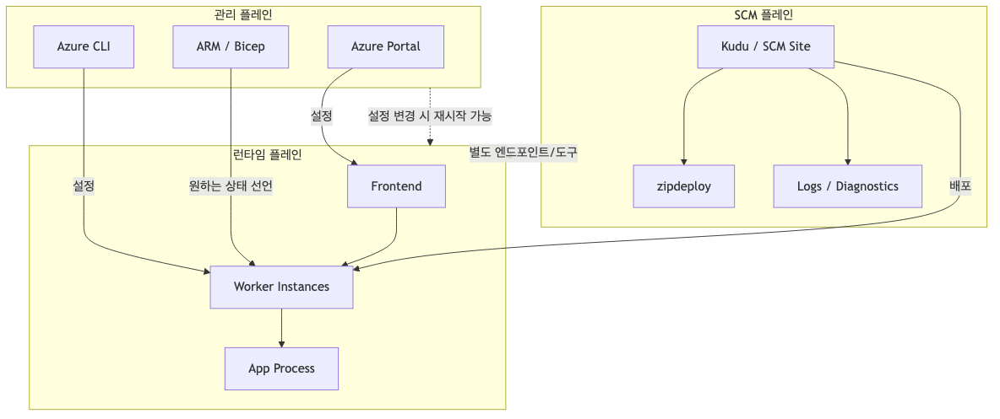
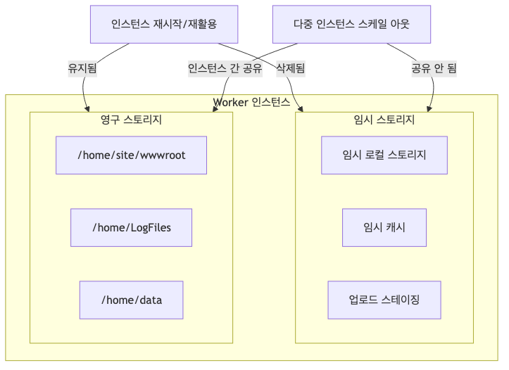

# Azure App Service란? - 플랫폼 아키텍처 이해하기

처음 Azure App Service를 접하면 대개 이렇게 생각합니다. “좋네. 서버 안 만져도 되고, 그냥 코드만 올리면 되네.” 실제로 맞는 말입니다. 그런데 운영에 들어가면 그다음 질문이 바로 따라옵니다. “그런데 왜 설정 하나 바꿨는데 앱이 재시작됐지?” “배포는 끝났는데 왜 요청이 이상하게 들어오지?” “Kudu는 보이는데 앱은 왜 안 뜨지?”

App Service는 단순히 “편한 배포 서비스”로만 보면 자주 헷갈립니다. 반대로 내부 구조를 한 번 제대로 이해해 두면, 장애를 만났을 때 어디를 봐야 하는지 감이 생깁니다. 포털에서 무엇을 바꾸는 행위가 실제 런타임에 어떤 영향을 주는지, 로그를 어디서 봐야 하는지, 로컬 파일을 어디까지 믿어도 되는지 같은 운영 감각도 훨씬 빨리 붙습니다.

이 글은 Azure App Service 101 시리즈의 첫 번째 글입니다. 여기서는 App Service를 처음 쓰는 개발자 관점에서, “이 서비스가 정확히 무엇이고, 어떤 멘탈 모델로 이해해야 운영이 쉬워지는가”를 설명해 보겠습니다. 한 가지 관점이 중요합니다. **App Service는 하나의 박스가 아니라, 서로 역할이 다른 여러 면(plane)으로 이루어진 플랫폼**이라는 점입니다.

---

<!-- a-grade-intro:begin -->
## 핵심 질문

App Service는 다른 호스팅 옵션과 비교해 언제 선택해야 하고, 무엇을 책임져야 할까요?

이 글은 그 질문에 답하기 위해 Azure App Service의 위치의 핵심 결정과 운영 함정을 살펴봅니다.

<!-- a-grade-intro:end -->

## 이 글에서 답할 질문

- App Service는 PaaS 모델 안에서 어디에 자리잡는가?
- Linux와 Windows 호스팅은 같은 가격이 아니다 — 무엇이 갈리는가?
- App Service Plan과 App은 어떤 1:N 관계로 묶이고, 비용은 누구에게 청구되는가?
- 코드 배포, 컨테이너 배포, WebJobs는 같은 App Service 위에서 어떻게 공존하는가?
- App Service를 쓰지 말아야 할 워크로드는 어떤 모양인가?

## App Service가 뭔가요?

Azure App Service는 웹 앱, REST API, 모바일 백엔드를 호스팅하기 위한 **완전 관리형 플랫폼**입니다. 여러분이 VM을 직접 만들고 패치하고, 웹 서버를 깔고, 로드 밸런서를 붙이고, 운영 체제를 관리하는 일을 줄여 주는 PaaS(Platform as a Service)입니다.

현업에서는 이 차이가 생각보다 큽니다. 작은 팀일수록 더 그렇습니다. 애플리케이션을 빨리 내보내야 하는데, 인프라 운영 자체가 본업이 아닌 경우가 많기 때문입니다. App Service를 사용하면 팀은 코드와 배포 파이프라인에 집중하고, Microsoft는 서버 인프라 관리 및 패칭, 로드 밸런싱과 트래픽 라우팅, 자동 스케일링, 배포 파이프라인 통합 같은 기반 작업을 맡습니다.

하지만 여기서 중요한 오해 하나를 구분해야 합니다. **“인프라를 직접 관리하지 않는다”와 “플랫폼 동작을 이해할 필요가 없다”는 전혀 다른 말**입니다. 실제로는 반대에 가깝습니다. App Service는 추상화가 잘 되어 있어서 처음엔 편하지만, 운영 문제는 언제나 추상화 아래에서 발생합니다. 그래서 App Service를 잘 쓰는 팀일수록 포털 메뉴 이름보다 먼저, 플랫폼이 어떤 층으로 나뉘어 동작하는지부터 이해합니다.

---

## App Service를 이해하는 가장 좋은 방법: 3-Plane 멘탈 모델

App Service를 처음 배울 때 가장 도움이 되는 개념은 **3-Plane 아키텍처**입니다. 저는 이걸 App Service 운영의 지도라고 생각합니다. 어디에서 설정이 바뀌고, 어디에서 실제 요청이 처리되며, 어디에서 배포와 진단이 일어나는지만 구분할 수 있어도 절반은 이해한 셈입니다.

App Service는 크게 다음 세 영역으로 나뉩니다.

| Plane | 역할 | 주요 도구 |
|-------|------|----------|
| **Management Plane** | 설정과 구성 관리 | Azure Portal, CLI, ARM/Bicep |
| **Runtime Plane** | 실제 요청 처리 | Frontend + Worker 인스턴스 |
| **SCM Plane** | 배포와 진단 | Kudu (`.scm.azurewebsites.net`) |

이 구분이 왜 중요할까요? 현업에서 정말 자주 보는 혼동이 바로 이것입니다.

- Management Plane에서 App Setting을 바꿨다 → Runtime Plane이 재시작될 수 있음
- SCM(Kudu) 사이트에 접속이 안 된다 → 앱 자체는 정상 동작할 수도 있음

즉, 세 Plane은 서로 연결되어 있지만 **같은 것이 아니고**, 각자 **독립적인 API와 장애 모드**를 가집니다. “포털에서 설정은 정상인데 앱이 느리다”, “앱은 정상인데 배포 로그가 안 보인다” 같은 상황을 이해하려면 이 분리가 꼭 필요합니다.



*세 Plane의 역할 분리 구조*

이제부터 각 Plane을 하나씩 보겠습니다.

---

## Management Plane: 우리가 ‘원하는 상태’를 선언하는 곳

Management Plane은 여러분이 App Service에 대해 “이 앱은 이렇게 동작해야 해”라고 선언하는 곳입니다. Azure Portal에서 값을 바꾸거나, Azure CLI를 실행하거나, ARM/Bicep으로 리소스를 배포할 때 만나는 영역이 바로 여기입니다.

여기서 다루는 대표 설정은 익숙합니다. App Service Plan의 SKU와 인스턴스 수를 정하고, App Settings로 환경 변수를 넣고, Deployment Slot을 만들고, Custom Domain을 연결하고, Managed Identity를 붙입니다. 겉으로는 단순한 설정 화면이지만, 실제로는 런타임이 따라야 할 **Desired State**를 정의하는 인터페이스라고 보면 됩니다.

운영에서 중요한 포인트는 하나 더 있습니다. **설정 변경은 단순한 메타데이터 수정으로 끝나지 않을 수 있다**는 점입니다. 많은 설정은 프로세스 시작 시점에 적용되기 때문에, 변경 즉시 또는 변경 후 반영 과정에서 앱 재시작을 유발할 수 있습니다. 대표적으로 App Settings 변경, Startup Command 변경, Runtime Stack 변경, Slot Swap은 모두 운영 중 영향을 줄 수 있는 작업입니다.

이걸 모르고 운영하면 꽤 곤란한 일이 생깁니다. 예를 들어 “환경 변수 하나만 추가하면 되겠지” 하고 점심시간 직전에 값을 바꿨는데, 인스턴스가 재시작되면서 순간적인 응답 지연이 생길 수 있습니다. 특히 단일 인스턴스 환경이라면 더 직접적으로 체감됩니다. 저는 팀들이 이 지점을 과소평가해서, 장애라기보다 “설정 변경의 결과”였던 일을 한참 디버깅하는 경우를 자주 봤습니다.

실제로 현재 앱의 관리 상태를 확인할 때는 이런 식으로 CLI를 사용할 수 있습니다.

```bash
# 현재 앱 상태 확인
az webapp show \
    --resource-group $RG \
    --name $APP_NAME \
    --query "{state:state, hostNames:hostNames, httpsOnly:httpsOnly}" \
    --output json
```

이 명령은 작아 보여도 꽤 실용적입니다. 포털에 들어가지 않아도 앱의 상태, 바인딩된 호스트명, HTTPS 강제 여부를 빠르게 확인할 수 있어서 자동화나 점검 스크립트에 자주 들어갑니다.

Management Plane을 다룰 때 기억할 문장은 이겁니다. **설정은 곧 런타임에 영향을 주는 변경 요청**입니다. 포털에서 저장 버튼을 누르는 순간, 그 뒤에서 어떤 재시작이나 재배치가 일어날 수 있는지 항상 염두에 두는 습관이 중요합니다.

---

## Runtime Plane: 사용자가 실제로 만나는 App Service

사용자 입장에서 App Service는 결국 “요청을 받아 응답하는 서비스”입니다. 그 일이 일어나는 곳이 Runtime Plane입니다. 이 영역은 포털의 설정 화면보다 훨씬 더 운영 체감이 강합니다. 느림, 오류, 재시작, 스케일링, 트래픽 분산 같은 문제는 대부분 여기서 관찰됩니다.

요청 흐름을 가장 단순하게 그리면 아래와 같습니다.


*Frontend와 Worker를 거치는 요청 흐름*

사용자 요청은 먼저 **Frontend**를 거칩니다. 여기서 TLS 종료, 호스트 검증, 라우팅 같은 작업이 처리됩니다. 그다음 **Worker** 인스턴스로 넘어가고, 마지막으로 애플리케이션 프로세스가 실제 비즈니스 로직을 실행해 응답을 반환합니다.

이 흐름은 단순해 보이지만, 운영 관점에서는 중요한 시사점이 많습니다. 예를 들어 사용자가 502나 503을 봤다고 해서 무조건 여러분 코드의 예외부터 의심하면 안 됩니다. 요청이 Frontend를 통과했는지, Worker가 건강한 인스턴스를 선택했는지, 앱 프로세스가 정상 기동했는지 단계별로 생각해야 합니다. 이 멘탈 모델이 없으면 “앱이 이상하다”는 한 문장 속에 완전히 다른 원인이 섞여 버립니다.

또 하나 중요한 사실은 **Worker 인스턴스는 영원하지 않다**는 점입니다. App Service의 인스턴스는 플랫폼 유지보수, Scale Out/In, 설정 변경으로 인한 재시작 같은 이유로 계속 재활용됩니다. 오늘 잘 돌던 인스턴스가 내일도 그대로 있을 거라고 가정하면 안 됩니다.

그래서 App Service에서는 다음 설계 원칙이 사실상 기본값입니다.

- 상태는 외부 저장소에 둡니다. 예를 들어 Redis나 데이터베이스를 사용합니다.
- 시작 로직은 멱등적으로 작성합니다. 인스턴스가 여러 번 떠도 같은 결과가 나와야 합니다.
- 종료 시 graceful shutdown을 고려합니다.
- 로컬 파일에 중요한 데이터를 저장하지 않습니다.

이건 교과서적인 권장사항처럼 들릴 수 있지만, 실제 운영에서는 아주 현실적인 비용 절감 포인트입니다. 인스턴스 교체를 고려하지 않은 앱은 스케일링 순간에만 문제가 드러나고, 그때는 이미 재현이 어려운 경우가 많습니다. “왜 배포 직후에만 로그인 세션이 날아가지?” 같은 질문이 나오는 순간, 대개는 런타임을 정적 서버처럼 가정한 설계가 원인입니다.

---

## SCM Plane: 배포와 진단을 위한 별도 출입구

App Service를 쓰다 보면 언젠가 `https://<app-name>.scm.azurewebsites.net` 주소를 만나게 됩니다. 이게 바로 **SCM Plane**, 흔히 Kudu라고 부르는 관리 도구입니다. 많은 입문자가 여기서 첫 번째로 헷갈립니다. “앱도 살아 있고, 배포도 여기서 하고, 파일도 보이네? 그럼 이게 곧 런타임이겠네?” 아닙니다. 편리하게 연결되어 있을 뿐, 역할은 분리되어 있습니다.

Kudu는 배포와 진단 작업에 특화되어 있습니다. ZIP 배포를 위한 `/api/zipdeploy`, 배포 이력을 보는 `/api/deployments`, 환경 정보를 보는 `/api/environment`, 로그 스트림을 보는 `/api/logstream`, 파일 브라우저 역할을 하는 `/api/vfs/` 같은 엔드포인트가 대표적입니다.

이 별도 출입구가 왜 좋을까요? 앱 본체에 영향을 최소화하면서도 운영자가 배포 이력과 환경 상태를 살펴볼 수 있기 때문입니다. 예를 들어 배포는 실패했지만 현재 서비스 중인 앱은 아직 살아 있는 상황, 또는 앱은 정상인데 배포 파이프라인에서만 문제가 나는 상황을 구분하기 쉬워집니다.

여기서 꼭 기억해야 할 중요한 함정이 하나 있습니다. **SCM ≠ 앱 컨테이너**입니다. 특히 Linux 커스텀 컨테이너를 사용할 때는 더 중요합니다. 이 경우 SCM 사이트는 **별도의 컨테이너**에서 실행되므로, SCM에서 보이는 파일시스템이나 프로세스가 곧 여러분 앱 컨테이너의 내부 상태라고 생각하면 안 됩니다.

그래서 Linux 커스텀 컨테이너 환경에서는 이런 오해가 자주 생깁니다. Kudu에 들어가서 “파일이 있는데 왜 앱에서는 안 보이지?” 혹은 “SCM에서는 프로세스가 정상처럼 보이는데 앱이 죽어 있는데요?” 이유는 간단합니다. 보고 있는 대상이 다르기 때문입니다. 이 환경의 디버깅은 앱 컨테이너 SSH나 애플리케이션 로그 중심으로 접근해야 합니다.

접근 제한 여부를 확인할 때는 다음 명령이 유용합니다.

```bash
# SCM 접근 제한 확인
az webapp config access-restriction show \
    --resource-group $RG \
    --name $APP_NAME \
    --output json
```

운영 팁을 하나 덧붙이면, Kudu가 잘 된다고 안심하지 말고 항상 “지금 보고 있는 것이 Management Plane인지, Runtime Plane인지, SCM Plane인지”를 먼저 구분하세요. App Service 문제 해결 속도는 이 질문을 얼마나 빨리 하느냐에 크게 좌우됩니다.

---

## 호스팅 모드가 바뀌면, 운영 포인트도 바뀐다

App Service는 하나의 고정된 실행 방식만 제공하지 않습니다. Windows Code, Linux Built-in, Linux Custom Container처럼 여러 호스팅 모드를 지원하고, 같은 App Service라도 이 선택에 따라 시작 방식과 진단 포인트가 달라집니다.

| 측면 | Windows Code | Linux Built-in | Linux Custom Container |
|------|-------------|----------------|----------------------|
| **시작 방식** | IIS/플랫폼이 시작 | 빌트인 이미지 + 명령 | 이미지 Pull 후 시작 |
| **포트** | 플랫폼 관리 | `PORT` 환경변수 | `WEBSITES_PORT` 설정 |
| **저장소** | 영구 저장 | `/home` 영구 | 설정에 따라 다름 |
| **진단** | Kudu 풍부 | Kudu 풍부 | SSH가 주요 수단 |

처음에는 이 표가 단순한 옵션 비교처럼 보일 수 있습니다. 그런데 실제로는 “왜 같은 코드를 다른 앱에서는 잘 띄우는데 이번엔 안 뜨지?” 같은 문제의 출발점이 됩니다. 예를 들어 Linux Built-in에서는 애플리케이션이 `PORT` 환경변수에 맞춰 바인딩해야 하고, Linux Custom Container에서는 `WEBSITES_PORT`를 기준으로 플랫폼과 컨테이너가 연결됩니다. 이 포인트를 놓치면 앱 자체는 떠 있는데 외부에서는 계속 죽은 것처럼 보일 수 있습니다.

실전에서는 이런 식으로 코드를 작성합니다.

```python
# Python (Flask) 예시 - 올바른 포트 바인딩
import os
port = int(os.environ.get("PORT", 8000))
app.run(host="0.0.0.0", port=port)
```

이 예제가 중요한 이유는 단순히 Flask 문법 때문이 아닙니다. App Service가 런타임에 기대하는 방식으로 앱을 열어 두는 가장 기본적인 계약이기 때문입니다. 로컬에서는 5000 포트로 잘 되던 앱이 App Service에 올리자마자 헬스 체크에 실패하는 경우, 상당수가 여기서 시작합니다.

또 한 가지, Linux Custom Container를 쓰기 시작하면 “App Service니까 다 똑같겠지”라는 기대를 조금 버리는 편이 좋습니다. 컨테이너 자체의 기동, 이미지 Pull, 포트 노출, 앱 내부 로그 확인까지 고려해야 하므로 운영 감각이 PaaS와 컨테이너의 중간쯤으로 이동합니다. 같은 App Service라도 모드가 다르면 운영 체크리스트도 달라진다는 뜻입니다.

---

## 파일시스템: 로컬처럼 보이지만, 로컬처럼 믿으면 안 된다

App Service에서 파일시스템은 아주 자주 오해되는 주제입니다. 특히 처음 배포한 뒤 SSH나 Kudu로 파일을 들여다보면 “아, 여기도 결국 서버 하나구나”라는 착각이 들기 쉽습니다. 하지만 운영 관점에서는 **임시 저장소와 영구 저장소를 명확히 구분해서 생각해야** 합니다.



*임시 저장소와 홈 디렉터리의 차이*

먼저 임시 저장소(Ephemeral)는 빠른 로컬 I/O를 제공할 수 있지만, 인스턴스 재시작 시 **삭제될 수 있고**, 인스턴스 간 **공유되지도 않습니다**. 그래서 임시 캐시, 업로드 스테이징, 중간 처리 파일처럼 “사라져도 되는 데이터”에만 써야 합니다.

반면 `/home`은 영구 저장소입니다. 재시작 후에도 **유지**되고, 여러 인스턴스가 **공유**할 수 있습니다. 대신 네트워크 기반이어서 로컬 디스크처럼 빠르다고 기대하면 안 됩니다. 자주 만나는 경로로는 배포된 앱 코드가 놓이는 `/home/site/wwwroot`, 앱과 플랫폼 로그가 쌓이는 `/home/LogFiles`, 애플리케이션 데이터 용도로 사용할 수 있는 `/home/data`가 있습니다.

> **주의 — Linux Custom Container의 경우:** `/home`의 영속성과 공유는 `WEBSITES_ENABLE_APP_SERVICE_STORAGE` 설정이 `true`일 때만 보장됩니다. 이 설정이 `false`이면 `/home`도 컨테이너와 함께 사라지는 임시 저장소가 됩니다. Custom Container를 쓴다면 이 앱 설정을 반드시 확인하세요.

이 차이를 모르면 운영 문제가 꽤 교묘하게 생깁니다. 예를 들어 파일 업로드 후 후속 작업이 다른 인스턴스에서 처리되는 구조인데, 업로드 파일을 임시 경로에만 저장했다면 어떤 요청은 잘 되고 어떤 요청은 실패할 수 있습니다. 반대로 `/home`을 로컬 디스크처럼 막 쓰면 성능이나 잠금(lock) 문제를 만나기 쉽습니다.

특히 많이 나오는 안티패턴이 하나 있습니다. **SQLite를 `/home`에 두고 운영하는 것**입니다. 얼핏 보면 “영구 저장이 되니까 괜찮겠네” 싶지만, `/home`은 네트워크 파일시스템입니다. Lock 경합이 생길 수 있고, 레이턴시가 흔들릴 수 있으며, 멀티 인스턴스에서는 데이터 손상 위험까지 있습니다. 프로덕션 환경이라면 Azure SQL, PostgreSQL 같은 관리형 데이터베이스를 선택하는 편이 훨씬 안전합니다.

여기서는 파일시스템을 상태 저장소로 보면 안 됩니다. **App Service의 파일시스템은 존재하지만, 상태 저장의 기본 해법은 아니다**는 점입니다. 운영이 길어질수록 이 구분은 더 중요해집니다.

---

## Health Check: 모니터링 기능이 아니라, 트래픽 제어 장치

많은 팀이 Health Check를 “있으면 좋은 옵션” 정도로 생각합니다. 하지만 App Service에서는 단순한 모니터링을 넘어, **어떤 인스턴스에 트래픽을 보낼지 결정하는 기준**이라는 점이 더 중요합니다.

동작 방식은 비교적 직관적입니다. 플랫폼이 지정한 Health 엔드포인트를 주기적으로 호출하고, `200 OK`를 받으면 그 인스턴스를 정상으로 간주해 트래픽을 계속 보냅니다. 반대로 실패하거나 타임아웃이 발생하면 unhealthy로 보고 트래픽 대상에서 제외한 뒤 복구를 시도합니다.

이 특성 때문에 Health 엔드포인트는 생각보다 신중하게 설계해야 합니다. 너무 가벼워도 의미가 없고, 너무 무거워도 오히려 정상 인스턴스를 unhealthy로 몰아갈 수 있습니다. 보통은 애플리케이션이 요청을 받을 준비가 되었는지, 그리고 핵심 의존성이 최소한으로 살아 있는지만 판단하도록 만드는 것이 좋습니다.

예를 들면 다음과 같습니다.

```python
@app.route('/health')
def health():
    # 가벼운 체크
    # 핵심 의존성만 확인
    # 무거운 DB 쿼리 금지
    return {"status": "healthy"}, 200
```

실무에서 자주 놓치는 포인트도 있습니다. `302 Redirect`는 성공으로 처리되지 않고, 1분 타임아웃은 unhealthy로 간주됩니다. 그리고 Health Check의 효과는 보통 2개 이상 인스턴스에서 더 뚜렷하게 나타납니다. 단일 인스턴스에서는 “비정상 인스턴스를 우회한다”는 장점이 제한적이기 때문입니다.

제가 특히 자주 본 실수는 Health 엔드포인트에 너무 많은 의미를 담는 경우입니다. 예를 들어 외부 API 여러 개와 데이터베이스까지 모두 깊게 검사하도록 만들면, 일시적인 외부 지연만으로도 인스턴스가 unhealthy 판정을 받을 수 있습니다. 그 결과 실제 장애보다 더 큰 트래픽 출렁임이 생기기도 합니다. Health Check는 진단 보고서가 아니라 **라우팅 판단 신호**라는 점을 기억하면 설계가 훨씬 단순해집니다.

---

## 운영 전에 꼭 가져가야 할 체크리스트

이제 App Service를 “코드 올리는 곳”이 아니라 “설정, 런타임, 배포 채널이 분리된 운영 플랫폼”으로 보기 시작했다면, 배포 전 확인해야 할 항목도 자연스럽게 정리됩니다.

먼저 신뢰성 측면에서는 Health 엔드포인트를 구현하고 실제로 테스트했는지, Health Check가 활성화되어 있는지, 가용성을 위해 2개 이상 인스턴스를 고려했는지, 애플리케이션의 시작 시간이 얼마나 걸리는지 확인해야 합니다. 시작 시간이 긴 앱은 배포나 재시작 때 생각보다 오래 불안정해질 수 있습니다.

배포 안전성 측면에서는 CI/CD로 불변 아티팩트를 만들고 있는지, 롤백 방법을 문서화하고 실제로 테스트해 봤는지, 배포 자격증명을 최소화했는지를 점검해야 합니다. 배포 방식이 흔들리면 런타임 문제와 배포 문제를 구분하기가 매우 어려워집니다.

관측성도 중요합니다. 구조화된 로깅을 켜 두었는지, 로그 보존 또는 외부 내보내기를 설정했는지, 에러율·재시작·레이턴시에 알람을 걸어 두었는지 확인해야 합니다. App Service는 관리형 서비스이지만, 문제가 생겼을 때 원인을 읽어 낼 재료는 결국 여러분이 남긴 로그와 메트릭입니다.

설정 자체도 다시 확인해야 합니다. 호스팅 모드에 맞는 포트 바인딩을 검증했는지, 스토리지 동작을 정확히 이해했는지, 민감 정보 값은 App Settings에만 두지 말고 가능하면 Key Vault와 연동했는지 점검해야 합니다. 입문 단계에서는 사소해 보여도, 실제 운영에서는 이 항목들이 장애 예방의 대부분을 차지합니다.

---

## 정리: App Service는 ‘간단한 배포 서비스’가 아니라, 이해할수록 다루기 쉬운 플랫폼이다

Azure App Service를 처음 보면 편리함이 먼저 보입니다. 그건 사실입니다. 하지만 운영을 오래 할수록 진짜 가치가 드러나는 지점은 편리함보다 **예측 가능성**입니다. 어떤 변경이 재시작을 부르는지, 요청이 어디를 거쳐 들어오는지, 배포와 진단 채널이 왜 분리되어 있는지, 파일시스템을 어디까지 믿어야 하는지 알고 나면, App Service는 훨씬 덜 신비롭고 훨씬 더 다루기 쉬운 플랫폼이 됩니다.

이 글에서 기억할 핵심만 다시 정리하면 이렇습니다.

- **Management Plane**은 설정과 구성의 중심이며, 설정 변경은 런타임 영향으로 이어질 수 있습니다.
- **Runtime Plane**은 실제 요청이 처리되는 곳이며, 인스턴스는 언제든 재활용될 수 있다는 전제로 설계해야 합니다.
- **SCM Plane**은 배포와 진단을 위한 별도 경로이며, 특히 Linux 커스텀 컨테이너에서는 앱 런타임과 동일시하면 안 됩니다.
- **파일시스템과 Health Check**는 입문자가 가장 쉽게 과소평가하지만, 운영 안정성에 가장 직접적으로 영향을 주는 주제입니다.

이 글은 시리즈의 출발점으로, App Service를 Management Plane·Runtime Plane·SCM Plane으로 나눠 보는 기본 관점을 잡아 줍니다. 이후 글들은 이 구조를 바탕으로 요청 흐름, 호스팅 선택, 배포와 운영 주제를 차례로 더 구체화합니다.

---

## 시니어 엔지니어는 이렇게 생각합니다

- **PaaS의 단순함이 가장 큰 가치** — VM·컨테이너 운영 부담 없이 앱에 집중할 수 있습니다.
- **쿠버네티스가 필요 없으면 PaaS가 우선** — AKS·ACA의 운영 비용을 피할 수 있다면 App Service가 합리적입니다.
- **스케일·배포 자동화가 1급 시민** — 슬롯·자동 스케일이 기본 제공되어 처음부터 활용합니다.
- **VNet·시크릿은 처음에 결정한다** — 사후 변경이 까다로우므로 보안 경계를 초기에 확정합니다.
- **관측은 Application Insights부터** — 로깅 누락은 운영 사고의 가장 흔한 원인입니다.

## 운영 체크리스트

- [ ] App Service Plan SKU와 비용을 워크로드 단위로 견적했다
- [ ] Linux/Windows 결정 기준(언어, 컨테이너 사용)을 문서화했다
- [ ] 한 Plan에 묶을 App 수와 격리 정책을 정했다
- [ ] App Service를 쓰지 말아야 할 케이스를 ADR로 기록했다
- [ ] 예상 트래픽과 SLA를 SKU 선택 근거에 포함했다

<!-- toc:begin -->
## 시리즈 목차

- **Azure App Service란? - 플랫폼 아키텍처 이해하기 (현재 글)**
- Request Lifecycle: 3am에 터진 502를 어디서부터 봐야 할까 (예정)
- Hosting Models: 어떤 플랜을 선택해야 할까? (예정)
- 첫 번째 배포: 로컬에서 Azure까지 (Python/Flask) (예정)
- Configuration 마스터하기: App Settings & 환경변수 (예정)
- 로그와 모니터링 기초: “앱이 느려요”에 답할 수 있는 상태 만들기 (예정)
- Scaling 101: 언제 Scale Up vs Scale Out? (예정)

<!-- toc:end -->

---

## 참고 자료

### 공식 문서
- [Azure App Service overview (Microsoft Learn)](https://learn.microsoft.com/azure/app-service/overview)
- [Kudu service overview (Microsoft Learn)](https://learn.microsoft.com/azure/app-service/resources-kudu)
- [Monitor App Service instances by using Health Check (Microsoft Learn)](https://learn.microsoft.com/azure/app-service/monitor-instances-health-check)

### 관련 시리즈
- [Azure Functions 101](../azure-functions-101/)

---
