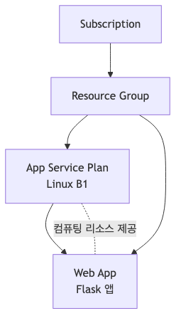
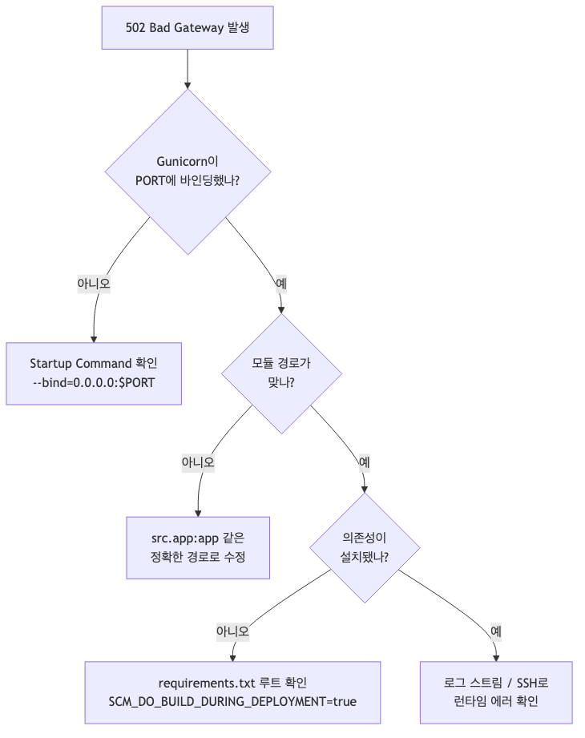

# 첫 번째 배포: 로컬에서 Azure까지 (Python/Flask)

이론은 여기까지입니다. **이제 진짜로 배포해 봅시다.**

앞선 글에서 App Service가 어떤 플랫폼인지, 어떤 플랜을 골라야 하는지 감을 잡았다면 이제 남은 건 하나입니다. 로컬에서 잘 돌던 Flask 앱을 Azure App Service에 올리고, 브라우저에서 직접 열어보는 것. 이 순간부터 App Service는 더 이상 개념이 아니라, **내 앱을 띄우는 실제 운영 환경**이 됩니다.

이번 글은 따라 치면 끝나는 데모가 아니라, **왜 이 설정이 필요한지까지 이해하는 배포 튜토리얼**로 구성했습니다. 그래서 중간중간 “여기서 502가 뜨면 뭘 의심해야 하는지”, “왜 Flask 개발 서버가 아니라 Gunicorn으로 확인해야 하는지”도 같이 함께 확인합니다.

---

<!-- a-grade-intro:begin -->
## 핵심 질문

첫 배포에서 무엇을 검증해야 이후 운영이 안전해질까요?

이 글은 그 질문에 답하기 위해 첫 배포 체크포인트의 핵심 결정과 운영 함정을 살펴봅니다.

<!-- a-grade-intro:end -->

## 이 글에서 답할 질문

- App Service에 첫 배포할 때 반드시 결정해야 할 파라미터는 무엇인가?
- Run from package vs. content deploy는 어떻게 다른가?
- 환경별(dev/stage/prod) 슬롯 전략은 어떻게 시작해야 가성비가 좋은가?
- 초기 배포 후 health check를 자동으로 돌리려면 무엇을 켜야 하는가?
- 최초 배포에서 흔히 막히는 인증/권한 문제는 무엇인가?

## 이번 글에서 만들 결과

이 글을 끝내면 다음을 직접 해보게 됩니다.

- 로컬에서 Flask 앱을 개발 모드와 프로덕션 모드로 각각 실행하기
- Azure에서 Resource Group, App Service Plan, Web App의 관계 이해하기
- `az webapp up`으로 첫 배포 끝내기
- 로그와 상태 확인으로 “진짜로 살아 있는 앱”인지 검증하기
- 502/기동 실패가 났을 때 어디부터 봐야 하는지 감 잡기

---

## 사전 준비

| 항목 | 권장 사항 |
|---|---|
| Python | 3.11 이상 |
| Azure CLI | 최신 버전 |
| Azure 구독 | 활성 상태 |
| 운영체제 | macOS / Linux 기준 설명 (Windows 대안은 같이 표기) |

먼저 Azure CLI가 준비되어 있는지 확인합니다.

```bash
az --version
az login
```

왜 이 단계가 필요할까요?

- `az webapp up`은 **리소스 생성 + 배포**를 같이 수행하므로 Azure 인증이 꼭 필요합니다.
- CLI 버전이 너무 오래되면 런타임 이름이나 옵션이 달라서 같은 명령이 실패할 수 있습니다.

로그인 후 구독이 여러 개라면, 실수로 다른 구독에 배포하지 않도록 현재 컨텍스트도 확인해 두세요.

```bash
az account show --output table
```

---

## 전체 흐름 먼저 보기

배포는 아래 순서로 진행됩니다.


*로컬 개발부터 Azure 배포까지의 전체 흐름*

여기서 봐야 할 점은 하나입니다.

1. 로컬에서 앱이 뜬다고 끝이 아닙니다.
2. **App Service가 실제로 앱을 실행하는 방식에 가깝게** Gunicorn으로 먼저 검증해야 합니다.
3. 그 다음 Azure에 올리고, 빌드/기동/응답을 차례로 확인해야 배포가 끝납니다.

---

## Step 1. 가장 작은 Flask 앱부터 준비하기

첫 배포에서는 앱 로직보다 **배포 경로가 단순한 구조**가 중요합니다. 그래서 일부러 기능을 최소화한 앱으로 시작하겠습니다.

프로젝트 구조는 이렇게 갑니다.

```text
my-flask-app/
├── src/
│   └── app.py
└── requirements.txt
```

### `src/app.py`

```python
import os
from flask import Flask, jsonify

app = Flask(__name__)

@app.route("/")
def home():
    return jsonify(
        {
            "message": "Hello from Azure App Service!",
            "environment": os.environ.get("APP_ENV", "development"),
        }
    )

@app.route("/health")
def health():
    return jsonify({"status": "healthy"}), 200

if __name__ == "__main__":
    port = int(os.environ.get("PORT", 8000))
    app.run(host="0.0.0.0", port=port)
```

### `requirements.txt`

```text
Flask==3.1.3
gunicorn==25.3.0
```

여기서 중요한 포인트가 두 개 있습니다.

### 왜 `/health` 엔드포인트를 따로 만들까?

첫 배포에서는 “페이지가 떠 보인다”보다 **프로세스가 정상 기동했고 요청을 처리할 수 있다**를 빠르게 확인하는 게 더 중요합니다. `/health`는 그 확인용입니다.

### 왜 `gunicorn`을 미리 의존성에 넣을까?

Flask 내장 서버는 개발용입니다. 편하지만, 운영 환경에서 프로세스 관리나 동시 요청 처리 전제를 갖고 있지 않습니다. App Service의 Linux Python 앱은 기본적으로 Gunicorn 계열 실행 방식을 사용하므로, **로컬에서도 같은 축으로 확인하는 게 배포 실패를 가장 많이 줄여 줍니다.**

---

## Step 2. 로컬 개발 모드에서 먼저 확인하기

먼저 개발 모드로 실행해 봅니다. 지금은 “코드가 맞는지” 확인하는 단계입니다.

```bash
mkdir my-flask-app
cd my-flask-app
python3 -m venv .venv
source .venv/bin/activate
```

> Windows PowerShell에서는 `python -m venv .venv` 후 `.venv\Scripts\Activate.ps1` 를 사용하면 됩니다.

의존성을 설치합니다.

```bash
pip install --upgrade pip
pip install -r requirements.txt
```

개발 서버를 띄웁니다.

```bash
export FLASK_APP=src.app:app
export FLASK_DEBUG=1
flask run --host 0.0.0.0 --port 8000
```

다른 터미널에서 응답을 확인합니다.

```bash
curl http://127.0.0.1:8000/
curl http://127.0.0.1:8000/health
```

예상 응답 예시는 아래와 비슷합니다.

```json
{"environment":"development","message":"Hello from Azure App Service!"}
```

```json
{"status":"healthy"}
```

왜 개발 모드부터 확인할까요?

- 문법 에러, import 에러, 라우팅 오타 같은 **가장 싼 실패**를 여기서 잡을 수 있기 때문입니다.
- App Service 문제인지, 애플리케이션 문제인지 나중에 구분하기 쉬워집니다.

여기서 실패하면 Azure로 가지 말고 먼저 고치세요. 배포는 디버깅을 더 어렵게 만들 뿐입니다.

---

## Step 3. Gunicorn으로 프로덕션처럼 한 번 더 실행하기

이제 중요한 확인입니다. **개발 서버가 아니라 Gunicorn으로 띄워봅니다.**

```bash
export PORT=8000
gunicorn --bind=0.0.0.0:$PORT src.app:app
```

다른 터미널에서 다시 확인합니다.

```bash
curl http://127.0.0.1:8000/health
```

필요하면 워커 옵션도 한 번 넣어볼 수 있습니다.

```bash
gunicorn --bind=0.0.0.0:$PORT --workers 2 --timeout 120 src.app:app
```

### 왜 이 단계가 진짜 중요할까?

배포 직후 가장 흔한 상황이 이것입니다.

> “로컬에서는 됐는데 Azure에서는 안 떠요.”

대부분 원인은 App Service 자체가 아니라 **실행 방식 차이**입니다.

- Flask 개발 서버로만 확인함
- Gunicorn이 찾을 모듈 경로를 잘못 적음
- `PORT` 바인딩을 안 맞춤
- startup command가 실제 코드 구조와 안 맞음

즉, 이 단계는 단순 예행연습이 아니라 **배포 실패를 미리 재현하는 안전장치**입니다.

만약 여기서 `ModuleNotFoundError`가 난다면, Azure에서도 거의 같은 문제를 다시 볼 가능성이 큽니다. 지금 고치는 편이 훨씬 쉽습니다.

---

## Step 4. Azure에서 어떤 리소스가 생기는지 이해하기

이제 Azure 쪽입니다. 배포 전에 리소스 관계를 먼저 한 번 머릿속에 그려두면 CLI 명령이 훨씬 덜 헷갈립니다.



*구독부터 웹앱까지 이어지는 Azure 리소스 계층*

핵심만 추리면 이렇습니다.

- **Subscription**: 비용과 권한의 최상위 경계
- **Resource Group**: 관련 리소스를 함께 묶는 관리 단위
- **App Service Plan**: CPU/메모리 같은 **컴퓨팅 리소스 풀**
- **Web App**: 실제 내 애플리케이션이 올라가는 논리적 앱 리소스

특히 많이 헷갈리는 포인트 하나:

> Web App이 곧 서버가 아닙니다. 실제 컴퓨팅 비용과 용량은 App Service Plan이 결정합니다.

앞선 03편에서 플랜을 골랐다면, 이제 그 플랜 위에 첫 앱을 올리는 단계라고 생각하면 됩니다.

---

## Step 5. 배포에 쓸 변수 정리하기

명령을 길게 하드코딩하기보다 변수로 잡아두면 실수가 줄어듭니다.

```bash
RG="rg-appservice101-demo"
PLAN="plan-appservice101-demo"
APP_NAME="appservice101-$RANDOM"
LOCATION="koreacentral"
RUNTIME="PYTHON:3.11"
```

이름이 잘 잡혔는지 확인해 둡니다.

```bash
printf "RG=%s\nPLAN=%s\nAPP_NAME=%s\nLOCATION=%s\n" "$RG" "$PLAN" "$APP_NAME" "$LOCATION"
```

왜 앱 이름을 랜덤하게 잡을까요?

App Service의 기본 호스트명은 `<app-name>.azurewebsites.net`이고, 이 이름은 **전역적으로 유일**해야 합니다. 이미 누가 쓰고 있는 이름이면 그대로 실패합니다.

---

## Step 6. App Service가 빌드와 실행을 제대로 하도록 설정하기

이번 예제는 `app.py`가 루트가 아니라 `src/app.py` 안에 있습니다. 즉, 플랫폼이 알아서 추론해 주길 기대하기보다 **우리가 명시적으로 실행 방법을 알려주는 편이 안전**합니다.

### 먼저 리소스만 생성하기

```bash
az group create \
  --name $RG \
  --location $LOCATION

az appservice plan create \
  --name $PLAN \
  --resource-group $RG \
  --location $LOCATION \
  --sku B1 \
  --is-linux

az webapp create \
  --name $APP_NAME \
  --resource-group $RG \
  --plan $PLAN \
  --runtime "PYTHON|3.11"
```

이렇게 나눠서 만드는 이유는 단순합니다.

- 리소스 구조를 눈으로 이해하기 쉽고
- Plan과 App을 명시적으로 통제할 수 있고
- 나중에 같은 Plan에 앱을 더 붙이는 그림도 자연스럽게 이어지기 때문입니다

### Oryx 빌드 자동화 켜기

```bash
az webapp config appsettings set \
  --resource-group $RG \
  --name $APP_NAME \
  --settings SCM_DO_BUILD_DURING_DEPLOYMENT=true
```

이 설정은 왜 중요할까요?

App Service의 Python 배포에서는 Oryx가 루트의 `requirements.txt`를 보고 의존성을 설치합니다. 이 설정이 빠지면 ZIP 배포 후에도 패키지 설치가 안 되어, 앱은 올라갔는데 시작하자마자 import 에러가 나는 상황이 생길 수 있습니다.

### Startup command 지정하기

```bash
az webapp config set \
  --resource-group $RG \
  --name $APP_NAME \
  --startup-file "gunicorn --bind=0.0.0.0:\$PORT src.app:app"
```

여기서 `\$PORT`가 핵심입니다.

- App Service가 실행 시점에 `PORT`를 주입합니다.
- 우리가 임의로 8000이나 5000에 고정하면 플랫폼이 기대하는 포트와 어긋날 수 있습니다.

즉, **운영 환경에서는 플랫폼이 준 포트에 바인딩해야 합니다.**

> 만약 여기서 502가 뜬다면, 거의 항상 `startup command` 또는 `PORT` 바인딩을 먼저 의심하면 됩니다.

---

## Step 7. 코드 배포하기

이제 진짜 배포입니다. 프로젝트 루트에서 실행하세요.

먼저 현재 디렉터리를 ZIP으로 묶습니다.

```bash
zip -r app.zip . -x ".venv/*" "__pycache__/*" "*.pyc"
```

그다음 App Service에 업로드합니다.

```bash
az webapp deploy \
  --resource-group $RG \
  --name $APP_NAME \
  --src-path app.zip \
  --type zip
```

이 흐름이 하는 일은 다음과 같습니다.

1. ZIP 파일을 App Service에 업로드하고
2. Oryx가 `requirements.txt`를 보고 의존성을 설치하고
3. startup command에 따라 앱을 재시작합니다

즉, **업로드 → 빌드 → 기동**이 순서대로 이어집니다.

배포 후 바로 실패하면 아래부터 의심하세요.

- 현재 디렉터리가 프로젝트 루트가 맞는가?
- `requirements.txt`가 루트에 있는가?
- `SCM_DO_BUILD_DURING_DEPLOYMENT=true`가 설정되어 있는가?
- Azure 구독/리소스 그룹 컨텍스트가 맞는가?

---

## Step 8. 배포가 끝났다고 바로 믿지 말고 검증하기

배포 성공 메시지는 출발점이지, 끝이 아닙니다. **실제 HTTP 응답이 와야 성공**입니다.

앱 URL을 가져옵니다.

```bash
APP_URL="https://$(az webapp show \
  --resource-group $RG \
  --name $APP_NAME \
  --query defaultHostName \
  --output tsv)"

printf "%s\n" "$APP_URL"
```

먼저 health endpoint부터 확인합니다.

```bash
curl "$APP_URL/health"
```

그다음 메인 엔드포인트도 봅니다.

```bash
curl "$APP_URL/"
```

예상 응답 예시:

```json
{"status":"healthy"}
```

```json
{"environment":"development","message":"Hello from Azure App Service!"}
```

여기서 `environment` 값이 아직 `development`인 건 이상한 일이 아닙니다. 아직 `APP_ENV`를 Azure App Settings로 주입하지 않았기 때문입니다. 즉, 배포가 끝났더라도 환경별 설정 주입이 분리되지 않으면 앱은 여전히 로컬 기본값으로 동작할 수 있습니다.

### 첫 접속이 조금 느릴 수도 있습니다

특히 낮은 티어에서는 첫 기동 직후 응답이 느릴 수 있습니다. 한두 번 새로고침하거나 몇 초 뒤 다시 `curl` 해보세요.

하지만 계속 실패한다면, 이제는 추측하지 말고 로그를 봐야 합니다.

---

## Step 9. 로그를 켜고, 살아 있는지 확인하기

운영에서 “배포가 안 된다”를 푸는 가장 빠른 방법은 감이 아니라 로그입니다.

먼저 앱 로그를 파일 시스템으로 보낼 수 있게 설정합니다.

```bash
az webapp log config \
  --resource-group $RG \
  --name $APP_NAME \
  --docker-container-logging filesystem
```

그다음 실시간 로그를 봅니다.

```bash
az webapp log tail \
  --resource-group $RG \
  --name $APP_NAME
```

이 상태에서 다른 터미널에서 요청을 보내 보세요.

```bash
curl "$APP_URL/health"
```

### 로그에서 뭘 보면 될까?

- Gunicorn이 정상 기동했는지
- import 에러가 있는지
- startup command가 실행되었는지
- 요청이 들어왔을 때 200 응답이 나는지

만약 로그가 거의 안 나오면, startup command가 아예 실행되지 않았거나 앱이 너무 빨리 죽는 상황일 수 있습니다.

---

## Step 10. 502가 나오면 이렇게 좁혀가기

첫 배포에서 가장 자주 만나는 에러는 `502 Bad Gateway`입니다. 겁먹을 필요는 없습니다. 대부분 원인이 몇 가지로 좁혀집니다.



*502 원인을 단계별로 좁혀 가는 흐름*

아래 순서로 보면 거의 항상 실마리가 잡힙니다.

### 1) `PORT` 바인딩이 맞는가?

startup command에서 반드시 플랫폼이 준 포트를 써야 합니다.

```bash
gunicorn --bind=0.0.0.0:$PORT src.app:app
```

여기서 `$PORT` 대신 `8000` 같은 하드코딩을 넣으면, 컨테이너는 살아 있어도 플랫폼이 트래픽을 연결하지 못할 수 있습니다.

### 2) startup command가 코드 구조와 맞는가?

이번 예제의 앱 객체는 `src/app.py` 안의 `app`입니다. 그래서 `src.app:app`이어야 합니다.

아래처럼 잘못 쓰면 Gunicorn이 앱을 못 찾습니다.

```bash
gunicorn --bind=0.0.0.0:$PORT app:app
```

루트에 `app.py`가 없으니 당연히 실패합니다.

### 3) 의존성이 실제로 설치되었는가?

배포는 됐는데 `ModuleNotFoundError`가 보이면 거의 여기입니다.

확인 포인트:

- `requirements.txt`가 프로젝트 루트에 있는가?
- `SCM_DO_BUILD_DURING_DEPLOYMENT=true`가 설정되어 있는가?
- 배포 로그에 `pip install` 실패가 있었는가?

배포 관련 로그 목록은 아래처럼 볼 수 있습니다.

```bash
az webapp log deployment list \
  --resource-group $RG \
  --name $APP_NAME \
  --output table
```

### 4) SSH로 앱 컨테이너 안을 직접 볼 수 있는가?

로그만으로 애매하면 SSH가 빠릅니다.

```bash
az webapp ssh \
  --resource-group $RG \
  --name $APP_NAME
```

연결되면 이런 것들을 확인해 볼 수 있습니다.

- 내 파일이 실제로 배포되었는지
- 로그 파일이 있는지
- startup command 기준으로 경로가 맞는지

App Service의 Python/Oryx 배포는 실행 시점 파일 경로와 빌드 시점 파일 경로가 다를 수 있으니, **절대 경로 가정**보다 상대 경로와 앱 구조 확인이 더 중요합니다.

---

## Step 11. Azure Portal에서 눈으로도 확인하기

CLI가 익숙해도, 첫 배포에서는 Portal 화면을 한 번 보는 게 좋습니다.

### Deployment Center

여기서는 최근 배포 이력과 실패 여부를 확인할 수 있습니다.

- App Service → Deployment Center

배포는 성공했다고 했는데 앱이 안 뜬다면, 여기서 먼저 “배포 자체는 끝났는가?”를 확인하세요.

### Log stream

실시간 로그를 Portal에서도 볼 수 있습니다.

- App Service → Log stream

CLI 로그 tail과 같은 맥락이지만, Portal만 열어 둔 상태에서 빠르게 확인하기 좋습니다.

### Kudu/Advanced Tools

고급 진단이 필요하면 Kudu가 유용합니다.

```text
https://<app-name>.scm.azurewebsites.net
```

여기서 할 수 있는 일:

- 파일 브라우저 확인
- 환경 정보 확인
- 진단 로그 접근

초보자에게는 조금 낯설 수 있지만, “내 파일이 실제로 어디까지 갔는지” 확인하는 데는 매우 강력합니다.

---

## 여기까지 왔다면: 축하합니다, 앱이 라이브입니다

브라우저에서 `https://<app-name>.azurewebsites.net`가 열리고, `/health`가 200을 반환하고, 로그에서 요청이 보인다면 끝입니다.

**정말로 배포한 겁니다.**

이 순간이 중요한 이유는 단순히 Flask 예제를 올렸기 때문이 아닙니다. 앞으로 Django든 FastAPI든, 혹은 더 큰 서비스든 간에 App Service 배포를 바라보는 기본 프레임이 생겼기 때문입니다.

이제 머릿속에는 최소한 이 연결이 남아 있어야 합니다.

- 앱은 코드만 있으면 끝나지 않는다
- 플랫폼이 기대하는 방식으로 실행되어야 한다
- 배포 성공 메시지보다 실제 응답과 로그가 더 중요하다

첫 배포에서 이 감을 잡으면, 이후 운영 문제를 훨씬 덜 무섭게 다룰 수 있습니다.

---

## 리소스 정리 (선택)

실습이 끝났고 더 이상 유지할 필요가 없다면 리소스를 삭제해 비용을 아낄 수 있습니다.

```bash
az group delete --name $RG --yes --no-wait
```

Resource Group을 지우면 안에 있는 Plan, Web App도 함께 삭제됩니다.

---

## 정리

이번 글에서 한 일은 단순히 “배포 명령 한 번 실행”이 아니었습니다.

1. Flask 앱을 최소 구조로 준비하고
2. 개발 서버와 Gunicorn을 각각 확인해 실행 차이를 이해하고
3. Azure의 리소스 관계를 파악한 뒤
4. Oryx 빌드와 startup command를 명시적으로 설정하고
5. `az webapp up`으로 배포한 다음
6. health check, 로그, SSH로 검증까지 마쳤습니다

즉, 이제 여러분은 **App Service에 앱을 올리는 가장 기본적인 실전 루프**를 한 번 끝까지 돌아본 상태입니다.

배포가 끝나면 곧바로 이런 질문이 남습니다.

> “그럼 `APP_ENV`, DB 연결 문자열, API 키 같은 값은 어디에 넣고 어떻게 환경별로 관리하지?”

실무에서는 이 질문에 답하는 순간부터 배포가 운영 절차로 바뀝니다. 오늘 올린 앱이 진짜 운영 앱처럼 보이기 시작하는 지점도 바로 여기입니다.

---

## 이 시리즈에서의 위치

이번 글은 App Service 101의 개념 편을 지나 실제 배포 루프를 처음 끝까지 돌려 보는 단계입니다. 여기서 남겨 둔 환경 변수, 연결 문자열, Key Vault 같은 설정 관리 주제가 곧바로 운영 안정성과 보안의 기준이 됩니다.

---

## 시니어 엔지니어는 이렇게 생각합니다

- **배포 슬롯을 처음부터 사용한다** — 스왑 기반 배포가 무중단의 가장 단순한 길입니다.
- **배포 방식은 하나로 통일한다** — ZIP·CI·Container를 섞으면 사고 추적이 어려워집니다.
- **환경 변수와 시크릿을 분리한다** — Key Vault 참조를 표준으로 둡니다.
- **워밍업 경로를 만든다** — 스왑 직후 콜드 스타트가 첫 사용자를 망칩니다.
- **롤백 절차를 사전에 시연한다** — 스왑 되돌리기를 한 번도 안 해보면 사고 시 무용지물입니다.

## 운영 체크리스트

- [ ] 리전, SKU, 런타임 버전을 사전에 고정했다
- [ ] 배포 방식(zip, ACR, GitHub Actions)을 명시적으로 선택했다
- [ ] Managed Identity와 Key Vault 접근 권한을 구성했다
- [ ] Health check 경로와 시간 임계값을 설정했다
- [ ] 롤백 슬롯 swap 시나리오를 한 번 연습했다

<!-- toc:begin -->
## 시리즈 목차

- [Azure App Service란? - 플랫폼 아키텍처 이해하기](./01-what-is-app-service.md)
- [Request Lifecycle: 3am에 터진 502를 어디서부터 봐야 할까](./02-request-lifecycle.md)
- [Hosting Models: 어떤 플랜을 선택해야 할까?](./03-hosting-models.md)
- **첫 번째 배포: 로컬에서 Azure까지 (Python/Flask) (현재 글)**
- Configuration 마스터하기: App Settings & 환경변수 (예정)
- 로그와 모니터링 기초: “앱이 느려요”에 답할 수 있는 상태 만들기 (예정)
- Scaling 101: 언제 Scale Up vs Scale Out? (예정)

<!-- toc:end -->

---

## 참고 자료

### 공식 문서
- [Quickstart: Deploy a Python web app to Azure App Service (Microsoft Learn)](https://learn.microsoft.com/azure/app-service/quickstart-python)
- [Configure Linux Python apps for Azure App Service (Microsoft Learn)](https://learn.microsoft.com/azure/app-service/configure-language-python)
- [Azure CLI `az webapp up` reference](https://learn.microsoft.com/cli/azure/webapp#az-webapp-up)
- [Kudu service overview for App Service](https://learn.microsoft.com/azure/app-service/resources-kudu)

### 관련 시리즈
- [Azure Functions 101](../azure-functions-101/)

---
